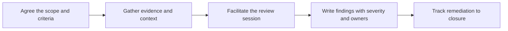

# Technical Reviews and Assessments

> **Core skill:** Leading reviews of architectures, implementations, and practices so findings are accurate, fair, and actionable — and so the team actually acts on them.

## Why This Matters

The advocate and consultant are repeatedly asked to look at someone else's work and say what they see: a partner's integration design, a customer's deployment plan, a team's readiness to go live, an implementation that is not performing. The review is a high-leverage moment. A good one prevents expensive mistakes, transfers judgment to the reviewed team, and strengthens the relationship. A bad one — vague, political, or late — burns credibility and changes nothing.

Reviewing without authority is the defining constraint. The reviewer rarely owns the system or commands the team; influence comes from evidence, fairness, and the usefulness of the findings. That means conversations framed as shared problem-solving rather than audits, findings anchored to criteria the team accepts, and a tone that separates the work from the people who did it.

The most common failure is the ornamental review: a document is scanned, generic advice is returned, and nobody can point to a single decision it changed. Preventing that is a facilitation problem. Scoped criteria, gathered evidence, a session where the team can respond, findings with severity and owners, and follow-through that verifies remediation are what make a review an intervention rather than an opinion.

## Review Types This Role Leads

| Review Type | Question It Answers | Typical Trigger | Output |
|---|---|---|---|
| Solution design review | Will this design meet the requirements and constraints? | Before implementation starts | Findings and recommended changes |
| Implementation assessment | Does the built system match intent and good practice? | Mid-project or before launch | Rated findings with remediation path |
| Architecture assessment | Is the system structurally sound for its context? | Adoption, migration, due diligence | Risks, strengths, options |
| Operational readiness review | Can the team run this in production safely? | Before go-live | Readiness verdict with conditions |
| Practice and process review | Are working practices producing good outcomes? | Enabling a team or partner | Improvement plan with quick wins |

## The Reviewer Stance

| Stance | Move | Avoid |
|---|---|---|
| Curious before critical | Ask why before judging what | Leading with the conclusion |
| Evidence anchored | Tie every finding to an observed artifact | Opinions dressed as facts |
| Criteria shared | Agree the standard before measuring against it | Importing a hidden rubric |
| Team preserving | Critique the work, protect the people | Language that assigns blame |
| Decision oriented | Rank findings by consequence | A flat list of observations |
| Time aware | Match review depth to the stakes | Gold-plating a low-stakes review |

## Facilitating a Review Session

| Phase | Facilitation Move | Artifact |
|---|---|---|
| Scope | State what is in and out; agree the criteria | One-page scope note |
| Context | Let the team present their constraints and intent | Shared understanding in the room |
| Evidence | Walk the artifacts together; ask questions at each stop | Observed facts, captured verbatim |
| Findings | Draft findings live; let the team challenge them | Agreed finding statements |
| Priorities | Rank by severity and effort with the team | Ordered remediation list |
| Close | Confirm owners, dates, and the verification method | Action register |



## Evidence and Criteria

| Criterion | Evidence to Seek | Common Gap |
|---|---|---|
| Requirements fit | Traced requirements to design decisions | Untraced assumptions |
| Scalability | Load assumptions, limits, and test results | Unstated peak scenarios |
| Security posture | Threat model, auth flows, secret handling | Reviews that skip data flows |
| Operability | Runbooks, monitoring, rollback plan | Nobody owns the 3 a.m. case |
| Maintainability | Test coverage, coupling, documentation | Structure judged only by taste |
| Delivery reality | Timeline, team capacity, dependencies | Plans that ignore the team size |

## Findings That Land

| Element | Weak Form | Strong Form |
|---|---|---|
| Statement | The architecture is risky | A single database instance carries all traffic; a zone failure is a full outage |
| Evidence | General concern | Reference to the deployment topology and failure test |
| Consequence | Could be a problem | Estimated outage window and affected users |
| Recommendation | Improve resilience | Add a standby replica with an automated failover test before launch |
| Severity | High | High: address before launch; named owner; verification recorded |

## Severity and Prioritization

| Level | Definition | Expected Response |
|---|---|---|
| Critical | Immediate harm to security, data, or availability | Blocking; fix or mitigate before proceeding |
| High | Likely failure or major cost if unaddressed | Fix before the next phase; owner named |
| Medium | Real but survivable weakness | Schedule with a date; verify at the next review |
| Low | Improvement with modest payoff | Backlog with rationale; revisit if context changes |
| Observation | Context worth knowing; not a defect | Recorded; no action required |

## Follow-Through and Verification

| Stage | Practice |
|---|---|
| Publication | Findings delivered in writing within a short, promised window |
| Triage | Team confirms, contests, or defers each finding explicitly |
| Remediation | Owners and dates recorded in the team's own tracker |
| Verification | Reviewer checks the fix against the original evidence, not a summary |
| Closure | A short note confirms resolution; deferred items are re-owned |

## Practical Applications

**Review leadership checklist:**

- [ ] Scope and criteria were agreed and written before evidence gathering
- [ ] The reviewed team presented their context before any judgment
- [ ] Findings were drafted live and challenged in the room
- [ ] Every finding has evidence, consequence, recommendation, and severity
- [ ] Owners and dates exist for every high finding or above
- [ ] Verification was performed against the original evidence

**Findings log template:**

```markdown
# Review Findings: [System or Project]

**Scope:** [what was reviewed; what was excluded]
**Criteria:** [standards applied]
**Reviewers:** [names]

| ID | Finding | Evidence | Consequence | Recommendation | Severity | Owner | Status |
|----|---------|----------|-------------|----------------|----------|-------|--------|
| F1 | [statement] | [artifact] | [impact] | [change] | High | [name] | Open |

**Deferred items:** [finding, rationale, re-owner]
**Verification log:** [finding, verified by, date, result]
```

## Common Pitfalls

| Pitfall | Why It Is a Problem | Better Approach |
|---------|---------------------|-----------------|
| **Ornamental review** | Generic advice changes no decisions | Evidence-anchored findings with owners and dates |
| **Criteria by surprise** | The team feels ambushed by an unseen standard | Agree the criteria before gathering evidence |
| **Blame-tinged language** | The team defends itself instead of improving the system | Critique the work; preserve the people |
| **Flat finding lists** | Everything looks equally urgent; nothing gets fixed first | Severity levels tied to consequence |
| **Review without follow-up** | Findings rot; the same issues return next review | Verification against original evidence |
| **Depth out of proportion** | High ceremony for low stakes; fatigue sets in | Match review depth to risk and stakes |

## Success Indicators

- Every high finding has an owner, a date, and a verified resolution
- Teams request the next review voluntarily
- The reviewed team can explain what changed and why
- Later projects repeat fewer findings from previous reviews
- Findings are quoted in the team's own planning, not filed away

## Related Topics

- [[02_Discovery_Sessions]] — where the requirements and constraints a review measures against originate
- [[01_Workshops_and_Hands_On_Sessions]] — the enablement format when findings require teaching
- [[07_Facilitation_Techniques]] — keeping review sessions honest and productive
- [[05_Solution_Guidance/00_overview|Solution Guidance]] — where review findings feed the recommendation loop
- [[career-path/15_Solutions_and_Enterprise_Architect/01_Business_Analysis_and_Capability_Mapping/00_overview|Business Analysis and Capability Mapping (Solutions Architect)]] — enterprise context for large assessments

## Summary

Technical reviews and assessments are facilitation with consequences: scoping what is being judged against criteria everyone accepts, gathering evidence before forming views, running a session where the team can respond rather than merely receive, writing findings that pair statement with evidence and severity, and following remediation through to verified closure. Authority is not required — evidence, fairness, and follow-through are.
