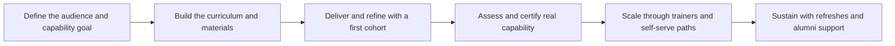

# Enablement Programs

> **Core skill:** Designing repeatable programs — partner, customer, and internal — that make other people independently capable, so capability scales beyond your own calendar.

## Why This Matters

One consultant helping one customer produces one outcome. A consultant who builds an enablement program produces outcomes through every person the program reaches. This is the multiplication step of the role: partner engineers who can implement without escalation, customer teams who can run the integration themselves, internal colleagues who can carry the advocate's methods into their own conversations. The program is the product; the sessions are deliveries.

Programs fail in a specific, predictable way: as content dumps. A library of recordings and slides is published, attendance is counted, and nothing changes because nobody verified that anyone can do anything. Enablement is not distribution — it is capability change, and capability must be built with practice, feedback, and assessment, then sustained with support structures after the formal training ends.

The consultant's advantage is knowing where the friction actually is, from discovery, support archaeology, and hands-on work in the field. A program built from those inputs targets the real blockers — the two-step authentication flow that defeats every integrator, not the abstract architecture topic that feels important to the vendor. That grounding is what separates an enablement program that moves adoption numbers from one that moves nothing.

## What Enablement Programs Cover

| Audience | Capability Goal | Typical Artifacts |
|---|---|---|
| Partner engineers | Implement and support the product independently | Certification path, implementation playbooks, sandbox |
| Customer teams | Operate and extend what was delivered | Handover curriculum, runbooks, office hours |
| Internal field teams | Sell, scope, and support credibly | Enablement library, demo environments, FAQ |
| Developer community | Adopt and integrate without hand-holding | Quickstarts, guided labs, community clinics |
| Trainers and champions | Teach others the same material | Train-the-trainer kit, slide sources, exercise bank |

## Scaling Models

| Model | Reach | Cost | Control of Quality | Best For |
|---|---|---|---|---|
| Direct delivery by you | Low | High | Highest | First cohorts; complex material |
| Train the trainer | Medium to high | Medium | Medium; depends on trainers | Partner networks; regional scale |
| Certification program | High | Medium | High, if assessment is real | Verifiable capability claims |
| Self-serve materials | Highest | Low after build | Low; learners self-select | Broad awareness and onboarding |
| Blended path | High | Medium | High when sequenced well | Serious capability programs |

## Program Design Decisions

| Decision | Options | Considerations |
|---|---|---|
| Capability target | Awareness, usage, mastery, certification | Mastery claims require practice and assessment |
| Audience scope | One segment or several | Multiple segments force parallel tracks; start narrow |
| Delivery mix | Live, recorded, written, sandbox | Live for hard concepts; async for reference |
| Assessment | None, quizzes, practical projects, certification | No assessment means no verification of capability |
| Language and region | Single or localized | Localization multiplies cost; plan for it early |
| Governance | Who owns updates; who certifies | Content decays the day the product ships a change |

## Building a Program in Phases

| Phase | Activities | Exit Criteria |
|---|---|---|
| Define | Pick the audience and the capability target; collect friction evidence | One-page program charter |
| Design | Sequence curriculum; build exercises and assessment | Piloted material ready for a real audience |
| Pilot | Run with a first cohort; instrument it | Fixes identified from learner evidence |
| Certify | Formalize assessment and recognition | Certified people exist who can be verified |
| Scale | Train the trainers; publish self-serve paths | Deliveries happen without you |
| Sustain | Reviews, refreshes, alumni support | Program survives product changes and staff turnover |



## Measuring Enablement

| Metric | What It Shows | Pitfall |
|---|---|---|
| Completion rate | Whether the path is finishable | Completion without competence is theater |
| Assessment pass rate | Whether capability actually formed | Easy tests inflate both numbers |
| Time to first independent delivery | How fast the program pays off | Requires tracking beyond the course |
| Escalation rate from enabled teams | Whether independence is real | Escalations can have many causes |
| Trainer-led delivery count | Whether scale-out happened | Trainers need support or quality drifts |
| Adoption metrics for enabled audiences | The business effect | Attribution needs a comparison group |

## Sustaining the Program

| Decay Risk | Countermeasure |
|---|---|
| Product changes break exercises | Version the curriculum; test after each release |
| Trainers drift in quality | Refresh sessions; observe one delivery per trainer per quarter |
| Materials rot quietly | Owners named per module; review dates set |
| Champions leave | A cohort of trainers, not one hero |
| Learners forget | Alumni channel, refresher paths, regular clinics |

## Practical Applications

**Enablement program checklist:**

- [ ] The capability target is specific and testable, not a topic list
- [ ] The curriculum includes practice and assessment, not only content
- [ ] A pilot cohort has run and the materials were revised from evidence
- [ ] Trainers or champions are identified and supported
- [ ] Success metrics include capability and adoption, not just attendance
- [ ] Every module has a named owner and a review date

**Partner enablement plan template:**

```markdown
# Enablement Plan: [Partner or Team]

**Capability target:** [what participants can do when finished]
**Audience:** [roles, count, current skill, languages]
**Path:** [modules, order, formats, duration]
**Assessment:** [practical project or certification]
**Support after:** [office hours, alumni channel, escalation map]
**Success metrics:** [capability and adoption measures]
**Owners:** [program owner; module owners; trainer pool]
```

## Common Pitfalls

| Pitfall | Why It Is a Problem | Better Approach |
|---------|---------------------|-----------------|
| **Content dump** | Consumption without practice changes no behavior | Practice and assessment in every path |
| **Attendance as success** | Seat counts rise while capability stays flat | Measure independent delivery, not sign-ins |
| **Built for the vendor's org chart** | Topics follow internal structure, not the learner's work | Design around the learner's tasks and friction |
| **One hero trainer** | The program dies when one person leaves or is busy | Build a trainer cohort and refresh loop |
| **Frozen materials** | Product changes make exercises fail; trust collapses | Versioned curriculum; post-release testing |
| **No certification bar** | Certified people cannot actually do the job | Practical assessment with real tasks |

## Success Indicators

- Enabled teams deliver work without escalating to the core team
- Trainers deliver sessions without the original author present
- Certified individuals pass practical tasks, not just quizzes
- The program survives a product release and a staff change
- Adoption metrics for enabled audiences move relative to comparable groups

## Related Topics

- [[06_Training_and_Curriculum_Design]] — the learning structure every program needs
- [[01_Workshops_and_Hands_On_Sessions]] — the delivery format most programs are built on
- [[07_Facilitation_Techniques]] — the craft trainers must inherit to scale quality
- [[06_Community_and_Ecosystem/00_overview|Community and Ecosystem]] — community channels that sustain programs
- [[05_Solution_Guidance/00_overview|Solution Guidance]] — the method programs propagate to partners

## Summary

Enablement programs multiply the advocate and consultant by building capability in others: a specific, tested capability target; a curriculum with practice and assessment; a pilot that improves the material; certification that makes capability verifiable; trainer cohorts and self-serve paths that scale delivery; and a sustain loop that keeps exercises true as the product changes. The program is finished only when it runs without you — and keeps running when you are gone.
