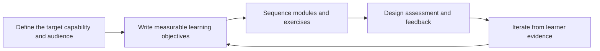

# Training and Curriculum Design

> **Core skill:** Structuring learning journeys — objectives, exercises, assessment, sequencing — so learners move from awareness to independent capability instead of passive familiarity.

## Why This Matters

Workshops and enablement programs stand on something deeper than good delivery: the design of the learning itself. A curriculum is an argument about how capability forms — what learners must try, in what order, with what feedback, and how anyone will know it worked. Advocates and consultants are asked to build these structures for courses, certifications, partner training, and developer learning paths, and the design quality shows up directly in whether learners can do the job afterward.

Technical people tend to design curricula from the structure of the technology rather than the structure of learning: every feature gets a module, in the order the system was built. Learners cannot absorb that. Capability forms through doing progressively harder versions of the real work, so strong curriculum design works backward from the target performance — what the learner will do on the job — and arranges objectives, exercises, and assessment to build toward exactly that.

Assessment is the part most technical curricula skip, and it is the part that makes the rest honest. Without it, nobody can tell a learner who understood from one who nodded along, trainers optimize for comfort, and certifications become attendance records. Designing assessment first, before content, is the single highest-leverage habit in this skill: it forces specificity about what capability means.

## The Capability Ladder

| Level | Learner Can | Typical Format |
|---|---|---|
| Awareness | Describe what the technology is and why it exists | Overview content; demos |
| Understanding | Explain how it works and when to use it | Guided explanation; focused reading |
| Practice | Perform core tasks with reference material at hand | Hands-on exercises with checkpoints |
| Independence | Perform real work without scaffolding | Projects; production-like scenarios |
| Mastery | Handle edge cases, debug, and teach others | Certification tasks; mentoring; stretch work |

## Writing Learning Objectives

| Vague Objective | Measurable Objective | Assessment |
|---|---|---|
| Understand authentication | Implement a token refresh flow that survives expiry | Working code reviewed against criteria |
| Learn about deployment | Deploy the sample service to a staging environment with a rollback tested | Observed deployment and rollback |
| Be familiar with the data model | Extend the schema and migrate existing records without downtime | Migration executed on a test dataset |
| Know the API best practices | Diagnose and fix three broken integration scenarios | Fixes verified by tests |

## Module Design

| Component | Design Rule | Example |
|---|---|---|
| Opening hook | Show the outcome first; let learners see where they are going | A working app they will build toward |
| Concept input | Short, targeted, timed to the task at hand | Two minutes of explanation before the exercise that needs it |
| Guided exercise | Steps with checkpoints; hints on demand | First integration with a reference solution available |
| Solo exercise | Same skill, new surface, no steps | Second integration from the requirements only |
| Debrief | Name the principle; connect to the learner's work | Why idempotency keys mattered in both tasks |
| Extension | Optional depth for fast finishers | Failure-mode analysis; performance tuning |

## Exercise Design

| Exercise Type | Builds | Example |
|---|---|---|
| Reproduce | Familiarity with the toolchain | Run the sample; observe the output |
| Modify | Understanding of mechanics | Change the retry policy; observe the effect |
| Diagnose | Debugging judgment | A broken configuration with three planted faults |
| Compose | Integration skill | Combine two services into one workflow |
| Design | Transfer and judgment | Choose and justify an approach for a new requirement |

## Assessment Methods

| Method | Measures | Limits |
|---|---|---|
| Knowledge quizzes | Recall and recognition | Weak proxy for doing |
| Guided practical task | Execution with support | Hides independence gaps |
| Independent project | Real capability | Expensive to grade fairly |
| Live troubleshooting | Judgment under pressure | Needs trained assessors |
| Teach-back | Depth of understanding | Time-intensive; strong signal |

## Sequencing a Learning Path

| Order | Rationale |
|---|---|
| Outcome demo first | Motivation anchors; learners see the destination |
| One narrow win early | Confidence from a completed loop, however small |
| Skill in dependency order | Nothing is exercised before its prerequisites appear |
| Repetition with variation | Same skill applied to new surfaces for transfer |
| Failure cases after success | Error handling lands once the happy path is owned |
| Integration task at the end | Everything combined the way work actually arrives |



## Practical Applications

**Curriculum design checklist:**

- [ ] The target performance is written as something a learner does, not knows
- [ ] Every objective has a matching assessment before content is written
- [ ] Each module pairs concept input with a guided and a solo exercise
- [ ] The sequence starts with an early completed win
- [ ] Failure cases are taught after the happy path, not before
- [ ] The first cohort's evidence feeds a revision pass

**Curriculum map template:**

```markdown
# Curriculum: [Title]

**Audience:** [who; prerequisites; context of use]
**Target capability:** [what learners can do at the end; at what level]
**Assessment:** [capstone task; criteria; who judges]

| Module | Objective | Concept Input | Exercise | Checkpoint |
|--------|-----------|---------------|----------|------------|
| M1 | [measurable objective] | [topic, minutes] | [task] | [verification] |

**Evidence from last cohort:** [completion, pass rate, confusion points]
**Next revision:** [changes planned; owner]
```

## Common Pitfalls

| Pitfall | Why It Is a Problem | Better Approach |
|---------|---------------------|-----------------|
| **Feature-order curriculum** | Organized by the product's structure, not learning | Work backward from target performance |
| **Objectives that cannot be observed** | Understand and know cannot be assessed or verified | Verb-based, measurable objectives |
| **Content without exercise** | Recognition masquerades as capability | Every module includes doing |
| **Assessment as afterthought** | Nobody can prove the learning worked | Design assessment before content |
| **Happy path only** | Learners meet their first error alone in production | Plant failures; teach diagnosis |
| **Never revised** | First-draft friction persists for every future cohort | Revise from cohort evidence each run |

## Success Indicators

- Learners pass practical assessments, not just attendance
- Graduates perform the target work without scaffolding
- Trainers report fewer repeated confusion points across cohorts
- The curriculum survives a product change with targeted edits, not a rewrite
- Assessment results correlate with on-the-job performance

## Related Topics

- [[05_Enablement_Programs]] — the program scale this curriculum design serves
- [[01_Workshops_and_Hands_On_Sessions]] — the live delivery format for designed modules
- [[02_Documentation_and_Learning_Materials/00_overview|Documentation and Learning Materials]] — reference materials that complement training
- [[07_Facilitation_Techniques]] — the delivery craft trainers need for any module
- [[career-path/02_Senior_Software_Engineer/06_Communication_and_Influence/04_Facilitation|Facilitation (Senior)]] — the facilitation foundation this builds on

## Summary

Training and curriculum design turn capability claims into verifiable outcomes: target performance stated as doing, objectives measurable and matched to assessment, modules that pair short concept input with guided and solo practice, failure cases taught after the happy path, and sequences ordered by learning dependencies rather than the product's structure. The design is the difference between training that is attended and capability that exists.
