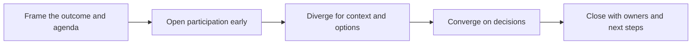

# Facilitation Techniques

> **Core skill:** The working craft of guiding groups — agendas, questioning, time, participation, and conflict — so that any session reaches its stated outcome, in the room and remotely.

## Why This Matters

Every other skill in this area is delivered through a session: the workshop, the discovery conversation, the review, the demo. Facilitation is the operator under all of them — the set of concrete moves that keeps a group moving from talking to an articulated outcome. Facilitators are judged by the meeting's product: a decision, a confirmed understanding, a plan with owners. If the group could have reached the same result without you, you did not facilitate; you hosted.

The advocate and consultant facilitate constantly, often without the title: a partner call that must end with a scope, a community session that must produce next steps, a review that must rank findings. Where a formal facilitator manages process for a neutral meeting, this role brings technical judgment into the process — which raises a specific danger. The moment you start defending your own idea, you stop facilitating. The craft is keeping your expertise available to the group while the group keeps ownership of the outcome.

Good facilitation is largely invisible and almost entirely preparation: an agenda built backward from the outcome, roles made explicit, materials tested, and interventions rehearsed. The visible part is small — a handful of moves applied at the right moments: opening participation early, protecting the quiet voices, cutting a tangent with respect, sensing when divergence is done, and closing every thread with an owner.

## The Facilitator Stance

| Do | Do Not |
|---|---|
| Own the process; let the group own the content | Present your preferred solution as the neutral map |
| State the outcome at the start and return to it | Let the agenda drift because the group got comfortable |
| Ask, then stay silent long enough for answers | Fill every pause with your own view |
| Track who has not spoken | Let the loudest three voices become the meeting |
| Park tangents visibly with a return plan | Kill tangents without acknowledging them |
| Close every thread with owner and date | End on enthusiasm without next steps |

## Core Moves

| Move | When to Use | Effect |
|---|---|---|
| Frame the outcome | Session opening | The group knows what a good session produces |
| Round robin | Early collection of context | Every voice enters once before debate starts |
| Playback | After complex input | Confirms understanding; catches drift early |
| Parking lot | When tangents surface | Respects the thought without derailing the goal |
| Explicit divergence | Before deciding anything | Separates option generation from judgment |
| Checkpoint vote | When discussion circles | Tests whether the group is ready to converge |
| Last check for dissent | Before closing a decision | Surfaces disagreement the room was suppressing |
| Action close | Final minutes | Every thread ends with owner and date |

## The Session Shape

| Stage | Goal | Techniques |
|---|---|---|
| Open | Shared purpose and expectations | Frame outcome; agenda mapping; round robin |
| Diverge | Full context and options on the table | Brainstorm; written input; silent idea generation |
| Discuss | Test options against criteria | Criteria first; structured pros and cons; evidence requests |
| Converge | Choose and commit | Vote; dot ranking; decision owner named |
| Close | Lock outcomes and follow-ups | Playback; action list; parking lot review |

## Managing Dynamics

| Situation | Intervention |
|---|---|
| One voice dominates | Thank them; explicitly invite others; use rounds |
| Discussion loops on a side issue | Name it; park it with a timebox; restate the main question |
| Silence after a question | Wait longer; then offer a smaller question or ask for writing first |
| Conflict between parties | Move from positions to criteria; separate people from problems |
| Decision made too fast | Ask the dissent question; check whose absence matters |
| Room splits into side talk | Pause; invite the side conversation to the table |
| Expert in the room corrects others bluntly | Acknowledge the correction; redirect tone; protect the learner |
| Energy collapse | Stand; change format; shorten remaining items |

## Remote and Hybrid Craft

| Challenge | Technique |
|---|---|
| Silence and fatigue | Shorter segments; frequent interaction; camera-light norms |
| Participation hiding behind tools | Direct invitations; written rounds via chat first |
| Screen-share monologues | Handouts with artifacts instead of long shared screens |
| Hybrid room split | The remote participant is addressed first; cameras face the group |
| Time zones and short attention | Cut content by a third; send the rest as async material |
| Decisions without closure | End with a written action list sent within the hour |

## Recovering a Slipping Session

| Symptom | Reset Move |
|---|---|
| The outcome has faded | Stop; restate the outcome; ask what blocks it |
| The agenda is dead | Ask the group which item matters most today; re-rank openly |
| A decision keeps reopening | Name the loop; identify what evidence would settle it |
| Time is gone, outcome is not | Cut scope explicitly; schedule the remainder with a plan |
| The group is disengaged | Switch to small tasks; make progress visible in five minutes |



## Practical Applications

**Facilitation prep checklist:**

- [ ] The session outcome is written in one sentence and maps to the agenda
- [ ] Required participants, roles, and materials are confirmed
- [ ] Materials and links were tested before the session
- [ ] Opening and closing scripts are prepared
- [ ] Parking lot and timeboxes are ready for tangents
- [ ] The action close template is open before the session starts

**Agenda template:**

```markdown
# Session: [Title]

**Outcome:** [what exists when the session ends]
**Attendees and roles:** [who; facilitator, note-taker, deciders]

| Time | Item | Purpose | Lead |
|------|------|---------|------|
| 0:00 | Open and frame | Shared outcome | Facilitator |
| 0:05 | Item 1 | Diverge and discuss | [name] |
| 0:35 | Item 2 | Decide | [name] |
| 0:55 | Close | Confirm actions | Facilitator |

**Parking lot:** [live during the session]
**Actions:** [what / who / when — confirmed before closing]
```

## Common Pitfalls

| Pitfall | Why It Is a Problem | Better Approach |
|---------|---------------------|-----------------|
| **Facilitator as participant** | Defending your idea ends neutrality; the group stops owning the outcome | Keep expertise available; let the group decide |
| **Agenda without outcome** | The meeting covers topics and concludes nothing | Build the agenda backward from the outcome |
| **The unanswered silence problem** | Filling every pause kills quieter contributions | Wait; then ask a smaller question or use written input |
| **Tangent tolerance** | Side topics consume the session; the main question dies | Park tangents visibly with a return plan |
| **Convergence without dissent check** | Agreement hides objections that resurface later | Ask the dissent question before closing |
| **No action close** | Good discussion evaporates without owners and dates | Final minutes always produce the action list |
| **Remote as an afterthought** | Remote voices disappear; decisions lack social buy-in | Address remote participants first; use written rounds |

## Success Indicators

- Sessions end with artifacts: decisions, action lists, confirmed understanding
- Every attendee speaks at least once; the quiet voices appear in the notes
- Parking lot items return with owners instead of dying
- The group can restate the outcome and its decisions without your help
- The same facilitation quality holds in remote and hybrid rooms

## Related Topics

- [[01_Workshops_and_Hands_On_Sessions]] — tasks plus facilitation; the densest format
- [[02_Discovery_Sessions]] — facilitation applied to extracting real needs
- [[04_Technical_Reviews_and_Assessments]] — keeping review sessions evidence-based and fair
- [[career-path/02_Senior_Software_Engineer/06_Communication_and_Influence/04_Facilitation|Facilitation (Senior)]] — the meeting-scale foundation of this craft
- [[06_Community_and_Ecosystem/00_overview|Community and Ecosystem]] — facilitation at community scale

## Summary

Facilitation techniques are the moves that convert a group's time into outcomes: framing the result before the discussion, opening participation early, separating divergence from convergence, intervening on dynamics without dominating, and closing every session with owners and dates. The facilitator's expertise remains available but never takes the pen — the group owns the content, and the result is visible the moment the meeting ends.
