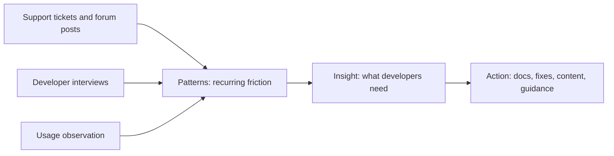

# Customer and Developer Understanding

> **Core capability:** The advocate and consultant find the real needs, constraints, and obstacles of developers and customers through interaction — building the empathy that makes guidance accurate instead of generic.

## Why This Matters

Advocates who guess at developer needs produce content nobody reads. Consultants who assume customer requirements design solutions for the wrong problem. The foundation of both roles is disciplined understanding: what developers are actually trying to do, where they get stuck, what constraints they operate under, and what would make them succeed.

This is research with a technical lens: interviews that uncover workflows, support-ticket archaeology that reveals real friction, and adoption analysis that shows where users drop off. The advocate's advantage is lived proximity to the ecosystem — but only if it is channeled through method rather than anecdote.

## Topics in This Capability Area

| Topic | Core Skill | When It Matters |
|-------|------------|-----------------|
| [[01_Developer_and_Customer_Research]] | Interviewing developers and customers for real signal | Content planning; product input |
| [[02_Needs_and_Context_Discovery]] | Uncovering workflows, goals, constraints, and blockers | Engagement start; discovery |
| [[03_Observing_Real_Usage_and_Friction]] | Watching how the product is actually used | Adoption analysis; DX work |
| [[04_Support_Signal_Archaeology]] | Mining tickets, forums, and issues for patterns | Prioritizing docs and fixes |
| [[05_Developer_Segmentation]] | Segmenting audiences by role, maturity, and goal | Targeting content and programs |
| [[06_Feedback_Systems_and_Surveys]] | Building collection mechanisms for continuous input | Program operation |
| [[07_Empathy_as_a_Professional_Skill]] | Maintaining curiosity and humility about users | Always; the foundation |

## From Signal to Understanding

Signals are everywhere — the craft is turning them into insight that changes what gets built and written.

## Practical Applications

### Understanding Checklist

- [ ] Interviews reach developers across segments, not just the loudest users
- [ ] Support signals are analyzed periodically for recurring themes
- [ ] Real usage observation happens on fresh environments, not just demos
- [ ] Constraints (compliance, budget, legacy, team size) are documented per customer context
- [ ] Insights are shared with product and engineering, not kept in the advocate's head

## Common Pitfalls

| Pitfall | Why It Is a Problem | Better Approach |
|---------|---------------------|-----------------|
| **Anecdote-driven advocacy** | The loudest community voice becomes the roadmap | Method-based research; segment representation |
| **Expert blindness** | Forgetting what confusion feels like | Watch beginners; test on fresh environments |
| **Research without reporting** | Insights die in notebooks | Synthesize into input product and docs actually use |
| **Assumption of similarity** | One customer's needs generalized to all | Segment; verify context before guiding |

## Success Indicators

- Content and guidance cite real evidence from research, not assumptions
- Product and docs teams request the advocate's synthesis before planning
- Adoption friction decreases where research was acted on
- Developers say "you understood my problem" — the ultimate measure

## Related Capabilities

- [[03_Facilitation_and_Enablement/00_overview|Facilitation and Enablement]]: discovery sessions operationalize this understanding
- [[07_Product_Feedback_and_Ecosystem_Strategy/00_overview|Product Feedback and Ecosystem Strategy]]: insights flow into product here
- [[career-path/14_Product_Manager/01_Problem_Discovery/00_overview|Problem Discovery (PM)]]: the product-side discovery discipline
- [[career-path/15_Solutions_and_Enterprise_Architect/01_Business_Analysis_and_Capability_Mapping/00_overview|Business Analysis and Capability Mapping (Solutions Architect)]]: enterprise context analysis

## Summary

Customer and developer understanding is disciplined empathy: interviewing for signal, observing real usage, mining support archaeology, segmenting audiences, and turning it all into insight that changes what gets built and written. Advocates who understand deeply need to persuade less — the right solution is obvious once the real problem is visible.