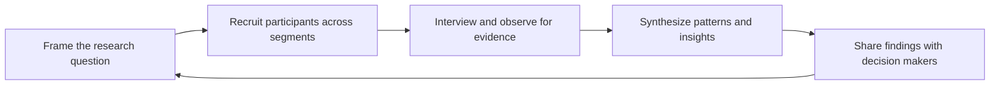

# Developer and Customer Research

> **Core skill:** Running interviews and research with developers and customers that produce real signal — evidence about what they actually do, not what they politely say they would like.

## Why This Matters

Every content plan, roadmap input, and guidance recommendation ultimately rests on a claim about what developers need. When that claim comes from the loudest community thread or the last conversation the advocate happened to have, the result is advocacy by anecdote: content nobody reads, fixes nobody needed, and a slow loss of credibility with the teams who build the product. Research is how the role replaces assertion with evidence.

Developer research has a specific texture. Developers are expert users of tools and ruthless judges of explanation; they will not politely walk through a survey designed for consumers, and they are unusually good at describing their own workflows when asked concretely and specifically. The practical tradition that fits this audience — asking about the last time they did a thing rather than whether they would do it, watching tasks rather than collecting opinions — is core to the role.

The advocate is positioned better than anyone for this work: they sit inside the community, speak the language, and can recruit participants from real channels. That advantage becomes a liability only when it substitutes for method. The discipline is what makes the proximity valuable: a framed question, a representative sample, recorded verbatim evidence, and a synthesis that other teams can act on and cite.

## What Research Can Answer

| Question | Method | What It Changes |
|---|---|---|
| Where do developers get stuck in onboarding? | Contextual interviews plus setup observation | Quickstarts and first-run experience |
| What content does a segment actually read? | Analytics plus interviews about recent learning | Content formats and channels |
| What would trigger adoption of feature X? | Last-time narratives; workflow interviews | Positioning and proof needs |
| Why is retention dropping after week one? | Cohort data plus exit conversations | The specific friction to fix |
| How do customers evaluate alternatives? | Decision-story interviews | Comparison content and demo emphasis |
| What do support gaps cost users? | Ticket archaeology plus interviews | Priorities for docs and tooling |

## Methods and Their Limits

| Method | Strengths | Limits | Best For |
|---|---|---|---|
| Individual interviews | Depth; verbatim language; why behind behavior | Small n; interviewer bias | Understanding workflows and problems |
| Contextual observation | Real behavior in real conditions | Time-intensive; observer effects | Friction in setup, usage, recovery |
| Surveys | Reach; comparability across segments | What people report is unreliable for behavior | Prioritizing among known themes |
| Usage analytics | Scale; reveals actual behavior | Silent on why; instrumented surface only | Finding where, not why |
| Support and forum mining | Existing unpaid signal at scale | Biased toward the vocal and severe | Recurring friction and severity |
| Community listening | Ambient awareness; early signals | Noise; self-selected voices | Trend detection; hypothesis generation |

## Interview Craft

| Technique | Why It Works |
|---|---|
| Ask about the last time, not the general case | Recent concrete memory beats predicted behavior |
| Follow the workflow end to end | Context and adjacent friction surface naturally |
| Ask what happened before and after the tool | The product is rarely the whole story |
| Let silence do work | The second sentence after a pause is usually the real one |
| Record verbatim phrases | The user's language is future content and ticket language |
| Ask for artifacts | Screen shares, config files, and repos correct memory |
| End with the open door | The next conversation is often better than the first |

## Bias Countermeasures

| Bias | How It Shows | Countermeasure |
|---|---|---|
| The loudest voice | One power user's needs framed as the market | Segment quota; recruit the quiet majority |
| Leading questions | Do you find the setup painful | Neutral wording; ask for stories |
| Vivid recent case | The last support call becomes the priority | Check frequency before acting |
| Selection bias | Interviewees come from conference regulars | Recruit from support, forums, and churn lists |
| Confirmation listening | Notes capture agreement, not contradiction | Capture verbatims that contradict you |
| Expert blindness | What confused a beginner is not noticed | Watch the beginner do it, not just talk about it |

## From Notes to Insight

| Stage | Output | Quality Bar |
|---|---|---|
| Raw notes | Verbatim quotes, timestamps, artifacts | Traceable to a person and session |
| Coding | Themes tagged across sessions | Consistent tags; counts available |
| Patterns | Themes that appear across segments | Frequency and severity, not just existence |
| Insight | Statements of what is true and why it matters | Falsifiable; cites the evidence |
| Recommendation | Actions for content, docs, product, or guidance | Named owner; expected effect |



## Practical Applications

**Research readiness checklist:**

- [ ] The research question is written before any conversation starts
- [ ] Participants span segments, not just the loudest or nearest voices
- [ ] Question guides use narratives and avoid leading wording
- [ ] Verbatim quotes and artifacts are captured with context
- [ ] Themes are counted across sessions before conclusions form
- [ ] Findings are delivered to the people who can act on them

**Research brief template:**

```markdown
# Research Brief: [Topic]

**Question:** [what we need to know and why]
**Decisions this informs:** [content, docs, product, guidance]
**Participants:** [segments; how many; recruitment channels]
**Method:** [interviews, observation, survey, data]
**Discussion guide:** [narrative prompts]
**Analysis plan:** [coding scheme; how patterns are counted]
**Deliverable:** [insight summary; where it goes]
```

## Common Pitfalls

| Pitfall | Why It Is a Problem | Better Approach |
|---------|---------------------|-----------------|
| **Anecdote as research** | One conversation becomes the voice of the market | Sampling across segments; counted themes |
| **Asking about the future** | Predictions of behavior are unreliable | Last-time narratives; observed behavior |
| **Leading questions** | Interviewees perform agreement instead of reporting | Neutral prompts; stories over ratings |
| **Notes without synthesis** | Insight dies in the advocate's notebook | Coded themes; written insight with evidence |
| **Convenience participants** | Conference regulars over-represent a thin slice | Recruit from support, churn, and quiet users |
| **Research without a consumer** | No decision changes; the work becomes diary | Brief the decision-makers before starting |

## Success Indicators

- Recommendations cite research evidence with quotes attached
- Product and docs teams ask for the synthesis before planning
- Findings contradict at least some internal assumptions, usefully
- Participants from later segments confirm the earlier patterns
- Content built from research performs against the metrics it targeted

## Related Topics

- [[02_Needs_and_Context_Discovery]] — applying research craft inside live engagements
- [[03_Observing_Real_Usage_and_Friction]] — the behavioral half of the evidence base
- [[07_Empathy_as_a_Professional_Skill]] — the stance that keeps research honest
- [[career-path/14_Product_Manager/01_Problem_Discovery/01_Customer_Interviews|Customer Interviews (PM)]] — the product-side interview discipline
- [[07_Product_Feedback_and_Ecosystem_Strategy/00_overview|Product Feedback and Ecosystem Strategy]] — where research insight lands in the product

## Summary

Developer and customer research replaces anecdote with evidence: a framed question, participants recruited across segments, interviews that ask about real last-time behavior and capture verbatim language, observation where behavior is what matters, coding that counts themes before conclusions, and insight delivered to the people who can act on it. For a role built on proximity to the ecosystem, method is what keeps that proximity from becoming a liability.
