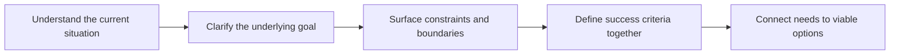

# Needs and Context Discovery

> **Core skill:** Uncovering not just what developers and customers want, but the workflow, goals, and constraints around it — the full context that decides whether any solution can fit.

## Why This Matters

A stated request is the beginning of understanding, not the end of it. "We need single sign-on" may mean forty users on one domain, or a regulated enterprise with federation partners and an audit process; the same words lead to solutions that differ in cost by an order of magnitude. The advocate and consultant who receives requests at face value build for the letter of the request and fail the spirit of the need.

Context is the difference between generic guidance and guidance that lands. Every technical recommendation is actually a fit claim: this approach, for this workflow, within these constraints, with this team. Strip the context and what remains is a stack-overflow answer — correct in general, unreliable here. Discovering context is not gather-everything documentation; it is finding the few facts that change the shape of the recommendation.

The craft is mostly discipline about sequence: understand the situation before the goal, the goal before the requirements, the constraints before the options. Each layer reframes the layer beneath it. Teams that skip layers produce precise answers to the wrong question, and the consultant's job is to notice that before implementation does.

## Wants, Needs, and Evidence

| Signal | What It Usually Means | Probe For |
|---|---|---|
| We need X technology | A chosen solution looking for validation | The problem X was meant to solve |
| It has to be cheap | Cost anxiety from a real or feared number | The actual budget process and scale |
| Our team is small | Capacity is the binding constraint | Who will operate this in six months |
| The previous attempt failed | A specific organizational scar exists | What happened, by whose account |
| Everyone needs access | Access-control requirements are unexplored | Roles, data classes, and audit needs |
| We want it by Q4 | A business event drives the date | What event, and what slipping costs |

## The Context Map

| Dimension | Guiding Questions | Why It Matters |
|---|---|---|
| Goal | What outcome improves, for whom, and by when? | Direction for every later trade-off |
| Workflow | How does the work happen today, step by step? | Fit is decided in the details of the flow |
| Constraints | Budget, compliance, legacy systems, headcount, timelines? | Eliminates apparently viable options |
| Decision process | Who decides, who influences, what would block approval? | Determines what a recommendation must survive |
| Environment | What stack, infrastructure, and tooling surround the problem? | Integration reality beats architectural elegance |
| Success criteria | How will this be judged in three months? | Defines done before work starts |
| History | What was tried before, and what happened? | Prevents repeating a failed approach |

## Elicitation Techniques

| Technique | Uncovers | Watch-Out |
|---|---|---|
| Workflow walkthrough | The real process, including workarounds | People describe the ideal process unless asked for the last real case |
| Last-time stories | Concrete behavior and pain points | Generalizing from one vivid case |
| Artifact review | Configs, tickets, spreadsheets as they really are | Interpreting data without the owner present |
| Five whys | The goal behind the request | Tone; it is a technique, not an interrogation |
| Constraint fencing | Hard boundaries versus soft preferences | Accepting preferences as physics |
| Draft option playback | Reactions to a strawman | Anchoring the customer too early |

## Confirming Understanding

| Technique | Practice |
|---|---|
| Playback | Restate the need, goal, and constraints; ask for corrections |
| Written summary | Deliver within days, in the customer's own language |
| Assumption list | State every assumption you are making about their context |
| Criteria check | Confirm how they will judge a good outcome |
| Open items | Name what is unknown and who will resolve it |

## From Context to Options

| Context Finding | Implication for Guidance |
|---|---|
| Small team, no ops capacity | Prefer managed and boring over powerful and custom |
| Compliance-heavy environment | Architecture must cite controls from the start |
| Fast-approval culture | Deliver a thin slice quickly, then expand |
| Legacy system at the center | Integration plan precedes feature plan |
| Previous failure at a vendor | Address the failure mode explicitly in the proposal |
| Unclear decision process | Identify the real approver before investing in a recommendation |



## Practical Applications

**Context discovery checklist:**

- [ ] The goal is stated as an outcome for a person, not a feature
- [ ] The current workflow is documented step by step
- [ ] Hard constraints are separated from preferences and captured verbatim
- [ ] The decision process and approver are known
- [ ] Success criteria were confirmed, not assumed
- [ ] A written context summary was played back and corrected

**Context summary template:**

```markdown
# Context Summary: [Customer or Team]

**Outcome sought:** [what improves; for whom; by when]
**Current workflow:** [steps; where it hurts; workarounds in use]

## Constraints
- Hard: [budget, compliance, legacy, capacity, dates]
- Soft: [preferences; reversible choices]

## Decisions
- Approver: [who] — Criteria: [what matters to them]

## Success Criteria
- [how it will be judged; by whom; when]

## Assumptions and Open Items
- [assumption] — [how it will be validated]
```

## Common Pitfalls

| Pitfall | Why It Is a Problem | Better Approach |
|---------|---------------------|-----------------|
| **Request as requirement** | Solving the stated ask while missing the goal | Probe the goal behind the request first |
| **Preferences mistaken for constraints** | Options eliminated for no real reason | Separate hard constraints from soft preferences |
| **Missing the workflow** | Elegant solution that breaks on the real process | Walk the workflow end to end |
| **Unknown approver** | A perfect recommendation meets an unexpected veto | Map the decision process early |
| **Context in the head** | Understanding dies with the engagement; nobody can reuse it | Written context summary shared with all parties |
| **One visit, forever** | Context changes; guidance silently goes stale | Reconfirm context at each phase boundary |

## Success Indicators

- Recommendations explain the constraints they honor, not just the technology
- The customer confirms the context summary with specific corrections
- Options are evaluated against agreed success criteria
- Implementation encounters no surprise constraints discovered late
- Colleagues can pick up the engagement from the written context alone

## Related Topics

- [[01_Developer_and_Customer_Research]] — the research methods this applies
- [[05_Developer_Segmentation]] — context differs by segment; segments frame the questions
- [[04_Support_Signal_Archaeology]] — where existing friction evidence lives
- [[career-path/15_Solutions_and_Enterprise_Architect/01_Business_Analysis_and_Capability_Mapping/00_overview|Business Analysis and Capability Mapping (Solutions Architect)]] — enterprise context analysis
- [[career-path/14_Product_Manager/01_Problem_Discovery/00_overview|Problem Discovery (PM)]] — the product discipline around the same problem

## Summary

Needs and context discovery turns requests into understanding: goals before features, workflows before assumptions, hard constraints separated from preferences, the decision process mapped, and success criteria agreed while the people who own them are present. The output is a written, corrected context summary — the artifact every later recommendation, review, and implementation plan must fit, and the difference between a generic answer and the right one.
