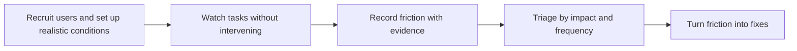

# Observing Real Usage and Friction

> **Core skill:** Watching developers and customers work with the product in real conditions — their tasks, their environment — to see the friction that interviews and demos never surface.

## Why This Matters

People cannot reliably report their own friction. They compress struggles into a verdict, remember the ending rather than the middle, and normalize workarounds until they become invisible. The only honest instrument for friction is observation: a real person, a real task, a real environment, and someone watching who notes where time goes, where confusion appears, and where the work actually happens.

The advocate and consultant get rare access to these moments: the customer's first integration attempt, the partner engineer setting up sandbox credentials, the developer following the quickstart on their own machine. That access converts directly into the highest-value fixes available — every observed stumble in the first thirty minutes of use is a fix whose payoff multiplies across the entire user base.

The discipline is watching without fixing. The instinct of a knowledgeable observer is to intervene — to answer the question that would have cost the user ten minutes of confusion, because the ten minutes feel wasteful. But the intervention destroys the evidence. The observed struggle is the data; the advocacy skill is to note it accurately, then fix the root cause so nobody pays that cost again.

## Why Observation Beats Opinion

| What People Say | What Observation Shows | Why It Matters |
|---|---|---|
| The setup was fine | Forty minutes lost to a version mismatch | Fixed quickstarts remove a silent adoption tax |
| The docs are good | The critical step was found by trial, not reading | Reading paths differ from writing paths |
| I would use this daily | The workflow collides with an internal tool | Adoption depends on the surrounding system |
| The error was clear | Recovery took three searches and one guess | Error clarity includes the recovery path |
| Performance is fine locally | Real datasets stall the default configuration | Defaults decide the production experience |

## Observation Methods

| Method | Reveals | Cost | Best For |
|---|---|---|---|
| Moderated task observation | Friction in a watched session, with think-aloud context | High per session | Onboarding, core workflow design |
| Unmoderated task recordings | Friction without an observer present | Medium; needs tooling | Scale; remote participants |
| Shadowing a real workday | The true context around the product | High; rare access | Enterprise customers; partners |
| First-run on a clean machine | Setup friction in its natural state | Low | Every release; quickstart verification |
| Support-ticket replays | Reproducing reported friction exactly | Medium | Prioritizing fixes with evidence |

## What Friction Looks Like

| Friction Type | Typical Symptom | Example Evidence |
|---|---|---|
| Setup | Long stretches installing, re-reading, retrying | Time stamps; screenshots of failed installs |
| Comprehension | Re-reading the same paragraph; guessing at terms | Which words caused the pause |
| Navigation | Searching for the next step across pages | The path taken versus the intended path |
| Error recovery | Errors met with searches, restarts, or abandonment | Recovery time; external searches used |
| Integration | Interior systems colliding with the tool | The workaround built to bridge them |
| Trust | Hesitation before risky actions; verification rituals | Extra checks performed before proceeding |

## Running an Observation Session

| Phase | Practice | Artifact |
|---|---|---|
| Frame | Explain that the product is under test, not the participant | The participant relaxes and narrates |
| Warm-up | Establish the goal and context of their real task | The real task, not a scripted demo |
| Tasks | Give goals, not steps; allow natural exploration | Time-stamped notes of behavior |
| Think-aloud | Prompt for thoughts without leading answers | Quotes at moments of confusion |
| Rescue rule | Intervene only to prevent total derailment; note it | Rescue moments marked as critical friction |
| Debrief | Ask what they would change and why | Priorities in the user's own language |

## Observing at Scale

| Signal | Question It Answers | Caveat |
|---|---|---|
| Funnel analytics | Where do users drop out of onboarding? | Silent on why they dropped |
| Time-to-first-success | How long until the aha moment? | Definition of success varies by segment |
| Error and retry rates | Which steps fail repeatedly? | Instrumentation misses client-side failure |
| Search queries in docs | What are users looking for and failing to find? | Only captures those who search |
| Session replays | What did the frustrated session look like? | Privacy and consent matter |
| Support correlation | Which friction turns into tickets? | Only the friction that reaches support |

## From Observation to Action

| Finding | Owner | Artifact |
|---|---|---|
| Quickstart loses users at credential step | Docs team | Rewritten step with a verified copy-paste path |
| Default configuration fails on real data sizes | Product team | Changed default; migration note |
| Error message does not name the fix | Engineering | Error text change with a linked guide |
| Workaround used by every observed team | Product and docs | Supported solution or documented pattern |
| Confusion about a core concept | Learning materials | Concept primer added to the getting-started path |



## Practical Applications

**Observation session checklist:**

- [ ] The session uses the participant's real task, not a scripted demo
- [ ] The product, not the participant, is framed as under test
- [ ] Consent for recording and notes is confirmed
- [ ] Think-aloud prompting is prepared but not leading
- [ ] A rescue rule is agreed and rescue moments are marked
- [ ] Findings are logged with timestamps and verbatim quotes

**Friction log template:**

```markdown
# Friction Log: [Session or Product Area]

**Participants:** [segment, skill level, environment]
**Task:** [the real goal given to the participant]

| # | Friction point | Evidence | Type | Severity | Suggested fix |
|---|----------------|----------|------|----------|---------------|
| 1 | [where it stuck] | [timestamp or quote] | Setup | High | [change] |

**Patterns across sessions:** [recurring themes]
**Rescue moments:** [where the observer had to intervene]
**Recommended owners:** [docs; product; engineering; materials]
```

## Common Pitfalls

| Pitfall | Why It Is a Problem | Better Approach |
|---------|---------------------|-----------------|
| **Intervening to help** | The fix instinct destroys the evidence being collected | Note the struggle; fix the root cause later |
| **Demo conditions** | A prepared environment hides the friction real users meet | Fresh machines; real data shapes; real networks |
| **Recruiting only experts** | Expert fluency hides beginner blockers | Mix skill levels; include first-timers |
| **Watching without logging** | Sharp memories fade; details get lost | Timestamped friction log during the session |
| **Findings without owners** | Observation becomes theater that changes nothing | Route every finding to a named team |
| **One session conclusions** | A single participant's quirk becomes a mandate | Confirm patterns across sessions and data |

## Success Indicators

- Onboarding friction measurably decreases where observations were acted on
- Each observation produces routed findings with owners, not just notes
- Support tickets decline in the categories the observations targeted
- Developers complete first tasks without external searches or help
- The advocate can quote real session evidence in planning arguments

## Related Topics

- [[01_Developer_and_Customer_Research]] — the broader research practice this feeds
- [[04_Support_Signal_Archaeology]] — the passive record that confirms observed patterns
- [[07_Empathy_as_a_Professional_Skill]] — the humility to watch instead of fix
- [[career-path/14_Product_Manager/05_Product_Analytics/00_overview|Product Analytics (PM)]] — the quantitative counterpart to session observation
- [[02_Documentation_and_Learning_Materials/00_overview|Documentation and Learning Materials]] — the artifact most friction findings change

## Summary

Observing real usage replaces reported experience with watched behavior: real tasks in real environments, think-aloud narration without leading, a rescue rule that preserves evidence, friction logged with timestamps and quotes, and patterns confirmed across sessions before they become priorities. Every observed stumble in the first ten minutes of use is a fix whose payoff multiplies across every future user — if the observer resists the urge to help and instead notes, routes, and repairs.
