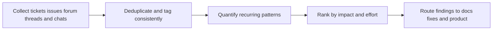

# Support Signal Archaeology

> **Core skill:** Mining the accumulated record — tickets, issues, forum threads, chats — for recurring friction, and turning it into evidence that prioritizes docs, fixes, and guidance.

## Why This Matters

Every support interaction is a small, honest account of where the product and its explanation fail. Individually they look like noise: a person could not find a step, a key expired, an upgrade broke a configuration. Aggregated and read as a record, they become the most grounded source of developer truth an organization possesses — real problems, real language, arriving unprompted, at a scale no interview schedule can match.

The advocate and consultant are natural archaeologists of this record. Product teams sample it when something escalates; the advocate lives in it, which makes the difference between reacting to the last loud ticket and reading the stratigraphy: what recurs weekly, what spiked after a release, what users have stopped reporting because they gave up. The stopped-reporting layers matter most — the friction that no longer generates tickets is often the friction that killed adoption.

The craft is turning anecdotes into defensible claims. A pile of stories convinces nobody in a planning meeting; counts, trend lines, and verbatim quotes do. Done well, this discipline gives the advocate a standing in product and docs discussions that opinion cannot buy: the numbers are checkable, the examples are quotable, and the fixes are testable — the release notes can name the friction that disappeared.

## Signal Sources and Their Biases

| Source | Strength | Bias | Mitigation |
|---|---|---|---|
| Support tickets | Severity and exact reproduction | Skewed to blockers; misses quiet failure | Pair with churn and analytics data |
| GitHub issues | Technical depth; public thread of the fix | Skewed to open-source users and power users | Read closed and stale issues too |
| Forum and Discord questions | Real language; near-real-time | Skewed to vocal members | Track repeat askers and lurkers behavior |
| Stack Overflow and Q and A | Surface for external evaluation | Skewed to what newcomers try first | Watch tag velocity, not just volume |
| Sales and partner escalations | Commercial stakes visible | Reward loud accounts | Normalize per-account before ranking |
| Internal team chat | Fast diagnosis of what is hard | Echoes internal assumptions | Verify against external language |

## The Mining Process

| Phase | Activity | Output |
|---|---|---|
| Collect | Pull tickets, issues, threads, chats for the period | A raw, dated corpus |
| Clean | Deduplicate; separate product defects from explanation gaps | A countable dataset |
| Tag | Apply a consistent code set to each item | Tagged records with counts |
| Count | Frequency, trend, and severity per code | Ranked patterns |
| Verify | Cross-check against analytics, interviews, or reproduction | Confirmed findings |
| Route | Assign findings to docs, product, guidance, or support | Owned actions with evidence attached |

## A Lightweight Taxonomy

| Code | Covers | Example Signal |
|---|---|---|
| Setup | Install, environment, credentials, first run | Version mismatch on step two |
| Auth | Keys, tokens, permissions, expiry | Rotation schedule undocumented |
| API design | Naming, pagination, inconsistency, surprises | Same concept named differently in two endpoints |
| Error clarity | Messages that do not name a cause or fix | Generic 400 with no field reference |
| Docs gap | Missing, stale, or misplaced explanation | Working example referenced but not written |
| Performance | Latency, limits, scaling surprises | Timeout at dataset sizes the docs do not mention |
| Cost | Billing surprises, unexpected usage | Quota behavior discovered in the invoice |
| Integration | Collisions with adjacent systems | Webhook signature fails behind a proxy |
| Deprecation | Migrations, breaking changes, timelines | Old SDK advice still ranking in search |

## Quantification Without Nonsense

| Measure | Good Use | Misuse |
|---|---|---|
| Frequency per code | Ranking recurring friction | Treating raw counts as market size |
| Trend over time | Spotting release regressions and fix effects | Ignoring seasonal patterns |
| Severity split | Separating blockers from annoyances | Averaging severity into nothing |
| Time to resolution | Measuring explanation gaps | Using it to grade individuals |
| Repeat contacts | Detecting unresolved root causes | Assuming every repeat is the same user fault |
| Silence analysis | Noticing what stopped being reported | Reading silence as satisfaction |

## Routing Findings

| Finding Class | Primary Owner | Secondary Action |
|---|---|---|
| Explanation gap | Documentation | Quickstart and error text update |
| Product defect | Engineering | Support macro until fixed |
| Design friction | Product | Guidance that avoids the trap meanwhile |
| Expectation mismatch | Advocacy and positioning | Content that sets correct expectations |
| Environment collision | Integrations or solution guidance | Documented pattern for the affected context |
| Policy confusion | Support and legal | Public clarification; FAQ entry |

## Operating Cadence

| Rhythm | Activity | Audience |
|---|---|---|
| Weekly | Scan new signals; tag; note spikes | Advocate's working notes |
| Monthly | Publish a short friction digest with counts and quotes | Product, docs, support |
| Quarterly | Deep review of trends, fixes shipped, and silent categories | Leadership and planning |
| Post-release | Targeted regression sweep of the affected codes | Release team |



## Practical Applications

**Signal archaeology checklist:**

- [ ] A fixed taxonomy exists, and tagging is consistent across periods
- [ ] Every digest separates defects from explanation gaps
- [ ] Frequency and trend accompany every claim, never a lone anecdote
- [ ] Silent categories are audited periodically for stopped reporting
- [ ] Each finding is routed to an owner with the evidence attached
- [ ] Fixes are verified by watching the relevant signals afterwards

**Friction digest template:**

```markdown
# Friction Digest: [Period]

**Sources scanned:** [tickets; issues; forums; chats — counts]
**Headline patterns:**
1. [pattern] — [count, trend, severity] — [quote] — owner: [team]
2. [pattern] — [count, trend, severity] — [quote] — owner: [team]

**New or spiking:** [code] — [what changed; suspected cause]
**Resolved since last digest:** [pattern] — [fix shipped] — [signal effect]
**Silent categories under watch:** [code] — [last seen; follow-up planned]
```

## Common Pitfalls

| Pitfall | Why It Is a Problem | Better Approach |
|---------|---------------------|-----------------|
| **Ticket anecdotes in planning** | The last loud case becomes a roadmap item | Frequency and trend before airtime |
| **Defects and confusion mixed** | Engineering closes confusion tickets as not-a-bug; the gap persists | Separate codes; route explanation gaps to docs |
| **Raw counts as priority** | Loud accounts and duplicates distort magnitude | Normalize for accounts; deduplicate before counting |
| **One-time archaeology** | Friction is a moving picture, not a snapshot | A steady cadence with trend lines |
| **Reading silence as success** | Users who gave up stop filing tickets | Audit silent categories deliberately |
| **Findings that never route** | Insight without an owner changes nothing | Every pattern leaves with an owner and a date |

## Success Indicators

- Planning conversations cite the digest's counts and quotes
- Documentation work is visibly targeted at the top coded patterns
- Post-fix sweeps show the relevant signal declining
- Support and advocacy work from the same taxonomy of friction
- Release notes occasionally name a documented friction removed

## Related Topics

- [[01_Developer_and_Customer_Research]] — interviews that explain what the numbers show
- [[03_Observing_Real_Usage_and_Friction]] — watching the friction tickets only partially capture
- [[06_Feedback_Systems_and_Surveys]] — the systems that keep new signal flowing in
- [[07_Product_Feedback_and_Ecosystem_Strategy/00_overview|Product Feedback and Ecosystem Strategy]] — where routed findings land in the product
- [[02_Documentation_and_Learning_Materials/00_overview|Documentation and Learning Materials]] — the artifact that absorbs most explanation gaps

## Summary

Support signal archaeology converts the byproduct of daily support into a durable evidence base: collecting and deduplicating tickets, issues, forum threads, and chats; tagging with a consistent taxonomy that separates defects from explanation gaps; quantifying frequency, trend, and severity; verifying against other sources; and routing each pattern to a named owner. The discipline turns the advocate from a carrier of anecdotes into the person in the room whose claims are counted, quoted, and — best of all — testable after the fix ships.
