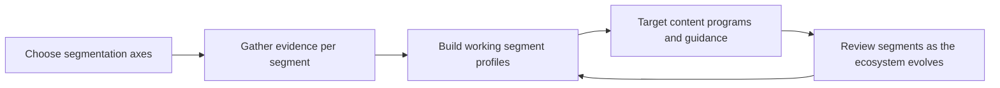

# Developer Segmentation

> **Core skill:** Segmenting audiences by role, maturity, and goal so content, programs, and guidance fit the people who actually receive them — instead of an average developer who does not exist.

## Why This Matters

The average developer is a statistical ghost. A weekend hobbyist evaluating a database and a platform engineer migrating a regulated production system share vocabulary and almost nothing else: different questions, different constraints, different definitions of a good answer. Content written for their average — the safe, generic middle — is precisely calibrated to serve neither, and it is the most common failure shape in developer-facing work.

Segmentation is the advocate's targeting discipline. Every asset has a receiving audience whether it was chosen or not; making the audience explicit converts a vague intention into design constraints — vocabulary, depth, examples, proof style, and call to action. It also converts measurement from vibes into cohort performance: this quickstart was built for first-timers, and first-timers complete it at this rate.

The consultant needs segmentation in a harder form. Customers arrive with a self-image that may not match their situation: a small team describing enterprise ambitions, an enterprise describing startup speed. Reading the real segment — maturity, capacity, constraints — rather than the claimed one is what keeps recommendations from being aspirational theater that collapses in implementation.

## Segmentation Axes

| Axis | Typical Segments | What It Changes |
|---|---|---|
| Role | App developer, platform engineer, data engineer, architect, technical manager | Questions asked; depth and framing |
| Maturity with the product | First-timer, occasional user, daily practitioner, migrator | Where the content starts; assumed vocabulary |
| Organizational context | Startup, scale-up, enterprise, regulated, agency or partner | Constraints, proof needs, buying process |
| Goal mode | Evaluating, adopting, operating, extending, teaching | Call to action; success definition |
| Skill style | Copy-paste integrator, deep reader, tinkerer, theory-first | Format and pacing |
| Language and region | Native English, translated, regulated markets | Localization; compliance framing |

## One Message Fails Everyone

| Segment | What They Need | Common Mistake |
|---|---|---|
| First-timer | A working result fast; zero assumed context | Dumped into architecture concepts first |
| Evaluator | Comparison criteria; honest limits | Marketing tone that reads as evasion |
| Migrator | A mapping from what they know; parity notes | Treated as a beginner |
| Production operator | Reliability, limits, failure modes, cost | Reference docs that omit operational reality |
| Extender | Extension points, internals, migration stability | Surface documentation only |
| Technical manager | Team impact, risk, support posture | Deep implementation detail with no summary |

## Building Segment Profiles

| Element | Questions to Answer | Evidence Source |
|---|---|---|
| Job to be done | What are they trying to accomplish when they meet us? | Interviews; support archaeology |
| Current alternative | What are they using now and why? | Evaluations; community threads |
| Constraints | What limits their options and pace? | Discovery; sales context |
| Vocabulary | What words do they use for our concepts? | Verbatim research quotes |
| Success moment | What first result makes them continue? | Observation; analytics |
| Failure trigger | What makes them abandon? | Churn conversations; friction logs |

## Targeting Content and Programs

| Asset | Segment Fit | Adaptation Example |
|---|---|---|
| Quickstart | First-timers; copy-paste integrators | Working result in five minutes; no concepts before first success |
| Migration guide | Migrators; operators | Concept mapping tables; behavioral differences called out |
| Architecture deep dive | Evaluators; extenders; architects | Trade-offs and limits, not features |
| Operations runbook | Production operators | Failure modes, SLO guidance, cost notes |
| Enablement course | Partners; customer teams | Task-built modules with certification |
| Executive summary | Technical managers; buyers | One page of impact, risk, and support posture |

## Segment Discipline

| Trap | Symptom | Guardrail |
|---|---|---|
| Over-segmentation | Six personas, three readers, no maintained content | Two or three working segments; expand from evidence |
| Persona fiction | Profiles written from imagination and kept forever | Profiles updated from research each cycle |
| Segment-of-one | One loud user becomes a segment | Frequency checks before creating a segment |
| Aspirational targeting | Designing for the segment the team wishes they had | Build for the users who actually arrive |
| Set-and-forget | Ecosystem shifts; segments silently drift | Quarterly review against fresh evidence |



## Practical Applications

**Segmentation checklist:**

- [ ] Every core asset names its primary segment before design starts
- [ ] Profiles are built from research evidence, not internal assumption
- [ ] At most three working segments are actively maintained
- [ ] Segment vocabulary is taken from verbatim user language
- [ ] Success and abandonment moments are defined per segment
- [ ] Segments are reviewed against fresh evidence each quarter

**Segment card template:**

```markdown
# Segment: [Name]

**Job to be done:** [what they are trying to accomplish]
**Current alternative:** [what they use today; why they look at us]
**Constraints:** [team, budget, compliance, timeline]
**Their vocabulary:** [terms they use; mapped to our terms]
**First success moment:** [the result that makes them continue]
**Abandonment trigger:** [what makes them leave]
**Primary assets for them:** [content, docs, programs]
**Evidence:** [research, data, tickets supporting this profile]
```

## Common Pitfalls

| Pitfall | Why It Is a Problem | Better Approach |
|---------|---------------------|-----------------|
| **Average-developer writing** | Generic content serves no one well | Pick a primary segment per asset |
| **Personas from imagination** | Profiles drift from reality; targeting misses | Profiles built and refreshed from evidence |
| **Expansion before depth** | Many segments, none served properly | Two or three focused segments first |
| **Confusing claimed and real segments** | Recommendations fit the story, not the situation | Read maturity, capacity, and constraints directly |
| **Vocabulary from internal docs** | Users do not recognize their own problem in our words | Learn and mirror user language |
| **Never revisiting** | Ecosystem shifts leave targeting stale | Scheduled quarterly review |

## Success Indicators

- Assets perform measurably better within their target segment than outside it
- Internal teams agree on which segment a given piece of content serves
- Research quotes appear in content and recommendations as real vocabulary
- Fewer assets are rewritten wholesale; targeted adaptations replace them
- Customers' implementation outcomes match what their segment profile predicted

## Related Topics

- [[01_Developer_and_Customer_Research]] — the evidence source for real segments
- [[06_Feedback_Systems_and_Surveys]] — mechanisms that keep segment data current
- [[02_Needs_and_Context_Discovery]] — reading real context beyond the claimed segment
- [[01_Technical_Communication/00_overview|Technical Communication]] — adapting one idea across segments
- [[career-path/14_Product_Manager/01_Problem_Discovery/00_overview|Problem Discovery (PM)]] — segment-driven product discovery

## Summary

Developer segmentation replaces the average developer with the real ones: choosing a small set of meaningful axes, building profiles from research evidence rather than assumption, targeting each asset at a named segment with its own vocabulary, success moment, and abandonment trigger, and reviewing the segments as the ecosystem shifts under them. It is the difference between writing for everyone and being read by someone.
