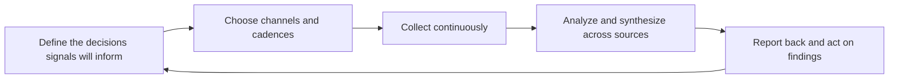

# Feedback Systems and Surveys

> **Core skill:** Building durable mechanisms — surveys, advisory groups, community channels, telemetry — that collect developer input continuously, and closing the loop so contributors see their input matter.

## Why This Matters

Research studies answer questions; feedback systems keep answers flowing when nobody is running a study. The advocate's advantage is position — inside the community, trusted by developers, present in the channels where opinions actually form — and a system converts that position from a series of lucky observations into a standing pipeline of evidence. Without one, the organization hears only what arrives loudly: escalations, viral complaints, and the opinions of whoever is nearest.

The second half of the system is the loop. Developers who report problems and hear nothing back stop reporting, and their silence is misread as satisfaction. A visible loop — we heard this, here is what happened, here is what we cannot do and why — is the single most effective way to keep the pipeline open. It is also brutally honest work: closing loops means committing to act or explain on the record.

Systems fail when they collect without consuming. A survey that runs quarterly and produces a PDF that nobody reads is worse than no survey: it spends the community's goodwill on data that changes nothing. The design principle that prevents this is demand-first: define who will act on each signal and how, before asking anyone anything. No consumer, no collection.

## The Feedback Portfolio

| Channel | Strength | Weakness | Cadence |
|---|---|---|---|
| Product surveys | Reach; comparability across periods | Low depth; survey fatigue | Quarterly or release-linked |
| Advisory groups | Depth; continuity; early signal access | Small biased sample; management overhead | Monthly or per-cycle |
| Community channels | Real-time pulses; real language | Noisy; self-selected voices | Continuous; summarized weekly |
| Support and issue mining | Severity; exact reproduction | Skewed to blockers | Continuous; digested monthly |
| Telemetry and analytics | Actual behavior at scale | Silent on intent and emotion | Continuous; reviewed in planning |
| Event and conference conversations | Fresh perspectives; evaluators | Anecdotal until aggregated | Per event; debrief within a week |

## Survey Design That Works

| Pitfall | Why It Fails | Better |
|---|---|---|
| Long forms | Completion collapses after five minutes | One decision per survey; branch deeper paths |
| Leading questions | Answers confirm the author's hopes | Neutral wording; test phrasing on colleagues |
| Predicted-behavior questions | Intentions do not predict usage | Ask about last-time behavior and frequency |
| No segmentation | One aggregate score hides every real difference | Capture role, maturity, and context fields |
| No baseline | A number with no comparison means nothing | Repeat questions to build trend lines |
| No follow-up path | Interesting answers are unexplorable | Optional contact field and a short opt-in list |

## Running a Feedback Loop

| Stage | Practice | Owner |
|---|---|---|
| Define | Name the decision each signal will inform | Program owner |
| Collect | Run channels on a steady cadence; respect fatigue limits | Advocate |
| Synthesize | Merge with support, telemetry, and research into one picture | Advocate |
| Route | Deliver findings to the teams who act on them | Program owner |
| Act or explain | Ship changes, or state publicly why not | Product, docs, support |
| Report back | Tell contributors what happened, with specifics | Advocate |

## Closing the Loop

| Signal Received | Response | Where It Lands |
|---|---|---|
| Bug report with reproduction | Fix plus credit in release notes | Issue thread; changelog |
| Feature request on the backlog | Public status and criteria; periodic updates | Roadmap channel; advisory group |
| Confusion in a concept | Documentation rewrite; reply in thread | Docs; original thread |
| Feature request declined | Honest explanation with the reason | Thread; FAQ entry |
| Recurring survey theme | Visible roadmap or research response | Blog or community post |

## Feedback Hygiene

| Risk | Mitigation |
|---|---|
| Survey fatigue | Fewer, better surveys; rotate audience subsets |
| Vocal minority capture | Weight by segment; read analytics alongside opinions |
| Silent majority ignored | Watch behavior data for the quiet users' story |
| Feedback theater | Every mechanism names who consumes its output |
| PII and privacy drift | Consent, minimization, and a retention rule per channel |
| Stale questions asked forever | Retire questions that no longer inform a decision |

## Cadence and Ownership

| Mechanism | Cadence | Owner |
|---|---|---|
| Community scan and weekly digest | Weekly | Advocate |
| Support signal digest | Monthly | Advocate with support |
| Product survey | Quarterly | Program owner |
| Advisory group session | Monthly to quarterly | Program owner |
| Loop-closure report | Per cycle, public | Advocate |



## Practical Applications

**Feedback system checklist:**

- [ ] Every channel has a named consumer and a decision it informs
- [ ] Surveys capture segment fields and repeat core questions for trends
- [ ] Signals are merged across sources before conclusions are drawn
- [ ] Contributors receive a specific response within a stated window
- [ ] Declined requests receive honest explanations, on the record
- [ ] Privacy, consent, and retention rules exist per channel

**Survey question template:**

```markdown
# Survey: [Decision it informs]

**Audience:** [segment; sample and size] — **Length:** [minutes]

**Q1 (behavior).** When was the last time you [did the thing]? — [frequency options]
**Q2 (context).** What were you trying to accomplish? — [open; short]
**Q3 (friction).** What, if anything, got in the way? — [open; optional]
**Q4 (segment fields).** Role — Maturity — Team size — Environment
**Q5 (loop).** May we contact you about your answers? — [opt-in]

**Follow-up commitment:** [what will be shared back; by when]
```

## Common Pitfalls

| Pitfall | Why It Is a Problem | Better Approach |
|---------|---------------------|-----------------|
| **Collect without consuming** | Goodwill spent on data nobody acts on | Demand-first: name the consumer before asking |
| **Survey fatigue** | Response rates decay; the sample skews further | Fewer surveys; rotate subsets; value back |
| **Echo chamber channels** | The same vocal members define reality | Weight and segment; read behavior data too |
| **No loop closure** | Contributors stop reporting; silence misread as success | Public reports of what changed and why |
| **Questionnaire as wish list** | Everything asked; nothing decided | One survey, one decision, short form |
| **Privacy drift** | Trust destroyed by careless data handling | Consent, minimization, and retention rules |

## Success Indicators

- Contributors reference past loop closures when reporting again
- Survey response rates hold steady across cycles
- Findings trace through to shipped changes or public explanations
- Planning meetings cite the merged feedback picture, not isolated anecdotes
- New channels get added with a named consumer and a cadence, not by default

## Related Topics

- [[02_Needs_and_Context_Discovery]] — the engagement-scale version of the same listening discipline
- [[04_Support_Signal_Archaeology]] — mining the passive record that complements active channels
- [[05_Developer_Segmentation]] — reading signal differences across audiences
- [[07_Product_Feedback_and_Ecosystem_Strategy/00_overview|Product Feedback and Ecosystem Strategy]] — where synthesized feedback meets product strategy
- [[career-path/14_Product_Manager/05_Product_Analytics/00_overview|Product Analytics (PM)]] — the quantitative side of the same loop

## Summary

Feedback systems and surveys turn community position into a standing evidence pipeline: a portfolio of channels each with a named consumer and cadence, surveys built around one decision with segment fields and trend lines, synthesis that merges signals across sources, routing to teams that act, and a visible loop that tells contributors what happened and why. The system is only as good as its closure — developers keep reporting exactly as long as reporting keeps mattering.
