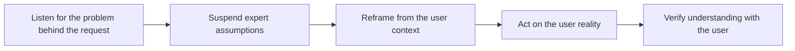

# Empathy as a Professional Skill

> **Core skill:** Maintaining disciplined curiosity and humility about users — the operating stance that keeps content, guidance, and recommendations accurate instead of clever.

## Why This Matters

Empathy in this role is not a personality trait; it is a technical instrument. The advocate who cannot remember what not-knowing feels like writes quickstarts that skip the step where beginners stop. The consultant who cannot hold a customer's constraints without judging them recommends architectures the customer's team cannot carry. Both failures share a root cause: the expert's own fluency substituted for the user's reality.

Professional empathy is also the most fatiguing skill in the area, because it inverts the expert's instincts all day. The expert wants to answer; empathy wants to understand the question first. The expert hears a technically wrong request; empathy hears a person describing a problem badly because the problem is genuinely confusing. Fatigue sets in, shortcuts appear, and the advocate starts responding to the user they remember instead of the one in front of them.

The antidote is method rather than feeling: scheduled exposure to beginner states, friction journals, verbatim capture, perspective checks before shipping content, and recurring calibration against real users. Treating empathy as a practice — with cadence and evidence — is what keeps it honest when the calendar is full and the expert voice is loudest in your own head.

## What Professional Empathy Is And Is Not

| It Is | It Is Not |
|---|---|
| Understanding the user's situation well enough to predict their next question | Agreeing with every request |
| Holding expertise lightly while in the user's context | Pretending to know less than you do |
| Advocacy for accuracy in the user's terms | Cheerleading or niceness |
| A method with practices and evidence | A mood that comes and goes |
| Respect for constraints you have not lived | Excusing poor systems that create those constraints |

## Empathy Failure Modes

| Failure Mode | How It Sounds | Correction |
|---|---|---|
| Expert blindness | It is obvious that you just configure the client | Watch a real beginner do it once |
| Solution deafness | What you actually need is a different approach | Play back the need before proposing |
| Contempt creep | Users never read anything | Read the friction log; most did, and it failed them |
| Audience inflation | Developers will understand this term | Test vocabulary with a fresh segment member |
| Fatigue shortcuts | Reusing the answer from the last three customers | Reconfirm this customer's context before answering |
| Virtue framing | We are the empathetic team | Evidence from sessions, not self-description |

## Practicing Empathy with Method

| Practice | Mechanism | Cadence |
|---|---|---|
| Beginner-state re-exposure | Complete the onboarding fresh, as a newcomer, following only public material | Every release cycle |
| Friction journaling | Record your own stumbles and confusion verbatim while working | Weekly |
| Verbatim listening | Use users' language in notes and drafts, not translations | Every session |
| Perspective check | Before shipping, ask whose view is missing from this material | Before publication |
| Shadowing | Sit with a user or partner team for a real working session | Quarterly |
| Teach-back | Ask a real user to explain your content back to you | Per major asset |

## Perspective Differences to Respect

| Difference | Adjustment |
|---|---|
| Different expertise level | Match assumed context to the audience's real baseline |
| Different ecosystem and language | Avoid idiom and culture-specific references in core material |
| Different organizational constraints | Do not propose what their compliance or capacity cannot absorb |
| Different time pressure | Respect that they are mid-incident when they find your page |
| Different definition of good | Learn their success criteria before setting yours |
| Different emotional state | Frustration is data about the problem, not the person |

## Staying Calibrated Over Time

| Drift Risk | Countermeasure |
|---|---|
| Spending all day with experts | Schedule recurring sessions with beginners |
| Success bias | Talk to users who abandoned, not only those who stayed |
| Answer-treadmill | Protect research time; do not spend the whole week responding |
| Familiarity with your own product | Re-run onboarding; track what you now skip unconsciously |
| Organizational flattery | Keep raw user quotes circulating, not just summaries |
| Growth in status | Keep the beginner practice; it is the calibration instrument |



## Practical Applications

**Empathy practice checklist:**

- [ ] Completed the onboarding objectively within the last release cycle
- [ ] Own friction journal entries exist for this month
- [ ] Content drafts quote user vocabulary, not internal shorthand
- [ ] A perspective check ran before each major asset shipped
- [ ] Spoke with a user who abandoned, not only happy users, this quarter
- [ ] Reconfirmed each active customer's context before the latest recommendation

**Perspective check template:**

```markdown
# Perspective Check: [Asset or Recommendation]

**Primary audience:** [segment; baseline; context of use]
**Whose view is missing:** [beginner; operator; skeptic; constrained team]
**Their likely first question:** [in their words]
**Vocabulary audit:** [terms used; user-verified replacements]
**Constraint honored:** [what this respects about their situation]
**Verification plan:** [who will read it back; when]
```

## Common Pitfalls

| Pitfall | Why It Is a Problem | Better Approach |
|---------|---------------------|-----------------|
| **Empathy as personality** | Depends on mood; disappears under deadline | Method with cadence and evidence |
| **Agreeing as empathy** | Every request validated; guidance loses technical spine | Understand the need; be honest about the fit |
| **Expert re-answer** | The remembered answer replaces the current user | Reconfirm context before responding |
| **Summary-only listening** | Paraphrases flatten the user's language and pain | Keep verbatim quotes in circulation |
| **Happy-user sampling** | Survivors' voices hide why others left | Recruit abandoners and quiet users deliberately |
| **Status drift** | Seniority spends less time near beginners | Scheduled beginner-state exposure |

## Success Indicators

- Developers say the material met them where they were
- Guidance accounts for abandonment cases, not just success stories
- User vocabulary appears verbatim in shipped content
- Colleagues ask for the perspective check before announcements
- Recommendations survive implementation because they honored real constraints

## Related Topics

- [[01_Developer_and_Customer_Research]] — the research methods empathy infuses
- [[02_Needs_and_Context_Discovery]] — holding customer context without judgment
- [[03_Observing_Real_Usage_and_Friction]] — keeping the beginner state visible
- [[career-path/02_Senior_Software_Engineer/06_Communication_and_Influence/02_Stakeholder_Communication|Stakeholder Communication (Senior)]] — perspective-taking in technical communication
- [[06_Community_and_Ecosystem/00_overview|Community and Ecosystem]] — empathy practiced at community scale

## Summary

Empathy as a professional skill is a method, not a mood: knowing the user's situation well enough to predict the next question, holding expertise lightly in their context, and treating curiosity as a maintained instrument — beginner-state exposure each cycle, friction journals, verbatim vocabulary, perspective checks before shipping, and deliberate calibration against the users most easily forgotten. Technical accuracy without it is just plausible; with it, guidance lands.
