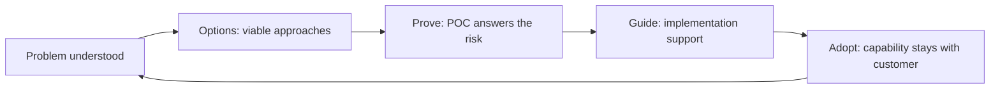

# Solution Guidance

> **Core capability:** The consultant connects customer problems to appropriate technical approaches — options, proofs, implementation guidance, and migration paths — without becoming the customer's outsourced engineering department.

## Why This Matters

Between understanding a problem and shipping a solution sits the consultant's craft: translating needs into viable technical approaches, proving the approach works, and guiding implementation so it succeeds. This is where technical credibility meets customer reality — the recommendations must be sound engineering *and* workable inside the customer's constraints.

The boundary matters: consultants guide, they do not take over. The goal is customer capability, not dependency. The consultant who designs everything becomes the bottleneck; the one who advises well leaves behind a team that can continue alone.

## Topics in This Capability Area

| Topic | Core Skill | When It Matters |
|-------|------------|-----------------|
| [[01_Problem_to_Solution_Mapping]] | Translating discovered needs into technical approaches | Engagement start; design phase |
| [[02_Reference_Architectures_and_Patterns]] | Guiding customers to proven patterns that fit | Solution design; reviews |
| [[03_Proofs_of_Concept_and_Pilots]] | Designing and running POCs that answer real questions | Pre-commitment; risk reduction |
| [[04_Implementation_Guidance]] | Supporting teams during build without taking over | Implementation phase |
| [[05_Migration_and_Upgrade_Guidance]] | Planning and supporting migrations between states | Version upgrades; platform moves |
| [[06_Adoption_Strategy_with_Customers]] | Building adoption roadmaps with customers, not for them | Post-delivery; expansion |
| [[07_Consulting_Boundaries_and_Ethics]] | Knowing when to say no, how to scope, where the line is | Every engagement |

## The Guidance Arc

Each phase reduces customer dependency and increases customer capability.

## Practical Applications

### Solution Guidance Checklist

- [ ] Recommendations cite the customer's constraints, not just best practice
- [ ] Options are presented with trade-offs before a direction is agreed
- [ ] POCs have explicit questions to answer, not just demos to show
- [ ] Implementation support builds customer capability rather than dependency
- [ ] Handover includes the customer team able to continue independently

## Common Pitfalls

| Pitfall | Why It Is a Problem | Better Approach |
|---------|---------------------|-----------------|
| **Taking over the build** | Consultant becomes the permanent contractor | Coach the customer team; review, don't replace |
| **Best-practice blindness** | Textbook architecture ignores customer constraints | Fit advice to context: budget, skills, legacy |
| **POC theater** | Demo optimized to impress; real risk untested | Define the risky question first; test that |
| **Adoption assumption** | Delivery treated as done at go-live | Adoption roadmap: who uses it, how, measured how |

## Success Indicators

- Customers continue successfully after the engagement ends
- Recommendations survive contact with the customer's real environment
- POCs de-risk decisions rather than decorate them
- Adoption grows after delivery because the path was designed

## Related Capabilities

- [[04_Customer_and_Developer_Understanding/00_overview|Customer and Developer Understanding]]: guidance starts from understanding
- [[03_Facilitation_and_Enablement/00_overview|Facilitation and Enablement]]: reviews and workshops as guidance mechanisms
- [[career-path/15_Solutions_and_Enterprise_Architect/02_Solution_Architecture_and_Design/00_overview|Solution Architecture and Design (Solutions Architect)]]: the architecture depth behind guidance
- [[career-path/06_Software_Architect/01_Architecture_Fundamentals/03_Architecture_Patterns_and_Styles|Architecture Patterns and Styles (Architect)]]: the pattern knowledge guidance draws on

## Summary

Solution guidance connects problems to proven approaches: mapping needs to options, proving risk down with POCs, supporting implementation without taking it over, and building adoption paths the customer owns. The consultant's true deliverable is not the solution — it is the customer's capability to run it.