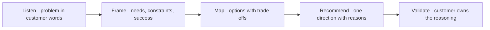

# Problem to Solution Mapping

> **Core skill:** Translating a discovered, messy problem into a small set of viable technical approaches — each traceable to the customer's real constraints, not the consultant's favorite stack.

## Why This Matters

Between a customer's stated problem and a workable solution sits a mapping step most engagements skip: the jump from "we need X" to "here is the architecture" is where recommendations go wrong. The consultant's value is not choosing technology; it is establishing that the technology chosen actually fits the problem as it exists — the constraints, the skills, the budget, the legacy, the politics.

A good mapping makes the problem legible before the solution becomes visible. It separates symptoms from causes, stated wants from underlying needs, and technical problems from process problems wearing technical clothes. The output is not a design; it is a small set of options with trade-offs, each traceable back to evidence.

This discipline also protects the engagement. When options trace to constraints and evidence, the recommendation survives scrutiny; when they trace to preference, the first budget cut or design review dissolves it. Mapping is how guidance stays honest and how the customer keeps ownership of the reasoning.

## From Statement to Capability Need

The first move is reframing: rewrite the request as a problem, and the problem as a capability gap.

| Stated Request | Likely Underlying Need | Capability Question | Trap To Avoid |
|----------------|------------------------|---------------------|---------------|
| "We need a Kubernetes platform" | Standardized deployment; reduced operational toil | What breaks today when teams deploy? | Adopting the tool before the need is proven |
| "Our API needs a rewrite" | Developer productivity; slower change cycles | Where exactly does change cost the most? | Full rewrite when targeted surgery suffices |
| "We need SSO" | Access control and audit compliance | What does compliance actually require, and of whom? | Solving a policy problem with only a protocol |
| "We need real-time everything" | Faster decisions at a few key moments | Which decisions, at what latency, for whom? | Paying streaming complexity for batch needs |
| "We need AI features" | Competitive pressure; manual workload | Which workflow step is manual, repeated, costly? | Feature-shaped solutions without a problem |

The table is a habit, not a form. The goal is to hold the request loosely and the need firmly.

## Framing Questions Before Options

Framing converts a complaint into a bounded problem worth solving:

| Dimension | Question | Why It Changes The Solution |
|-----------|----------|-----------------------------|
| Problem definition | What happens today, step by step, when it fails? | Distinguishes symptom from cause |
| Success definition | What measurable change counts as solved in ninety days? | Sets the bar options must clear |
| Constraints | Budget, skills, timeline, compliance, vendors | Eliminates approaches that cannot survive |
| Stakeholders | Who decides, who pays, who operates, who resists? | Names whose constraints bind |
| Existing assets | What is the team already running and skilled in? | Reuse beats invention when close enough |

## Option Mapping

A recommendation is not a solution; it is a short list with reasoning:

| Approach | Fits When | What It Costs | Key Risk |
|----------|-----------|---------------|----------|
| Extend what exists | Gap is narrow; current system healthy | Least; some design debt accepted | Workarounds calcify |
| Adopt an off-the-shelf component | Need is common; differentiation is elsewhere | Licensing and integration effort | Vendor coupling |
| Build targeted capability | Need is core and differentiating | Engineering time and ownership | Scope creep beyond the need |
| Replatform or rewrite | Current foundation blocks the goal | Highest; retraining and migration | Cost of the migration underestimated |

The discipline: every approach must map to the framed need, and every claim in the table must cite something the customer said or showed.

## The Constraint Filter

| Constraint Type | Example | How It Filters |
|-----------------|---------|----------------|
| Skill reality | Team is strong in Java, weak in Go | Prefer the option the team can run |
| Operational budget | No new headcount for on-call | Eliminate options needing new specialists |
| Compliance | Data residency requirements | Removes regions and managed services |
| Timeline | Decision needed by quarter end | Removes options that cannot show risk reduction in time |
| Political | Two teams must both win | Frames the option as mutual gain |

## The Mapping Sequence



Mapping is not complete when the consultant is convinced; it is complete when the customer can repeat the reasoning without the consultant in the room.

## Practical Applications

### Mapping Checklist

- [ ] The problem is written in the customer's words before any solution language appears
- [ ] Each option maps to a framed need, not to a technology preference
- [ ] Constraints are listed and visibly filter the option set
- [ ] Trade-offs are stated for every option, including the recommended one
- [ ] The customer can explain why the recommendation fits their context
- [ ] Evidence sources are named for every claim about the current state

### Options Register Template

```markdown
## Options Register — [engagement]
| # | Approach | Need It Serves | Trade-Offs | Constraints Cleared | Cost Class |
|---|----------|----------------|------------|---------------------|------------|
| 1 | [extend / adopt / build / replatform] | [need] | [costs, risks] | [list] | [low / medium / high] |

## Recommendation
- Direction: [option]
- Because: [needs + constraints it satisfies]
- Assumptions that would change it: [list]
- Open questions for the POC: [list]
```

## Common Pitfalls

| Pitfall | Why It Is a Problem | Better Approach |
|---------|---------------------|-----------------|
| **Solutioning before framing** | The first plausible architecture anchors everything after it | Frame needs and constraints first; options come second |
| **Single-option recommendation** | No trade-off means no real decision; risk hides | Present two to four options with honest costs |
| **Preference masquerading as analysis** | The customer inherits the consultant's taste as constraint | Trace every option to customer evidence |
| **Symptom-level mapping** | Fixing the visible failure misses the generating cause | Ask what breaks and why, repeatedly |
| **Ignoring the operator** | The team that runs the solution was never in the frame | Include operators in constraints and options |
| **Mapping to the demo** | The impressive path wins over the fitting one | Score options against success criteria, not demos |

## Success Indicators

- The customer repeats the reasoning for the chosen direction in their own words
- Options rejected can be explained as clearly as the option chosen
- Constraint changes visibly change the recommendation, not just the wording
- Implementation starts without re-litigating the decision
- Post-engagement, the customer maps new problems with the same discipline

## Related Topics

- [[02_Reference_Architectures_and_Patterns]]: proven structures that turn mapped options into design
- [[03_Proofs_of_Concept_and_Pilots]]: the next step when mapping leaves real uncertainty
- [[06_Adoption_Strategy_with_Customers]]: the mapped solution only matters if it gets adopted
- [[04_Customer_and_Developer_Understanding/00_overview|Customer and Developer Understanding]]: mapping starts from what discovery found
- [[career-path/15_Solutions_and_Enterprise_Architect/02_Solution_Architecture_and_Design/00_overview|Solution Architecture and Design (Solutions Architect)]]: the architecture depth this mapping feeds

## Summary

Problem to solution mapping is the discipline of holding the request loosely and the need firmly: frame the problem, list the constraints, map a small set of approaches with honest trade-offs, and recommend a direction the customer can defend alone. The mapping is done when the reasoning transfers — not when the consultant is convinced. That transfer is what turns a recommendation into a decision the customer owns.
