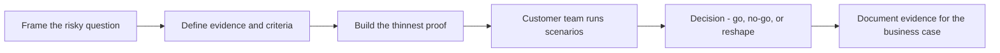

# Proofs of Concept and Pilots

> **Core skill:** Designing small, timeboxed experiments that answer the customer's riskiest question — and ending in a decision, not a demo.

## Why This Matters

Every serious recommendation carries uncertainty: will this integrate with the legacy auth layer, can the team operate it, does it meet the latency target under real load? Proofs of concept exist to buy information, cheaply and early, about exactly those uncertainties. Run well, a POC converts a debate into evidence; run badly, it converts budget into a polished demonstration that proves nothing.

The failure mode is POC theater: a demo shaped to impress, built by the vendor's best engineers, on a path that production will never take. The audience applauds, the purchase happens, and the real risk — the one that will decide success — was never touched. The consultant's craft is choosing the question worth answering, refusing to build anything that does not touch it, and designing the ending: go, no-go, or what must change.

POCs and pilots sit at different points on the same arc. A POC answers a technical question in isolation; a pilot tests the solution under real conditions with real users, before full commitment. Confusing the two produces either an overbuilt experiment or an under-tested rollout.

## POC Versus Pilot

| Dimension | Proof of Concept | Pilot |
|-----------|------------------|-------|
| Question | Can it work at all, here? | Does it deliver value in real conditions? |
| Duration | Days to a few weeks | Weeks to a quarter |
| Environment | Isolated, representative slice | Production-like, real users, real data |
| Success signal | The risky question answered | Measurable outcome against baseline |
| Output | Evidence and decision | Rollout recommendation or rollback |
| Typical cost | Low | Material; bounded by scope |

## Designing the POC

The design starts from the question, not the code:

| Element | Good Practice | Failure Mode |
|---------|---------------|--------------|
| The question | One sentence: what would make us not proceed? | Vague goal like "evaluate the platform" |
| Success criteria | Defined before building; falsifiable | Criteria invented after seeing the results |
| Scope | The thinnest path that touches the risk | Full feature surface, shallow everywhere |
| Environment | As close to the customer's constraints as possible | Vendor lab with none of the real constraints |
| Evaluation | Customer engineers run scenarios themselves | Vendor engineers perform the demo |
| Ending | Scheduled decision session with named deciders | POC drifts on with no decision point |

## The Riskiest Question First

| Risk Category | Example Question | POC Focus |
|---------------|------------------|-----------|
| Integration | Can we connect to the existing identity provider? | Build the connector, not the app |
| Performance | Does it hold the latency budget at peak volume? | Load test the hot path with real profiles |
| Data quality | Is our data clean enough for the model or index? | Data pass, not UI polish |
| Operability | Can our on-call team diagnose a failure? | Injection exercise and runbook draft |
| Compliance | Can data stay inside the required boundary? | Trace the full data path, not a summary |
| Cost | Does the economic model survive real usage? | Meter the POC against realistic volumes |

## The Experiment Arc



## Practical Applications

### POC Checklist

- [ ] The question worth answering is written down and agreed before work starts
- [ ] Success criteria are falsifiable and dated
- [ ] Scope excludes anything that does not touch the risk
- [ ] Customer engineers build or drive the critical scenarios
- [ ] The environment reproduces the binding constraints, not a sanitized version
- [ ] A decision session with named deciders is on the calendar from day one
- [ ] Results are written into a reusable evidence brief, including negative findings

### POC Charter Template

```markdown
## POC Charter — [topic]
- Question: [what uncertainty are we buying down]
- Not in scope: [list]
- Success criteria: [falsifiable, dated]
- Environment: [where it runs, what constraints it honors]
- Who runs the scenarios: [customer engineers by name]
- Timeline: [start, demo-free checkpoints, decision date]
- Decision to be made: [go / no-go / reshape, by whom]
- If no-go: [what we do instead]
```

## Common Pitfalls

| Pitfall | Why It Is a Problem | Better Approach |
|---------|---------------------|-----------------|
| **POC theater** | A curated demo answers the vendor's question, not the customer's | Test the riskiest question on the customer's terms |
| **Moving criteria** | Goalposts shift to rescue a preferred outcome | Freeze criteria before building; publish them |
| **Vendor-run evaluation** | Buy-in dies when the customer only watched | Customer engineers drive the critical scenarios |
| **Kitchen-sink scope** | Breadth destroys the timebox and dilutes the evidence | One question; cut everything else |
| **Pilot without baseline** | No before-numbers means no provable value after | Measure the baseline before the pilot starts |
| **Undecided ending** | The experiment becomes a permanent half-project | Schedule the decision session up front |

## Success Indicators

- The POC answers its question in writing, with evidence the customer accepts
- A decision is made on schedule — including honest no-go decisions
- Customer engineers, not just consultants, can describe what was tested and why
- Negative findings save the customer from a bad commitment
- POCs are cheap relative to the decisions they inform

## Related Topics

- [[01_Problem_to_Solution_Mapping]]: POCs test the riskiest mapped option
- [[02_Reference_Architectures_and_Patterns]]: patterns supply the candidate structure under test
- [[04_Implementation_Guidance]]: a successful POC hands over to guided implementation
- [[05_Migration_and_Upgrade_Guidance]]: pilots are the rehearsal for migration cutovers
- [[career-path/15_Solutions_and_Enterprise_Architect/02_Solution_Architecture_and_Design/00_overview|Solution Architecture and Design (Solutions Architect)]]: how POC evidence feeds the full design

## Summary

Proofs of concept and pilots are information purchases: frame the risky question, define falsifiable criteria, build only the thinnest proof, let the customer's engineers drive, and end at a scheduled decision. The measure of a good POC is not what it demonstrated but what it changed — a commitment made on evidence, or a costly mistake avoided while it was still cheap to avoid.
