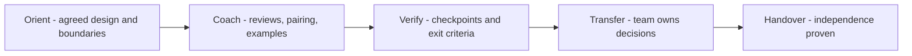

# Implementation Guidance

> **Core skill:** Supporting a customer team through the build — reviewing, coaching, and unblocking — without quietly becoming the team that actually does the work.

## Why This Matters

The implementation phase is where guidance either compounds or collapses into dependency. A consultant who steps in to write the hard parts because the deadline is close creates a debt of competence: when the engagement ends, the knowledge leaves with them and the system becomes an orphan. The disciplined alternative is slower for a week and faster for a year — coach the team past the hard part rather than doing it for them.

Implementation guidance is also where the design meets reality. Decisions made during discovery get stress-tested by real code, real data, and real timelines; guidance must adapt to what is learned without arbitrarily drifting from the agreed direction. The consultant's value is noticing when reality invalidates a design assumption and helping the customer re-decide consciously, rather than watching the architecture erode one expedient at a time.

The commercial subtext is real: the customer bought outcomes, not hours, but an engagement that becomes permanent outsourcing serves nobody well — not the customer's growth, not the consultant's portfolio of successful independences. Everything in this note exists to keep capability inside the customer's team.

## The Guide-Don't-Build Boundary

| Activity | The Consultant Does | The Customer Team Does |
|----------|---------------------|------------------------|
| Architecture decisions | Frames options, reviews, records rationale | Makes and owns the decision |
| Hard implementation | Pairs, demonstrates a technique once | Writes the production code |
| Code review | Reviews critical paths as a coach | Reviews the rest as owners |
| Testing | Helps define the strategy and gates | Owns and writes the tests |
| Operations | Advises on runbooks and alerts | Carries and answers the pager |
| Documentation | Models good structure; reviews | Writes and maintains the docs |

The boundary bends in emergencies, and bends back after. Whatever the consultant touches in a crisis is a teaching debt to repay.

## Support Modes

Different moments call for different guidance intensity:

| Mode | What It Looks Like | Use When | Watch For |
|------|--------------------|----------|-----------|
| Advisory | Scheduled reviews; team runs itself | Team is skilled; stakes are normal | Drifting away from the design |
| Pairing | Consultant and customer engineer at one keyboard | A skill must transfer on a real task | Consulting hijacks the keyboard |
| Demonstration | Consultant builds a thin example, then hands over | The technique is unfamiliar | The example becomes the codebase |
| Joint design session | Whiteboard alternatives together | A novel decision has arisen | Consultant decides by seniority |
| Troubleshooting | Structured debugging alongside the team | An incident threatens the timeline | Hero mode; no write-up of the lesson |

## Review Checkpoints

Guidance needs cadence and exit criteria, or it becomes drive-by opinion:

| Checkpoint | Question | Exit Criteria |
|------------|----------|---------------|
| Design walkthrough | Does the plan match the agreed direction? | Team presents; consultant asks, not tells |
| First vertical slice | Does the thinnest end-to-end path work? | Slice runs in a production-like environment |
| Hard part review | Is the riskiest component sound? | Specific concerns resolved or scheduled |
| Pre-production review | Are operations, security, and rollout ready? | Runbooks, alerts, and rollback tested |
| Handover review | Can the team continue without the consultant? | Named owner for every open area |

## Detecting Drift

Design drift is normal; silent drift is not. Review the codebase and decisions against the agreed design at each checkpoint. When reality has outgrown an assumption, help the team re-decide openly and update the record — conscious evolution is architecture; unconscious erosion is future archaeology.

## The Guidance Arc



## Practical Applications

### Implementation Guidance Checklist

- [ ] The guide-don't-build boundary is agreed with the customer and visible
- [ ] Every consultant-authored artifact has a customer owner
- [ ] Checkpoints are scheduled with explicit exit criteria
- [ ] Hard parts transfer a technique, not just a fix
- [ ] Design deviations are re-decided openly and recorded
- [ ] The handover review names an owner for every open area
- [ ] No consultant-only shortcuts remain in the critical path

### Guidance Session Template

```markdown
## Guidance Session — [date]
- Goal: [what the team should own after this session]
- Reviewed: [components, decisions, code paths]
- Found: [risks, drift, gaps — with evidence]
- Coached: [what was demonstrated or paired on]
- Handed over: [what the team will do next, by when]
- Next checkpoint: [date, exit criteria]
```

## Common Pitfalls

| Pitfall | Why It Is a Problem | Better Approach |
|---------|---------------------|-----------------|
| **Rescue coding** | Deadline pressure tempts the consultant to take the keyboard | Pair and transfer; be slow now to be fast later |
| **Advice without owners** | Recommendations evaporate without accountable names | Every action gets a customer owner and a date |
| **Checkpoint theater** | Reviews happen but nothing exits | Exit criteria per checkpoint, enforced kindly |
| **Silent drift** | Small expedients accumulate into an unintended architecture | Review against design each checkpoint; re-decide openly |
| **Hero mode** | The consultant becomes the single point of success | Rotate pairing partners; document as you go |
| **Indefinite handover** | The engagement never ends because dependence is comfortable | Define independence criteria and a date |

## Success Indicators

- The customer team ships changes without consultant review
- Customer engineers lead design walkthroughs and defend the architecture
- Open items have customer owners; consultant involvement shrinks on schedule
- Design drift is caught at checkpoints and consciously resolved
- On engagement end, nobody asks "who will maintain this?" — the answer is obvious

## Related Topics

- [[03_Proofs_of_Concept_and_Pilots]]: implementation guidance begins from proven assumptions
- [[05_Migration_and_Upgrade_Guidance]]: the most safety-critical form of guided build
- [[07_Consulting_Boundaries_and_Ethics]]: the boundary discipline that keeps guidance honest
- [[03_Facilitation_and_Enablement/00_overview|Facilitation and Enablement]]: reviews and workshops are guidance instruments
- [[career-path/07_SRE_and_Platform_Engineer/06_Developer_Platform/00_overview|Developer Platform (SRE)]]: operability guidance for what the team will run

## Summary

Implementation guidance is coaching with stakes: hold the guide-don't-build line, match support intensity to the moment, run checkpoints with real exit criteria, catch drift while it is still a decision, and design the ending — a team that owns the system completely. The consultant's success is measured in what the customer can do after the engagement that they could not do before it.
