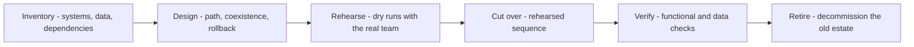

# Migration and Upgrade Guidance

> **Core skill:** Planning and supporting moves between states — version upgrades, platform changes, and data migrations — so that cutovers are rehearsed, reversible, and boring.

## Why This Matters

Migrations are where accumulated design debt comes due. Every shortcut, undocumented dependency, and forgotten integration sits in the path between the current state and the target state, and the migration plan is the document that either finds them in advance or meets them in production. Customers do not remember the clever architecture from the design phase; they remember whether the cutover weekend went quietly.

The consultant's leverage in a migration is disproportionate. An hour spent inventorying dependencies saves a week of incident response; a rehearsal of the cutover exposes a broken step while it is still a schedule slip instead of an outage. Migration guidance is largely about converting unknowns into rehearsals until nothing on cutover day is being attempted for the first time.

Version upgrades are migrations in miniature, and they follow the same arc: assess what depends on the current state, plan coexistence and rollback, rehearse, cut over, verify, and only then decommission the old world. The discipline scales from a minor dependency bump to a multi-year platform exit.

## Migration Types and Their Risks

| Migration Type | Example | Dominant Risk | Notes |
|----------------|---------|---------------|-------|
| Version upgrade | Runtime or database major version | Hidden breaking changes in dependencies | Usually rehearsable end to end |
| Platform move | On-premise to cloud, or between providers | Environmental differences; network and identity | Inventory of external interfaces is critical |
| Data migration | Schema redesign; system of record change | Silent data loss; dual-write conflicts | Verification queries are the safety net |
| Vendor exit | Replacing a SaaS with build or another vendor | Contractual and functional gaps | Exit plan is part of the original lock-in decision |
| Architecture migration | Monolith to services; batch to streaming | Behavioral drift during coexistence | Strangler seams keep the blast radius small |

## The Migration Plan

| Phase | Activities | Exit Criteria |
|-------|-----------|---------------|
| Inventory | Map systems, dependencies, data volumes, owners, interfaces | A diagram and list every stakeholder recognizes |
| Assess | Classify items: move as-is, adapt, rewrite, retire | Every item has a disposition and an owner |
| Design the path | Choose coexistence model, cutover strategy, rollback | Rollback is documented and plausible at every step |
| Rehearse | Dry runs in a production-like environment, with timing | The full sequence has run at least once, by the people who will run it |
| Cut over | Execute the rehearsed plan in a change window | Checklist complete; go or rollback decision made promptly |
| Verify | Functional, data, and performance verification against baselines | Baselines met; discrepancies explained |
| Decommission | Retire the old path, revoke access, archive data | No traffic or dependency remains; cost actually drops |

## Cutover Strategies

| Strategy | Fits When | Risk Profile |
|----------|-----------|--------------|
| Big bang | The old and new worlds cannot coexist | Highest; requires the most rehearsal |
| Phased by segment | Workloads can be moved in groups | Moderate; each phase teaches the next |
| Parallel run | Correctness must be proven against production output | Costly but safest for data-critical moves |
| Incremental strangling | A seam exists between old and new | Lowest per step; longest calendar |
| Blue-green swap | Both environments can run identical stacks | Fast rollback until the first write diverges |

## Coexistence Discipline

Most migrations spend most of their life in coexistence, and that is where complexity concentrates: dual writes, sync jobs, and version skew. Keep the coexistence surface as small as possible, assign an explicit owner and end date to every bridge, and instrument the bridges so the team can see when they are safe to remove.

## The Migration Sequence



## Practical Applications

### Migration Checklist

- [ ] Inventory is validated by the people who run the systems, not only from documents
- [ ] Every item has a disposition: move, adapt, rewrite, or retire
- [ ] Rollback is documented and has been attempted at least in a rehearsal
- [ ] The people who will execute the cutover are the people who rehearsed it
- [ ] Data verification queries are written before the migration, with expected results
- [ ] Coexistence bridges have owners, instrumentation, and end dates
- [ ] Decommissioning is planned, funded, and actually happens

### Migration Plan Template

```markdown
## Migration Plan — [source to target]
- Scope: [systems, data, interfaces in and out]
- Out of scope: [explicit exclusions]
- Coexistence model: [dual run / bridge / facade] — owner: [name]
- Cutover strategy: [big bang / phased / parallel / strangler]
- Rollback: [trigger conditions, steps, maximum time]
- Rehearsal log: [date, environment, findings, fixes]
- Verification: [queries, checks, baselines, acceptance]
- Decommission date: [date] — owner: [name]
```

## Common Pitfalls

| Pitfall | Why It Is a Problem | Better Approach |
|---------|---------------------|-----------------|
| **Paper inventory** | Documents lie; runtime dependencies do not | Validate with runtime traces and the operators |
| **No rollback plan** | A failed cutover becomes an indefinite outage | Every step reversible or explicitly one-way |
| **Rehearsal skipped** | Cutover day is the first run of a complex sequence | Dry run the full sequence with the real team |
| **Permanent coexistence** | Bridges quietly become architecture | Owner and end date on every bridge |
| **Untested verification** | Discovery of data loss after decommission | Verify against baselines before retiring anything |
| **Deferred decommission** | The old estate runs forever, paying double | Fund and schedule retirement from day one |

## Success Indicators

- Cutovers run as rehearsed, with no first-time steps in production
- Rollback exists, is tested, and — when invoked — works as documented
- Data verification passes before the old system is retired
- Coexistence bridges are removed on schedule, with their owners named
- The old estate's costs actually disappear after decommission

## Related Topics

- [[04_Implementation_Guidance]]: migrations are implementation with the highest stakes
- [[01_Problem_to_Solution_Mapping]]: the target state should trace to a framed need
- [[06_Adoption_Strategy_with_Customers]]: teams must adopt the new state for the move to count
- [[career-path/07_SRE_and_Platform_Engineer/06_Developer_Platform/00_overview|Developer Platform (SRE)]]: platform migrations and the operational discipline behind them
- [[04_Customer_and_Developer_Understanding/00_overview|Customer and Developer Understanding]]: migration surprises hide in how people actually work

## Summary

Migration and upgrade guidance converts a dangerous one-time event into a rehearsed sequence: inventory reality, design coexistence with rollback, rehearse with the people who will execute, verify against baselines, and retire the old estate on schedule. The measure of a guided migration is not heroics on cutover night — it is a cutover so boring that it is remembered as a non-event.
