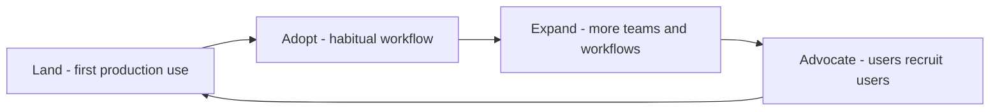

# Adoption Strategy with Customers

> **Core skill:** Building the roadmap from delivery to habitual use — with the customer, not for them — so the solution earns its value through adoption rather than assumption.

## Why This Matters

Delivery is not adoption. A system can be perfectly built, pass every acceptance test, and still sit largely unused six months later because the humans it was meant to serve were never brought along. Adoption is a change program: habits, workflows, skills, and incentives all have to move, and none of them move because a go-live date was met.

The consultant's posture here is decisive. Adoption roadmaps written *for* the customer are the customer's homework; adoption roadmaps built *with* the customer are their plan. The difference shows up in who runs the enablement, who chases stragglers, and who owns the metrics — in an owned plan, those are customer names; in a handed-over document, they remain the consultant's problem until the engagement ends, at which point adoption quietly plateaus.

Adoption also has a compounding structure: land, then adopt, then expand, then advocate. Teams that adopt one workflow become the reference for the next; customer champions become the proof that carries the next business unit. The consultant who designs for this progression leaves behind not a satisfied account but a propagating one.

## Adoption Is a Program, Not an Event

| Phase | Goal | Mechanism | Metric |
|-------|------|-----------|--------|
| Land | First real use in production | Guided onboarding; one workflow live | Time to first production use |
| Adopt | Habitual use by the target group | Training, office hours, embedded support | Weekly active usage of the feature |
| Expand | Reach beyond the first team | Internal champions; success stories | Number of teams, breadth of workflows |
| Advocate | Users recruit and defend | Community, references, feedback loop | Referrals, unsolicited praise, testimonials |

Each phase has a gate: do not push expansion while first-team adoption is not habitual; do not chase references while the core users are still struggling.

## The Adoption Roadmap

| Audience | What They Need | Enablement Mechanism | Owner |
|----------|----------------|----------------------|-------|
| Hands-on users | Skills and quick wins | Guided pilots; paired sessions | Customer team lead |
| Technical owners | Operability confidence | Runbook reviews; failure drills | Customer engineer |
| Managers | Effort-to-value clarity | Before-and-after metrics review | Consultant plus sponsor |
| Adjacent teams | A believable path in | Champion-led demos; starter templates | Champion network |
| Support and ops | Escalation clarity | Trained first line; known-issue list | Customer support lead |

## Working With Champions

Champions are the engine of durable adoption: early adopters who teach their peers, surface friction, and give the program credibility that no consultant can supply.

| Champion Role | Contribution | Support Provided |
|---------------|--------------|------------------|
| Early adopter | Proves value in a real workflow | Priority access and fixes |
| Peer trainer | Scales enablement beyond the consultants | Materials, office hours, recognition |
| Feedback conduit | Routes friction to the team | A fast path and visible follow-through |
| Internal advocate | Argues for expansion in internal forums | Evidence and stories, packaged |

Champions are not a free resource; treat their time as a real cost, ask before assuming, and recognize their contribution publicly.

## Adoption Risks to Watch

| Risk | Early Signal | Response |
|------|--------------|----------|
| Workflow mismatch | Users keep the old process alongside the new | Revisit the workflow with real users |
| Champion burnout | Enthusiasm drops; questions go unasked | Reduce load; add supporters; recognize |
| Silent abandonment | Usage decays after the launch push | Reactivation check-ins; discover why |
| Manager detachment | Sponsors stop quoting the metrics | Re-anchor the business case with them |
| Support gap | First line cannot answer common questions | Train, document, and instrument the support path |

## The Adoption Arc



## Practical Applications

### Adoption Checklist

- [ ] The adoption roadmap was written in working sessions with the customer team
- [ ] Every enablement item has a customer owner, not a consultant owner
- [ ] Success metrics per phase are defined before the phase starts
- [ ] Champions are identified, asked, supported, and recognized
- [ ] The old and new workflows are compared honestly with real users
- [ ] A reactivation plan exists for usage decay after launch
- [ ] The expansion case is evidenced by the first team's real results

### Adoption Roadmap Template

```markdown
## Adoption Roadmap — [solution]
| Phase | Users | Enablement | Owner | Metric | Target Date |
|-------|-------|------------|-------|--------|-------------|
| Land | [team] | [activities] | [name] | [metric] | [date] |
| Adopt | [team] | [activities] | [name] | [metric] | [date] |

## Champions
| Name | Role | Workflow | Support Committed | Recognition |
|------|------|----------|-------------------|-------------|

## Risks
- [risk] — signal: [x] — response: [y] — owner: [name]
```

## Common Pitfalls

| Pitfall | Why It Is a Problem | Better Approach |
|---------|---------------------|-----------------|
| **Go-live as finish line** | Usage decays once launch attention moves on | Treat launch as the start of the adopt phase |
| **Adoption plan written for them** | The customer inherits homework and defers it | Co-author the roadmap; customer owners throughout |
| **Training without workflow** | Skills with nowhere to be used evaporate | Anchor training in the user's real workflow |
| **Champion exploitation** | Unpaid, unrecognized labor burns out fast | Ask, support, credit, and limit the ask |
| **Chasing expansion early** | Breadth lands on an unproven core | Gate expansion on first-team habit metrics |
| **Invisible decay** | Nobody owns the usage dashboard | Instrument usage; review it monthly with owners |

## Success Indicators

- Usage becomes habitual before expansion begins; the gates are respected
- Customer owners can run enablement sessions without the consultant present
- Champions are visible, appreciated, and still enthusiastic a quarter later
- Manager sponsors quote adoption metrics voluntarily
- Expansion requests come from inside the customer organization

## Related Topics

- [[04_Implementation_Guidance]]: adoption begins where guided implementation ends
- [[01_Problem_to_Solution_Mapping]]: adoption metrics should trace to the framed success definition
- [[06_Community_and_Ecosystem/00_overview|Community and Ecosystem]]: champions live between the account and the community
- [[07_Product_Feedback_and_Ecosystem_Strategy/00_overview|Product Feedback and Ecosystem Strategy]]: adopters are the richest feedback source
- [[career-path/14_Product_Manager/00_overview|Product Manager]]: adoption outcomes are the product-side counterpart

## Summary

Adoption strategy turns delivery into value: plan land, adopt, expand, and advocate as distinct phases with gates, build the roadmap with the customer so owners are internal, work through champions who are asked, supported, and recognized, and instrument usage so decay is caught while it can still be reversed. The consultant's real deliverable is not a live system — it is a system the customer's people actually use and would recommend.
