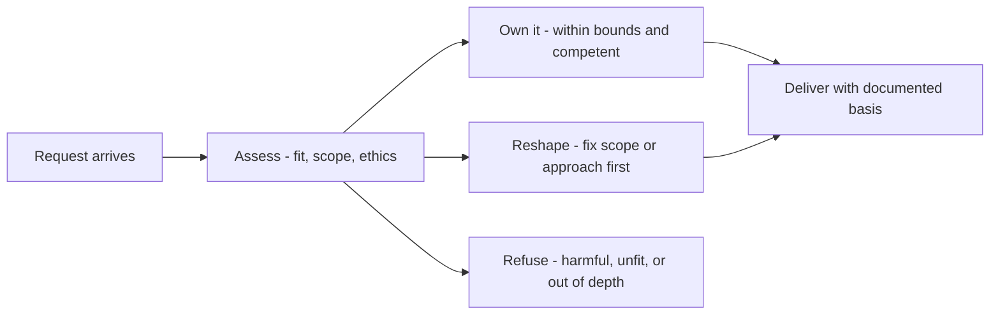

# Consulting Boundaries and Ethics

> **Core skill:** Knowing where the consultant's mandate ends — scoping work honestly, refusing what should be refused, and advising in the customer's interest even when it is inconvenient.

## Why This Matters

Every consulting engagement runs on an invisible contract: the customer trusts that the advice they receive is aimed at their success, not at the consultant's convenience, quota, or ego. That trust is the entire asset. It is also easy to trade away in small ways — recommending the tool you know instead of the tool that fits, staying quiet about a design you believe will fail, extending an engagement because the revenue is comfortable.

Boundaries make the trust concrete. A consultant with visible boundaries — what they will do, what they will not, when they will say no — is easier to trust than one who agrees to everything. Saying no to a badly scoped engagement is not a lost sale; it is a demonstration that the consultant's yes means something.

Technical consulting adds its own ethical layer: advice shapes systems that people depend on. Recommending a fragile architecture to close a deal, hiding a known limitation, or letting a customer build on an assumption you know is false are all ordinary-looking decisions with consequences that outlast the engagement. The standard is simple to state and demanding to practice: give the advice you would want to receive, and make its basis visible.

## The Boundary Framework

| Situation | The Temptation | The Disciplined Move |
|-----------|----------------|----------------------|
| Customer asks for resourcing beyond scope | Staff up; bill more | Coach the customer team; refuse to become the vendor's substitute |
| A deliverable is impossible on the timeline | Accept silently; hope | Surface the conflict; renegotiate scope or date |
| The customer wants a design you believe will fail | Build it; their call | Document the objection; offer alternatives; record the decision |
| You are asked to recommend your own product where it does not fit | Win the deal | Name the fit honestly; a wrong fit costs more later |
| The engagement keeps extending | Enjoy the revenue | Test whether the customer is growing or hiding |
| Someone asks you to skip a review step "just this once" | Be flexible | Hold the step; explain why it exists |

## Scoping Honestly

Scope is an ethics instrument: a vague scope lets both sides interpret success differently, and the consultant usually wins the ambiguity in the short term and loses the relationship in the long term.

| Scope Signal | Why It Matters | Response |
|--------------|----------------|----------|
| "Just make it work" | Success is undefined; blame is guaranteed | Convert to measurable outcomes before starting |
| Open-ended availability | Consultancy becomes staff augmentation | Cap hours and name a deliverable per phase |
| Success defined as effort | Nobody can tell when the work is done | Anchor on outcomes, not activity |
| Scope widening mid-engagement | Silent creep erodes quality and trust | Change control: explicit trade-off discussions |
| Success depends on a third party | The consultant is set up to fail | Name the dependency and its risk in the plan |

## Ethics in Technical Advice

| Principle | In Practice |
|-----------|-------------|
| Customer interest first | The recommendation that serves them beats the one that serves you |
| Honest uncertainty | Say "I do not know" and say how you would find out |
| Full-cost disclosure | State costs, lock-in, and failure modes, not only benefits |
| No self-serving bias | Disclose when options benefit your employer or partners |
| Reversibility preference | Prefer advice that leaves the customer options open |
| Documented dissent | When overruled, record the objection and the decision |

## Boundaries Around Expertise

A boundary that consultants underrate is the edge of their own competence. Advising confidently outside your expertise is not a service; it is a risk transferred to the customer invisibly. The disciplined move is to name the edge — "this is outside my depth; here is who should review it" — which builds more trust than a fluent guess ever does. The same applies to organizational politics: consultants can advise on systems, but should be careful about manipulating internal power dynamics, even when invited.

## The Boundary Decision



## Practical Applications

### Boundary Checklist

- [ ] Success is defined in measurable outcomes before the engagement starts
- [ ] Deliverables and hours per phase are explicit, with change control
- [ ] Adjustments for fit and conflict are named before signing, not after
- [ ] When I disagree with a customer decision, my objection is documented
- [ ] My own competence limits are stated openly where they apply
- [ ] Every extension is justified by progress toward the outcome, not by continuity
- [ ] Advice never trades the customer's interest for my employer's

### Engagement Boundary Template

```markdown
## Engagement Boundaries — [customer]
- Outcome: [measurable success definition]
- In scope: [deliverables per phase]
- Out of scope: [what we will coach instead of do]
- Decision rights: [who decides what]
- Review checkpoints: [when success is checked]
- Disclosures: [product interests, partner interests, known limitations]
- Exit criteria: [when the engagement ends, how capability transfers]
- Change control: [how scope changes are agreed and priced]
```

## Common Pitfalls

| Pitfall | Why It Is a Problem | Better Approach |
|---------|---------------------|-----------------|
| **Vague scope** | Success means different things to both sides | Measurable outcomes and explicit exclusions |
| **Serving the deal** | Fitting advice bends to closing pressure | Disclose interests; recommend against when warranted |
| **Silent dissent** | Disagreement unhappens; consequences do not | Document objections; keep advising after being overruled |
| **Competence overreach** | Confident advice outside your depth transfers hidden risk | Name the edge; bring in the right expert |
| **Dependency by design** | Permanent consultants mean a stalled customer | Design capability transfer into every engagement |
| **Scope by inertia** | Extensions accumulate without justification | Tie every extension to the original outcome |

## Success Indicators

- The customer can name what you advised against, and it is on record
- Declined or reshaped engagements are respected, not resented
- Customers grow more independent as the engagement proceeds
- Your recommendations hold up when reviewed by third-party experts
- The customer asks for you again when a genuinely hard problem appears

## Related Topics

- [[04_Implementation_Guidance]]: boundaries are enforced day to day during the build
- [[06_Adoption_Strategy_with_Customers]]: adoption plans must transfer capability, not retain it
- [[01_Problem_to_Solution_Mapping]]: honest mapping is where self-serving advice gets exposed
- [[03_Facilitation_and_Enablement/00_overview|Facilitation and Enablement]]: neutral facilitation is boundary discipline in action
- [[career-path/03_Staff_Engineer/04_Influence_and_Alignment/00_overview|Influence and Alignment (Staff)]]: influence without authority demands visible ethics

## Summary

Consulting boundaries and ethics are the discipline that makes the rest of solution guidance trustworthy: scope in measurable outcomes, refuse what should be refused, disclose costs and interests, document dissent, stay inside your competence, and always advise as the customer's advocate. The engagement that ends with an independent customer was the one that started with boundaries set before there was anything to gain from bending them.
