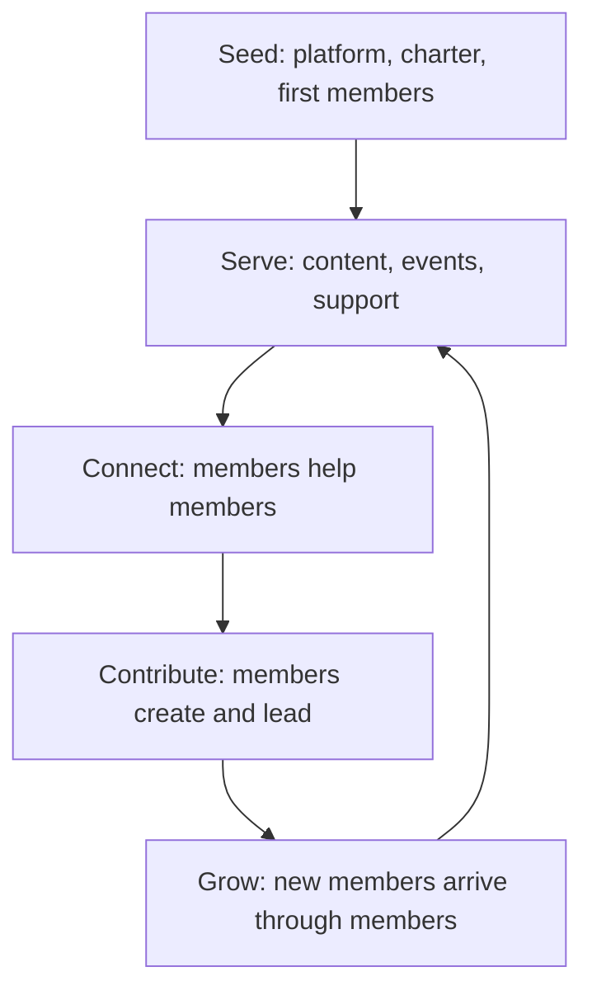

# Community and Ecosystem

> **Core capability:** The advocate builds durable learning and feedback networks — communities, programs, events, and open-source relationships — that create value for members and organizational insight for the sponsor.

## Why This Matters

Communities compound: members help each other, content multiplies, and trust accrues to the organization behind the community. But communities cannot be manufactured — they can only be seeded, served, and sustained. The advocate's role is stewardship: creating conditions where developers and partners form connections, learn together, and stay engaged.

The ecosystem dimension extends further: open-source projects, partner organizations, conferences, and platform relationships form a web that no single company controls but every technology company depends on. Advocates operate at these nodes — representing the organization outward and the ecosystem inward.

## Topics in This Capability Area

| Topic | Core Skill | When It Matters |
|-------|------------|-----------------|
| [[01_Community_Building_Fundamentals]] | Establishing and nurturing developer communities | Program start; community health |
| [[02_Developer_Programs_and_Relationships]] | Champion, ambassador, and partner programs | Ecosystem growth |
| [[03_Open_Source_Engagement]] | Participating in and supporting OSS communities | OSS strategy; contributions |
| [[04_Events_and_Conferences]] | Speaking, sponsoring, and running developer events | Visibility; recruitment; trust |
| [[05_Community_Programs_and_Content]] | Hackathons, office hours, newsletters, learning series | Engagement cadence |
| [[06_Community_Health_and_Moderation]] | Codes of conduct, moderation, healthy participation | Always; protecting the space |
| [[07_Measuring_Community_Impact]] | Metrics that matter: participation quality, outcomes | Reporting; program design |

## The Community Flywheel

The flywheel turns when members start producing value for each other — that is the moment a community exists.

## Practical Applications

### Community Checklist

- [ ] The community has a clear purpose members would state the same way
- [ ] Participation pathways exist from lurking to contributing to leading
- [ ] Moderation and a code of conduct protect the space
- [ ] Events and content run on a sustainable cadence
- [ ] Impact is measured by outcomes (contributions, retention, referrals), not vanity counts

## Common Pitfalls

| Pitfall | Why It Is a Problem | Better Approach |
|---------|---------------------|-----------------|
| **Community as marketing channel** | Members detect extraction; engagement collapses | Serve member value first; advocacy follows |
| **Founder dependency** | Community dies when the advocate moves on | Grow leaders; delegate programs to members |
| **Vanity metrics** | Big membership numbers, dead conversation | Measure weekly active participation and contribution |
| **Unmoderated growth** | Toxicity drives out the people you needed | Active moderation; visible code of conduct |

## Success Indicators

- Members answer each other's questions without staff prompting
- Member-led content, meetups, or projects emerge independently
- Community-sourced feedback reaches product with regularity
- Churn and toxicity stay low as the community grows

## Related Capabilities

- [[01_Technical_Communication/00_overview|Technical Communication]]: the content that starts conversations
- [[07_Product_Feedback_and_Ecosystem_Strategy/00_overview|Product Feedback and Ecosystem Strategy]]: community as insight source
- [[career-path/03_Staff_Engineer/07_Organizational_Learning_and_Mentoring/03_Communities_of_Practice|Communities of Practice (Staff)]]: internal community parallels
- [[career-path/02_Senior_Software_Engineer/06_Communication_and_Influence/00_overview|Communication and Influence (Senior)]]: relationship foundations

## Summary

Community and ecosystem work is stewardship: seeding spaces with purpose, serving them until members serve each other, and sustaining them through programs, events, and healthy moderation. The test of advocacy at scale is a community that thrives — and keeps giving back — long after the advocate stops pushing.