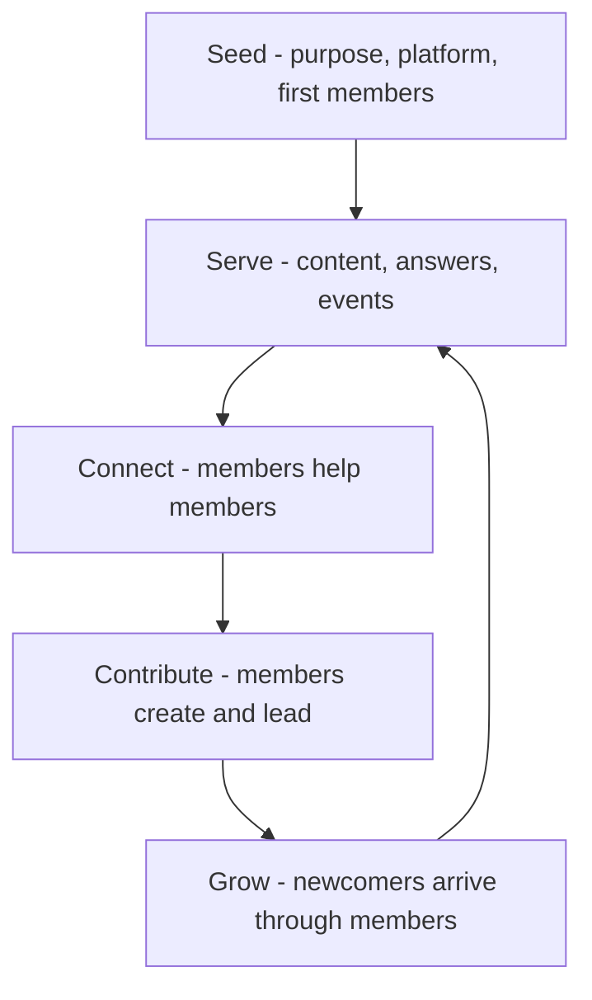

# Community Building Fundamentals

> **Core skill:** Seeding and stewarding a developer community — purpose, platform, first members, and the participation ladder — so members eventually create value for each other.

## Why This Matters

A community exists at the moment members help each other without staff prompting. Everything before that moment is construction; everything after it is stewardship. Advocates who understand this distinction stop measuring launch metrics — sign-ups, first posts — and start watching for the real ignition event: an answer from a member to a member, a user-written guide, a meetup run by someone who does not work for the company.

Communities cannot be manufactured, only cultivated. The soil is purpose: a clear answer to "why does this space exist, and who is it for?" that members would state the same way. The water is participation: making it easy to go from lurker to contributor to leader. The light is recognition: making contribution visible and valued. Miss any of the three and the space becomes either a ghost town or a marketing channel in disguise — and developers can tell the difference within a week.

The advocate's discipline is patience with structure. Most community failures are impatience failures: launching wide before the purpose is sharp, recruiting thousands before the first ten are served, automating before there is anything worth automating. The fundamentals are unglamorous and they work.

## Purpose Before Platform

| Charter Element | Question It Answers | Failure Signal |
|-----------------|---------------------|----------------|
| Purpose | Why does this space exist? | Members describe it as "the company's forum" |
| Audience | Who is it for, and who is it not for? | Everyone is invited; nobody feels addressed |
| Value exchange | What do members get for participating? | Staff do all the helping |
| Norms | How do we treat each other here? | First conflicts have no reference point |
| Boundaries | Where does company interest end and community interest begin? | Members suspect every post is marketing |
| Success | What does a healthy version look like in a year? | Success is measured only in member count |

## Stages of Community Growth

| Stage | Focus | The Tell |
|-------|-------|----------|
| Seeding | Purpose, platform, and ten committed members | Staff carry all conversation |
| Emergence | Regular activity; first norms form | Members answer simple questions |
| Growth | Onboarding paths; more contributors | Newcomers cite members, not staff |
| Maturity | Leaders emerge; self-sustaining rituals | Staff absence changes little |
| Renewal | Generational turnover; new themes | A new cohort finds its own voice |

Each stage has a different job for the advocate. Jumping stages — pushing growth before emergence — is the most common structural mistake.

## The Participation Ladder

| Rung | Behavior | What The Community Owes Them | What They Owe It |
|------|----------|------------------------------|------------------|
| Lurker | Reads, searches, learns | Fast answers to be found | Nothing yet — this is legitimate |
| Participant | Asks and answers occasionally | A friendly first reply | Follow the norms |
| Contributor | Writes guides, reports bugs, speaks | Credit and amplification | Keep improving quality |
| Leader | Runs programs, mentors, moderates | Support, tools, recognition | Sustain the space for others |
| Steward | Shapes direction with the team | A real seat at the table | Protect the purpose |

The design goal is a visible, achievable path up the ladder — and permission to lurk. Forcing participation converts lurkers into leavers.

## Platform Choice

| Platform Type | Strengths | Costs |
|---------------|-----------|-------|
| Chat | Immediacy, warmth, culture-forming | Knowledge evaporates; noisy for answers |
| Forum | Searchable, asynchronous, durable answers | Slower; needs seeding to avoid silence |
| Q&A sites | Existing reach; ranking incentives | Little control; reputation lives elsewhere |
| Code hosting discussions | Close to the work; developer-native | Fragmented across repos |
| In person meetups | Trust, depth, commitment | Geography; volunteer burn-out |

Most healthy ecosystems combine two or three: chat for connection, a forum for durable answers, and events for depth. Fighting the platform members already inhabit usually loses.

## The Community Flywheel



## Practical Applications

### Community Fundamentals Checklist

- [ ] The purpose fits in one sentence members would repeat approvingly
- [ ] The first ten members were invited personally, not broadcast
- [ ] A plausible path exists from lurking to leading
- [ ] Staff participate as members, not as broadcasters
- [ ] Norms and expectations are visible on day one
- [ ] The ignition event — member-to-member help — has been observed and celebrated
- [ ] Health metrics are tracked from the start, not retrofitted

### Community Charter Template

```markdown
## Community Charter — [name]
- Purpose: [one sentence]
- For whom: [audience] — not for: [exclusions]
- Value exchange: members get [x]; members give [y]
- Norms: [three to five behaviors]
- Staff role: [participate as members; where company interests are declared]
- Ladder: [lurker to leader path with named supports]
- Success in twelve months: [health signals, not vanity counts]
```

## Common Pitfalls

| Pitfall | Why It Is a Problem | Better Approach |
|---------|---------------------|-----------------|
| **Community as marketing** | Developers detect extraction and disengage | Serve member value first; company benefit follows |
| **Launching at scale** | A thousand silent members feel deader than ten active ones | Seed small and personally; grow through members |
| **Founder dependency** | The community dies when the advocate moves on | Grow leaders early; hand over rituals |
| **Platform vanity** | The wrong platform imposes wrong norms | Meet members where they already talk |
| **Permissionless lurking ignored** | Forcing participation pushes lurkers out | Make lurking legitimate; offer easy first steps |
| **Metric myopia** | Member count hides a dead conversation | Track weekly active participation and member help |

## Success Indicators

- Members answer each other before staff notice the question
- Newcomers cite member-authored content as their way in
- A member-led ritual — meetup, newsletter, study group — runs without staff
- Moderation needs shrink as norms internalize
- Product and engineering teams receive community-sourced insight regularly

## Related Topics

- [[02_Developer_Programs_and_Relationships]]: programs formalize the ladder's upper rungs
- [[05_Community_Programs_and_Content]]: cadence that keeps the flywheel turning
- [[06_Community_Health_and_Moderation]]: the safety layer that makes participation possible
- [[career-path/03_Staff_Engineer/07_Organizational_Learning_and_Mentoring/03_Communities_of_Practice|Communities of Practice (Staff)]]: the internal parallel to external community building
- [[07_Product_Feedback_and_Ecosystem_Strategy/00_overview|Product Feedback and Ecosystem Strategy]]: what a healthy community feeds the product

## Summary

Community building is seeding and stewardship, not manufacturing: get the purpose sharp, seed small and personally, offer a visible ladder from lurking to leading, and watch for the ignition event when members begin helping each other. From that moment the advocate's job shifts from creating activity to protecting the conditions that let members create it — which is exactly what durable communities are made of.
