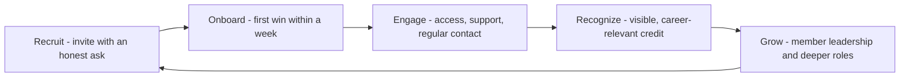

# Developer Programs and Relationships

> **Core skill:** Designing champion, ambassador, and partner programs that trade real value for real contribution — and sustaining the relationships that keep members contributing.

## Why This Matters

The moment a community ignites, the advocate's leverage changes: instead of being the person who answers and organizes, the advocate becomes the person who equips others to do it. Programs are that leverage, formalized — champions who teach, ambassadors who organize locally, partners who integrate. Done well, a program multiplies one advocate into dozens of advocates; done poorly, it invents a status hierarchy that corrodes the very community it was meant to serve.

The failure modes are well documented and endlessly repeated. A program that asks for marketing amplification but offers only a badge is not a program; it is unpaid advertising, and members eventually say so. A program with no exit for inactive members accumulates dead titles. A program that rewards volume over quality optimizes for spam. The antidote is reciprocity: every program element pairs a real contribution with real value — access, support, resources, recognition, or career benefit.

Programs also need to survive the advocate. If the program's vitality depends on one staff member remembering birthdays and sending swag, it is a personal project with a logo. Durable programs run on clear criteria, visible value, member leadership, and rhythms that outlast any individual's tenure.

## Program Taxonomy

| Program | Purpose | Member Receives | Organization Receives | Main Risk |
|---------|---------|-----------------|------------------------|-----------|
| Champion program | Depth: experts who teach and support | Early access, direct engineering contact | Documentation feedback, peer support, credibility | Elitism; dependency on a few |
| Ambassador program | Breadth: local organizers who run events | Budget, materials, platform support | Local presence; event coverage | Burn-out; quality variance |
| User group support | Sustainable local communities | Venue and budget; speaker access | Grassroots adoption; feedback | Organizers feel used as marketing |
| Partner program | Integrations and solutions built by others | Technical support, co-marketing | Ecosystem surface area; reach | Partners misaligned with user interest |
| Beta and feedback groups | Rapid product feedback | Influence, previews, recognition | Early signal; real-world testing | Feedback theater; ignoring what is heard |
| Alumni network | Continuity after formal roles end | Community and recognition | Long-term advocacy, hiring | Neglect; titles outlive contribution |

## Design Principles

| Principle | Practice | Anti-Pattern |
|-----------|----------|--------------|
| Clear exchange | Publish what members give and what they get | Meaningless badges for heavy asks |
| Earned, not sold | Criteria are transparent and applied | Pay-to-join tiers in a community program |
| Opt-in with exits | Easy to join; dignified to step back | Dead titles; guilt-driven retention |
| Member leadership | Members shape rules and mentor newcomers | Staff-only governance forever |
| Sustainable asks | Contribution fits a working developer's life | Full-time expectations for volunteers |
| Real recognition | Career-visible credit, conference slots, direct access | Swag as the only currency |

## The Relationship Lifecycle

| Stage | Organization Action | What The Member Needs To Feel |
|-------|---------------------|-------------------------------|
| Recruit | Personal invitation; honest about the ask | Wanted for their work, not their follower count |
| Onboard | Small first task; quick win; introductions | Competent and connected within a week |
| Engage | Regular, meaningful contact; prioritized access | Valued, not broadcast to |
| Recognize | Public credit at key moments | Seen by their peers and their employer |
| Grow | Deeper roles; leadership openings | A future in the relationship |
| Renew or release | Re-commitment conversations; graceful exits | Respected either way |

The renew-or-release moment is the one programs most often skip, and it is the one that decides whether the program is a living network or an accumulating list.

## Partner Relationships

Partners are a special case: the relationship is organizational, but it is carried by people. Keep the technical contact and the commercial contact distinct, give partners a named engineer to talk to, and never let quota conversations leak into engineering trust. The health test for a partner program is whether the partner would still integrate with you if the co-marketing budget disappeared.

## The Program Operating Cycle



## Practical Applications

### Program Design Checklist

- [ ] Every ask in the program is paired with a concrete, honest value exchange
- [ ] Entry criteria are public and applied consistently
- [ ] A member can step back without losing dignity or standing
- [ ] Recognition is career-visible, not just swag
- [ ] Members help govern and mentor; staff are not the only leaders
- [ ] The program has a renewal conversation, not permanent silent membership
- [ ] The program would survive the advocate leaving

### Program Brief Template

```markdown
## Program Brief — [name]
- Purpose: [what outcomes, for whom]
- Member profile: [who qualifies, how it is judged]
- The exchange: members give [x]; members get [y]
- Rhythm: [touchpoints, cadence, owner]
- Recognition: [how contributions become visible]
- Leadership path: [member roles in the program]
- Exit and renewal: [re-commitment cycle; dignified offboarding]
- Success signals: [contribution quality, retention, member sentiment]
```

## Common Pitfalls

| Pitfall | Why It Is a Problem | Better Approach |
|---------|---------------------|-----------------|
| **Badge without value** | Members learn the ask is one-sided and leave | Pair every ask with real access or resources |
| **Status inflation** | Titles multiply; prestige deflates | Keep tiers small and outcomes-based |
| **Volume rewards** | Programs optimize for spam and gaming | Reward quality and impact, review holistically |
| **Founder dependency** | Program vitality lives in one person's calendar | Member leadership and documented rhythms |
| **Quota creep** | Members feel turned into a sales channel | Keep advocacy voluntary; never script it |
| **No exits** | Inactive members accumulate; energy dilutes | Renewal cycles; graceful offboarding |

## Success Indicators

- Members volunteer for heavier asks because the exchange proved fair
- Contributions continue through holidays, launches, and staff changes
- Members recruit the next cohort themselves
- Partners talk about the relationship in technical terms, not discount terms
- Program leaders can explain the criteria and the value without consulting the advocate

## Related Topics

- [[01_Community_Building_Fundamentals]]: programs formalize the ladder's upper rungs
- [[05_Community_Programs_and_Content]]: the recurring activity programs run on
- [[07_Measuring_Community_Impact]]: programs must prove contribution quality, not headcount
- [[06_Community_Health_and_Moderation]]: recognition systems must not corrode community health
- [[career-path/03_Staff_Engineer/07_Organizational_Learning_and_Mentoring/03_Communities_of_Practice|Communities of Practice (Staff)]]: internal parallels to champion networks

## Summary

Developer programs turn community goodwill into durable leverage — or into quiet resentment — depending on the honesty of the exchange: recruit personally, onboard to a quick win, engage with real access, recognize visibly, and let members grow into leadership, including the dignity of stepping back. Partners get the same discipline with engineering trust kept separate from commercial talk. The program that survives its founder is the one designed as a relationship network, not a membership list.
