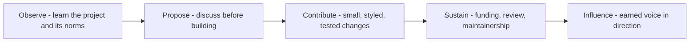

# Open Source Engagement

> **Core skill:** Participating in open source as a good citizen — contributing upstream, respecting maintainers, and turning project relationships into ecosystem strength without extracting from them.

## Why This Matters

Every technology company's stack rests on open source it does not control. The projects, libraries, and standards that developers depend on are maintained by people with their own priorities, constraints, and finite patience — and how a company engages with them becomes part of its reputation with every developer watching. Engagement done well earns influence, goodwill, and early knowledge; done badly, it burns bridges that take years to rebuild.

The advocate stands at the seam between the company's needs and the project's health. On one side: features the product wants, bugs that affect customers, performance the roadmap demands. On the other: maintainer bandwidth, project direction, and the norms of a community that predates any single company's interest. The skilled advocate translates between the two without bullying the smaller side — and actively resists the pattern where a large company's "contribution" is really a demand with a patch attached.

The strategic layer matters too. Good OSS engagement is not charity; it is infrastructure investment with compounding returns: fixes that stop recurring, influence on direction, a pipeline of contributors, and a credible public record that the company shows up rather than just consumes.

## Modes of Engagement

| Mode | Example | Commitment Level | When It Fits |
|------|---------|------------------|--------------|
| Consumption with reporting | Filing high-quality issues and repro cases | Low, continuous | Always — the baseline of good citizenship |
| Upstream fixes | Patches for bugs the company hit | Medium, as discovered | Default for any fix that can be contributed |
| Feature contribution | Implementing a needed capability in the open | High, negotiated | Roadmap alignment exists upstream |
| Sponsorship and funding | Money, CI, or infrastructure support | Medium, financial | The project is critical and underfunded |
| Maintainership | Committing to review, release, support | Very high | Strategic dependence; company commits staff |
| Ecosystem building | SDKs, integrations, documentation around the project | Varies | Growing adoption benefits both sides |

## The Contribution Playbook

| Step | Practice | Why |
|------|----------|-----|
| Listen first | Read contributing guides, lurk on issues, learn the norms | Projects reject contributions that ignore their culture |
| Ask before building | Open an issue or discussion for anything non-trivial | Prevents wasted work and maintainer resentment |
| Keep patches small | One change, one reviewable pull request | Large patches shift the review burden to volunteers |
| Match the project's style | Follow conventions, tests, and commit formats | Reduces maintainer cognitive load |
| Respond promptly | Answer review comments fast; iterate kindly | Respect flows both ways |
| Accept the outcome | Withdraw gracefully if declined | The project does not owe the company a merge |

## Working With Maintainers

| Guideline | Reason |
|-----------|--------|
| Their project, their rules | Leadership is earned in the project, not bought by employer size |
| No surprise roadmaps | Never announce what the project will do before maintainers agree |
| Fund the burden you create | If a contribution adds maintenance cost, help carry it |
| Credit liberally | Acknowledge maintainers in talks, docs, and customer conversations |
| Escalate rarely and transparently | Never route around a maintainer through private company channels |
| Remember they are volunteers | Patience is not optional; deadlines are the company's problem |

## Corporate Considerations

| Concern | Courtesies and Controls |
|---------|-------------------------|
| Licensing and compliance | Legal review for dependencies; contribute under the project's terms |
| Intellectual property | Assignments and employer approval before contributing employer work |
| Security disclosure | Follow coordinated disclosure; never drop a 0-day in a public issue |
| Competitive sensitivity | Contribute what serves the project, not what leaks strategy |
| Time budgets | Make contribution time a real, protected allocation |
| Consistency | One-off contributions read as extraction; sustained presence reads as commitment |

## The Contribution Flow



## Practical Applications

### OSS Engagement Checklist

- [ ] Every recurring bug fix is evaluated for upstreaming, not just forking
- [ ] Non-trivial work starts with an issue or discussion upstream
- [ ] Contribution time is protected as real work, not scrap-time
- [ ] Maintainers are credited in public work mentioning the project
- [ ] Security issues follow coordinated disclosure paths
- [ ] Company announcements never preempt project governance
- [ ] Critical dependencies have a plan beyond consumption — funding, staff, or both

### Contribution Plan Template

```markdown
## OSS Contribution Plan — [project]
- Why it matters: [dependency or ecosystem rationale]
- Mode: [fixes / features / funding / maintainership]
- Norms learned: [contributing guide notes, communication style]
- Open items proposed upstream: [issue links]
- Time commitment: [who, how many hours per month, protected how]
- Maintainer relationship owner: [name]
- Exit criteria: [what good looks like in twelve months]
```

## Common Pitfalls

| Pitfall | Why It Is a Problem | Better Approach |
|---------|---------------------|-----------------|
| **Surprise PRs** | Large unrequested patches burden volunteer reviewers | Discuss first; land changes in reviewable pieces |
| **Roadmap by announcement** | The company speaks for a project it does not govern | Influence through contribution and dialogue |
| **Take-only consumption** | Unreported issues and private forks erode goodwill | File, fix, and upstream as a default |
| **Employer muscle** | Escalating around maintainers poisons the well | Solve through the project's own channels |
| **Volunteer attrition ignored** | Key person leaves; critical dependency sours | Fund and staff what you depend on |
| **Hero one-offs** | Single big contributions read as marketing | Sustained, calm participation compounds |

## Success Indicators

- Maintainers accept your proposals faster because your patches are predictable
- Project contributors can name your organization as a helpful participant
- Fixes upstream reduce recurring customer pain at the source
- The company's voice is heard in project direction because contributions earned it
- Engagement continues through quarters without a launch-shaped spike

## Related Topics

- [[01_Community_Building_Fundamentals]]: OSS projects are communities with their own norms
- [[02_Developer_Programs_and_Relationships]]: projects and partners overlap in the ecosystem web
- [[05_Community_Programs_and_Content]]: upstream work feeds content and credibility
- [[07_Product_Feedback_and_Ecosystem_Strategy/00_overview|Product Feedback and Ecosystem Strategy]]: upstream signals shape product strategy
- [[career-path/07_SRE_and_Platform_Engineer/06_Developer_Platform/00_overview|Developer Platform (SRE)]]: platform teams live and die by upstream dependencies

## Summary

Open source engagement is citizenship with strategic upside: listen to a project's norms, propose before building, contribute small and styled patches, respect and fund the maintainers who carry the burden, and let influence be earned through sustained participation. The advocate who treats projects as partners rather than free suppliers turns dependency into a two-way relationship — and the ecosystem remembers which companies showed up.
