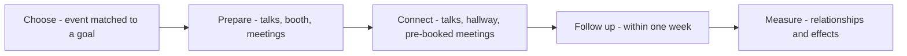

# Events and Conferences

> **Core skill:** Using events deliberately — speaking, sponsoring, and running gatherings — so that each event produces relationships and knowledge, not just attendance.

## Why This Matters

Conferences and meetups are where the distributed developer community briefly becomes a room. That concentration of intent — people who traveled to learn something — makes events the highest-trust channel advocacy has: a technical talk that teaches honestly earns credibility no ad can buy, and a conversation at a booth or hallway track can open relationships that sustain for years. But the same concentration makes events the most easily wasted budget in the advocate's portfolio.

The waste is familiar: a sponsorship purchased for logo placement and lead scans, a talk accepted because the CFP was easy, a meetup organized as a one-off with no follow-through. Each of these mistakes treats an event as a transaction instead of a lifecycle. The lifecycle view — plan the goal, prepare the contribution, connect in person, follow up diligently, and measure what changed — is what separates events that compound from events that merely occur.

For the advocate personally, events are also a career instrument: the hallway track is where ecosystem relationships, speaking opportunities, and hard-won field knowledge get exchanged. The discipline is deciding, per event, which of the possible goals it serves — recruiting, teaching, listening, partnership — and investing accordingly.

## The Event Portfolio

| Event Type | Primary Purpose | Typical Cost | Volunteer Load |
|------------|-----------------|--------------|----------------|
| Community meetup | Local trust and recurring presence | Low | Medium; needs a local organizer |
| Regional conference | Reach a practitioner audience | Medium | Medium; CFP and travel |
| Flagship industry conference | Visibility and enterprise conversations | High | High; booth, talks, staffing |
| Workshop or training day | Deep skill transfer; direct contact | Medium | High; materials and preparation |
| Own event | Full control of narrative and audience | Very high | Very high; a program of its own |
| Virtual event | Scale and accessibility | Low | Medium; production quality matters |

A portfolio, not a pile: each event should map to a distinct goal so the year's event budget reads as a strategy.

## Speaking Discipline

| Talk Shape | Fits When | Preparation Focus |
|------------|-----------|-------------------|
| Technical deep dive | The audience is expert; credibility is the goal | Correctness, demos that work, honest limits |
| Case study with a customer | Adoption proof is the goal | Named customer, real numbers, candid lessons |
| Tutorial or workshop | Skill transfer is the goal | Exercises, environment setup, pacing |
| Ecosystem or vision talk | Direction-setting is the goal | Evidence, not hype; respect for the audience |
| Lightning talk | Reach and first impression | One idea, sharply delivered |

Speaking rules that protect reputation: never present marketing as a technical talk, never demo what you have not rehearsed on the actual setup, and never say "it just works" about system behavior you have not proven. Audiences forgive complexity; they do not forgive being sold to under a technical banner.

## Sponsorship Discipline

| Decision | Question To Ask Before Committing |
|----------|-----------------------------------|
| Why sponsor | Which goal — hiring, adoption, ecosystem goodwill — does this serve? |
| What tier | Does the tier buy participation (talks, workshops) or only a logo? |
| Who staffs | Are the people going able to have real technical conversations? |
| What happens at the booth | Is there a demo, a game, a workshop — something worth approaching? |
| How leads are handled | Who follows up, within what window, with what message? |
| How it is measured | What changes if the event succeeds — and is that trackable? |

## The Event Lifecycle

| Phase | Activities | Failure To Avoid |
|-------|-----------|------------------|
| Choose | Match event to goal; check audience and past reviews | Attending out of habit |
| Prepare | CFP, talk rehearsal, booth plan, meeting pre-books | Arriving to improvise |
| Connect | Talks, hallway conversations, scheduled and happenstance meetings | Hiding behind the booth table |
| Follow up | Within a week: materials, answers, introductions | The silent post-event void |
| Measure | Relationships formed, knowledge gained, pipeline or adoption effects | Counting badge scans as impact |

The follow-up week is where most event value is either captured or lost — a message referencing the actual conversation beats a generic "great meeting you" every time.

## The Event Arc



## Practical Applications

### Events Checklist

- [ ] Every event on the calendar names the goal it serves
- [ ] Talks are rehearsed on the real setup, with fallback for demo failure
- [ ] Speaking content is technical, honest, and free of disguised marketing
- [ ] Booth or presence has something worth approaching — not just collateral
- [ ] Pre-event outreach books meetings with key people
- [ ] Follow-up happens within a week, referencing real conversations
- [ ] Each event is reviewed against its goal before renewal

### Event Plan Template

```markdown
## Event Plan — [event]
- Goal: [relationships / adoption / recruiting / listening]
- Format: [talk / workshop / booth / meetup]
- People to meet: [names and why]
- Talk abstract and rehearsal log: [status]
- Follow-up owner and window: [name, one week]
- Measurement: [what changes if this succeeds]
- Keep or cut next year: [decision date]
```

## Common Pitfalls

| Pitfall | Why It Is a Problem | Better Approach |
|---------|---------------------|-----------------|
| **Logo marketing** | Sponsorship buys visibility nobody remembers | Buy participation — talks, workshops, demos |
| **Demo on unrehearsed setup** | A live failure costs more trust than the demo buys | Rehearse on the venue's actual configuration |
| **Sales in a technical talk** | The audience disengages and remembers | Teach honestly; let the work advertise itself |
| **No follow-up** | Event connections decay within days | One-week follow-up with conversation references |
| **Burnout staffing** | The same three people work every booth | Rotate staff; protect recovery time |
| **Event habit** | Budget renews by inertia, not outcomes | Review each event against its stated goal |

## Success Indicators

- Attendees reference a talk or conversation months later
- Follow-up messages get replies because they cite real discussions
- The event calendar reads as a portfolio with distinct goals
- Customers and community members volunteer to speak or co-present
- Event decisions — keep, change, or cut — are made on evidence

## Related Topics

- [[05_Community_Programs_and_Content]]: events run on the same ask-the-community machinery as other programs
- [[02_Developer_Programs_and_Relationships]]: ambassadors often carry local event presence
- [[01_Technical_Communication/00_overview|Technical Communication]]: talks are the public form of technical communication
- [[07_Measuring_Community_Impact]]: events must be measured by outcomes, not attendance
- [[01_Community_Building_Fundamentals]]: meetups are the grassroots layer of community

## Summary

Events and conferences convert a distributed community into a room: choose each event against a goal, prepare talks and presence genuinely, connect with intent through talks and hallway conversations, follow up within a week while the memory is warm, and measure what actually changed. The advocate who runs events as a lifecycle rather than a calendar builds a portfolio where every gathering compounds — relationships, knowledge, and goodwill that outlast the closing keynote.
