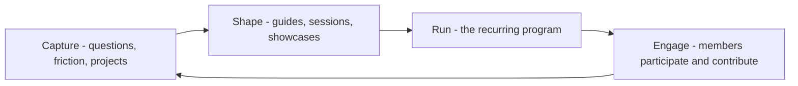

# Community Programs and Content

> **Core skill:** Running the recurring programs — office hours, learning series, newsletters, hackathons — that give a community its rhythm and its reasons to return.

## Why This Matters

Communities are held together by rhythm. A space that is sometimes busy and sometimes silent teaches members that participation is optional and forgettable; a space with predictable rituals — the weekly office hour, the monthly newsletter, the quarterly hackathon — teaches them there is a place for them and a time to show up. Programs are how the advocate converts purpose into cadence.

Content and programs are two sides of one engine. Programs generate content — the office hour question becomes a guide, the hackathon project becomes a case study — and content feeds programs — the guide becomes workshop material, the case study becomes a talk. Advocates who run them as separate workstreams double their overhead; advocates who run them as one loop halve it.

The governing constraint is capacity. Every recurring program is a permanent commitment: a monthly commitment is twelve executions a year, forever, and each one consumes preparation time that compounds. The mature advocate runs a small number of programs executed well, sources content from the community instead of authoring everything, and kills programs deliberately when they stop earning their cadence.

## The Program Portfolio

| Program | Cadence | Effort Per Cycle | Primary Outcome |
|---------|---------|------------------|-----------------|
| Office hours | Weekly or biweekly | Low, if scoped | Direct help; early friction signal |
| Learning series | Monthly | Medium | Skill depth across the community |
| Newsletter | Monthly | Medium | Re-engagement; curated updates |
| Hackathon | Quarterly or twice yearly | High | New builders; showcase projects |
| Study group or book club | Per book or module | Low, member-led | Peer learning; member leadership |
| Bug bash | Quarterly | Medium | Product feedback at volume; goodwill |
| Community showcase | Monthly | Low | Recognition; content source |

Choose the portfolio by capacity and purpose, not by envy of larger programs' calendars.

## Program Design Decisions

| Dimension | Options | Guidance |
|-----------|---------|----------|
| Hosting | Staff-hosted vs member-hosted | Move to member-hosted as soon as one member is ready |
| Format | Live vs asynchronous | Live builds trust; async builds archive |
| Scope | Broad help desk vs themed topic | Themes attract focused audiences and better content |
| Recording | Recorded vs in-the-room only | Record for reach; keep some sessions unrecorded for candor |
| Promotion | Announce every cycle vs standing slot | A standing slot becomes a habit; announcements fade |
| Ownership | Advocate-run vs co-owned | Co-owned programs survive staff transitions |

## The Content Engine

| Stage | Practice | Source |
|-------|----------|--------|
| Capture | Log every recurring question and friction point | Office hours, support, issues |
| Select | One question asked repeatedly beats ten asked once | Frequency plus severity |
| Shape | Answer in the format the question deserves | Guide, snippet, video, template |
| Publish | Route to where the audience already reads | Docs, blog, forum, newsletter |
| Reuse | Every artifact feeds two more later | Talks, workshops, onboarding |
| Measure | Which pieces actually get used and cited | Read-through and reuse, not clicks |

Content sourced from the community — member questions, member projects, member stories — outperforms staff-authored content because it carries the audience's own voice. The advocate's job is editorial: spot the pattern, shape the telling, connect the author to the platform.

## Sustaining the Rhythm

| Risk | Signal | Response |
|------|--------|----------|
| Cadence collapse | Sessions skipped "this once" and then again | Shrink scope; recruit co-hosts; or pause deliberately |
| Content drought | Publishing depends on inspiration | Run the capture stage seriously; mine questions |
| Host burnout | The same person prepares everything | Rotate hosts; template the formats |
| Audience fatigue | Attendance decays despite good sessions | Survey; change format; let a program rest |
| Volunteer drift | Contributors vanish without word | Check in personally; reduce the ask; thank them |

## The Program Loop



## Practical Applications

### Program and Content Checklist

- [ ] The portfolio fits actual capacity; every program has a named host
- [ ] At least one program is member-run or member-co-run
- [ ] A capture habit exists for recurring questions and friction
- [ ] Content is sourced from the community, not only authored by staff
- [ ] Every artifact is routed to at least two reuse channels
- [ ] Programs are reviewed each quarter and killed when they stop earning cadence

### Content Calendar Template

```markdown
## Community Calendar — [quarter]
| Week | Program | Host | Topic | Content Output |
|------|---------|------|-------|----------------|
| 1 | Office hours | [name] | [theme or open] | [questions logged] |
| 2 | Learning series | [name] | [topic] | [recording, guide update] |
| 3 | Newsletter | [name] | [curation] | [issue] |
| 4 | Showcase | [name] | [member project] | [story for reuse] |

## Capture Log
- Recurring question: [x] — heard [n] times — action: [guide / office hour topic / issue filed]
```

## Common Pitfalls

| Pitfall | Why It Is a Problem | Better Approach |
|---------|---------------------|-----------------|
| **Program sprawl** | Too many commitments; all executed thinly | Portfolio by capacity; fewer and better |
| **Staff-only authorship** | Content doesn't scale and misses community voice | Mine, shape, and platform member content |
| **Cadence erosion** | Skipped cycles teach members the rhythm is fake | Pause deliberately or shrink scope; never quietly skip |
| **Same faces everywhere** | New members see a closed club | Rotate hosts; invite newcomers to first steps |
| **Publish and abandon** | Content dies where it lands | Route every artifact to reuse channels |
| **Zombie programs** | Rituals continue past their purpose | Quarterly review; deliberate retirement |

## Success Indicators

- Members show up on rhythm because the slot is reliable
- At least one program runs without staff hosting
- Content pipeline is fed by community questions, not inspiration
- A member's project becomes a showcase, a story, and a conference talk
- Retired programs are replaced by member-initiated ones

## Related Topics

- [[01_Community_Building_Fundamentals]]: programs sustain the flywheel the fundamentals start
- [[04_Events_and_Conferences]]: events are programs at higher intensity
- [[07_Measuring_Community_Impact]]: cadence must show up as measurable outcomes
- [[02_Developer_Programs_and_Relationships]]: champions often become program hosts
- [[02_Documentation_and_Learning_Materials/00_overview|Documentation and Learning Materials]]: community content feeds and draws from the docs

## Summary

Community programs and content are one engine: capture the community's questions and projects, shape them into sessions, guides, and showcases, run the recurring rhythm that members can rely on, and let participation refill the pipeline. Run a portfolio that fits your capacity, move hosting to members as soon as they are ready, and retire programs deliberately rather than letting them rot — because a community's calendar is a promise, and promises should be kept or ended openly.
