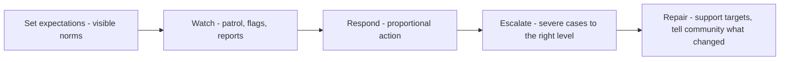

# Community Health and Moderation

> **Core skill:** Protecting the space — visible norms, consistent moderation, fair escalation, and a code of conduct that is enforced rather than decorative.

## Why This Matters

Community health is not the absence of conflict; it is the presence of enough trust that people disagree productively and vulnerable members stay. The moment a community feels unsafe to a meaningful slice of its potential members, the loss is invisible — the people quietly leave rather than complain — and the community slowly becomes homogeneous, brittle, and dead-ended. Health work prevents this erosion, and it is the advocate's most underrated responsibility because it is only noticed when it fails.

Moderation is where stated values become real. A code of conduct nobody enforces teaches the community that the organization tolerates whatever it can get away with; enforcement, applied consistently — including to well-known members and paying partners — teaches the opposite. The advocate's discipline is consistency: same norms, same response, regardless of the offender's status.

The work is also humane for the people doing it. Moderators absorb the worst of what a community produces, and burnout among moderators is a direct threat to the health it protects. Sustainable health practice includes rotation, support, and clear authority — nobody should be moderating alone, unbacked, and unpaid in emotional labor.

## The Health Foundation

| Element | Practice | Signal Of Failure |
|---------|----------|-------------------|
| Visible norms | Code of conduct at every door: repo, chat, event | Newcomers cannot find the rules |
| Enforcement consistency | Same response for same behavior, status-blind | Star members get a pass; newcomers do not |
| Fast first response | A reported issue gets a human reply quickly | Reports vanish into a void |
| Psychological safety | Questions without mockery; mistakes without shame | Beginners stop asking publicly |
| Diversity of participation | Different backgrounds, levels, and views | One in-group voice dominates |
| Moderator sustainability | Rotation, support, thanks, limits | The same two people absorb everything |

## The Code of Conduct

| Component | Content | Common Failure |
|-----------|---------|----------------|
| Scope | Where it applies — spaces, events, private channels | Ambiguous scope means ambiguous enforcement |
| Standards | Expected and unacceptable behaviors, with examples | Vague principles nobody can act on |
| Reporting | Channels, privacy, who receives reports | No way to report privately |
| Process | How reports are handled, by whom, timelines | No process; ad hoc improvisation |
| Consequences | Proportional responses, up to removal | Punishments invented in the moment |
| Commitment | Leadership holds itself to the same standard | Leaders exempt themselves |

A conduct policy is only worth what its enforcement record shows. Publish the policy; then actually run the process, and be prepared to point back at both.

## Moderation Models

| Model | How It Works | Fits When | Trade-Off |
|-------|--------------|-----------|-----------|
| Reactive | Respond to reports and flags | Small, high-trust spaces | Slow on ambient toxicity |
| Proactive patrol | Moderators scan and intervene early | Growing spaces; events | Labor cost; perception of over-policing |
| Community flags plus staff | Members flag; staff decide | Scale moments; forums | Flag abuse; staff bottleneck |
| Federated or shared | Distributed moderators align on norms | Multi-space ecosystems | Coordination overhead |
| Automated filters | Keyword and rate limits as first pass | High-volume channels | False positives; bias in rules |

Most healthy communities combine layers: automation catches spam, members flag, trusted community moderators triage, staff handle escalations and appeals.

## The Escalation Ladder

| Severity | Example | Response | Who Acts |
|----------|---------|----------|----------|
| Minor | Off-topic drift; mild incivility | Gentle redirect in place | Any moderator |
| Moderate | Repeated rudeness; bad-faith arguing | Private warning; log it | Community moderator |
| Serious | Harassment; discriminatory remarks | Immediate removal; temporary ban | Staff moderator |
| Severe | Threats; doxxing; predation | Permanent ban; report to authorities if warranted | Program lead plus legal |
| Systemic | Pattern by a group or notable member | Policy response; community communication | Leadership, with community told what changed |

Escalation should be boringly predictable. The worst outcome is not a harsh ruling; it is members unable to predict which behaviors are tolerated this week.

## The Protection Loop



## Practical Applications

### Health Checklist

- [ ] The code of conduct is visible at every entry point and enforced consistently
- [ ] A private reporting channel exists with named, trained receivers
- [ ] Severity levels and responses are documented before the first crisis
- [ ] Moderators rotate; nobody moderates alone or indefinitely
- [ ] Enforcement record includes notable members and partners, not just newcomers
- [ ] Affected members are supported after incidents, not just after verdicts
- [ ] The community hears what changed after a systemic response

### Moderation Runbook Template

```markdown
## Moderation Runbook — [community]
- Norms link: [code of conduct URL]
- Reporting channel: [where, who receives, privacy notes]
- Severity ladder: [minor to severe, with response per level]
- Standard responses: [warnings, removal, bans — templates]
- Evidence handling: [retention, privacy, need-to-know]
- Escalation contacts: [staff, legal, external if needed]
- Moderator care: [rotation schedule, peer support, debrief ritual]
```

## Common Pitfalls

| Pitfall | Why It Is a Problem | Better Approach |
|---------|---------------------|-----------------|
| **Decorative code of conduct** | Unexecuted norms teach that values are performance | Enforce visibly; publish that you did |
| **Status-blind failure** | Star members exempted; newcomers punished | Same rules for everyone; say so publicly |
| **Reactive-only moderation** | Ambient toxicity sets the culture before reports arrive | Patrol proactively as the space grows |
| **Moderator burnout** | The protectors leave; the space degrades | Rotate, support, and cap the emotional load |
| **Report black holes** | Members stop reporting when nothing happens | Fast human acknowledgment; outcome updates |
| **Trial by community** | Public pile-ons replace due process | Private, fair process; protect all parties |

## Success Indicators

- Newcomers of different backgrounds ask questions publicly and stay
- Conflicts get resolved in place; escalations are rare and proportional
- The moderation team rotates without gaps and reports sustainable load
- When enforcement touches a notable member, the community reacts with calm recognition that norms held
- People cite safety as a reason they participate

## Related Topics

- [[01_Community_Building_Fundamentals]]: norms and purpose are the foundation health protects
- [[02_Developer_Programs_and_Relationships]]: recognition systems must not create untouchable elites
- [[07_Measuring_Community_Impact]]: health metrics belong in every community report
- [[04_Events_and_Conferences]]: events need enforceable conduct policies too
- [[career-path/03_Staff_Engineer/07_Organizational_Learning_and_Mentoring/03_Communities_of_Practice|Communities of Practice (Staff)]]: internal spaces need the same protection

## Summary

Community health is the quiet infrastructure of everything else: visible norms, enforced codes of conduct, layered moderation, proportionate escalation, and care for both the targets of incidents and the moderators who handle them. The advocate protects the space not as an enforcer of tidiness but as a guarantee to every member — especially the newest and most vulnerable — that participation here is safe, and that the community's promises are the kind it keeps.
