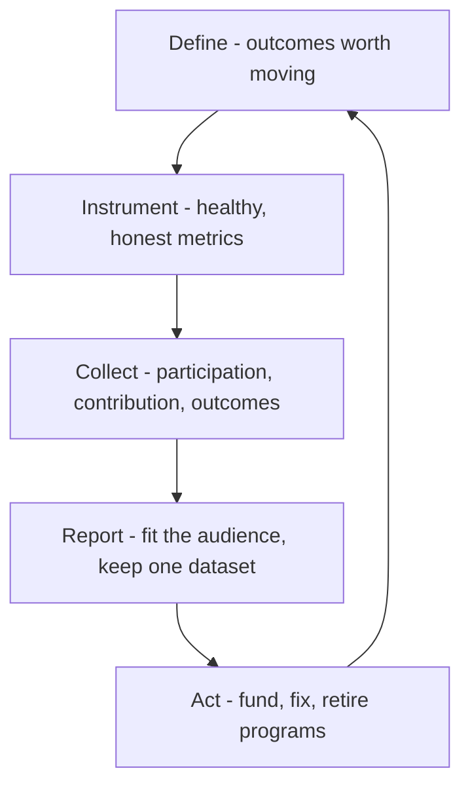

# Measuring Community Impact

> **Core skill:** Measuring what a community actually produces — participation quality, contributions, and outcomes — and reporting it credibly to both members and the organization that funds it.

## Why This Matters

Every community program eventually faces the budget question: what does this cost, and what does it return? The answer determines whether the program survives the next planning cycle. Advocates who answer with member counts and message volumes are asking leadership to take the value on faith — and faith is the first casualty of a tight quarter. Advocates who answer with participation quality, contribution trends, and adoption outcomes make the case with evidence.

The measurement problem is subtle because the easy numbers are misleading. A community can double its membership while its conversation dies; a forum can show flat post counts while a small core quietly answers hundreds of questions that never reach support. Vanity metrics flatter; health metrics explain. The advocate's job is to instrument the health of the system — who contributes, how fast questions resolve, whether members help each other — and then connect that health to outcomes the organization recognizes: activated developers, retained customers, reduced support load, product insight delivered.

Measurement also serves the community itself. Members deserve to see what their space produces, and public scoreboards that celebrate contribution quality — not just volume — reinforce the exact behaviors the community needs. What gets measured gets done, so measure the thing you actually want more of.

## The Metric Ladder

| Level | Examples | What It Answers | Warning |
|-------|----------|-----------------|---------|
| Activity | Sessions, posts, members | Is anything happening? | Flatters; tracks effort, not value |
| Participation quality | Questions answered, time to first reply, member-to-member answers | Is the community working? | Requires instrumentation to see |
| Contribution | Guides written, talks given, PRs, meetup hosting | What are members producing? | Volume can mask quality |
| Outcome | Activated developers, retained accounts, support deflection, insights adopted | What changed because of the community? | Hard; needs partnership with data owners |

Report the full ladder, with the bottom rungs as context and the top as the argument.

## Health Metrics Versus Vanity Metrics

| Vanity Metric | Why It Misleads | Health Substitute |
|---------------|-----------------|-------------------|
| Total members | Accumulates forever; counts the dead | Weekly active participants |
| Total posts | Rewards noise; spikes from one thread | Questions answered within a day |
| Page views | Traffic without relationship | New members who return in month two |
| Social followers | Borrowed audience; passive | Members who contribute after joining |
| Event attendance | One-day snapshot | Attendees who come back or bring others |
| Downloads | Consumption, not community | Users who join and stay |

## Contribution and Outcome Signals

| Signal | Measures | Collection Method |
|--------|----------|-------------------|
| Member-to-member answer rate | Community autonomy | Tag or language analysis of replies |
| Time to first helpful response | Responsiveness health | Thread timestamps |
| Contributor concentration | Bus factor and inclusivity | Contribution share distribution |
| First-time contributors per quarter | Pipeline health | First-action detection |
| Champion retention | Program sustainability | Renewal conversations plus activity |
| Support deflection | Cost offset | Ticket volume on community-covered topics |
| Adoption correlation | Business linkage | Cohort analysis with product data teams |
| Insights adopted from community | Feedback loop value | Product decision records |

## Reporting for Different Audiences

| Audience | Wants To Know | Format |
|----------|---------------|--------|
| Community members | Is the space healthy and worth my time? | Transparent health dashboard; contributor spotlights |
| Program leads | Where to invest next quarter | Trends by program and channel |
| Product and engineering | What the field is saying | Insight digests with frequencies and sources |
| Executives | What the investment returns | Outcome metrics, cost offsets, adoption links |
| Finance and planning | What to fund or cut | Cost per outcome; program comparisons |

One dataset, several framings: members see health, leaders see outcomes — but the underlying numbers must be the same, or the community will notice the gap.

## Closing the Measurement Loop

Metrics without action are decoration. Each reporting cycle should end with decisions: fund, fix, or retire a program; re-source content; recruit moderators; escalate an insight to product. Publish what changed to the community — measurement that never changes anything teaches members that the numbers are for someone else.

## The Impact Loop



## Practical Applications

### Measurement Checklist

- [ ] Metric set includes participation quality, not just activity volume
- [ ] At least one outcome metric is owned jointly with product or support
- [ ] Member-facing tracking is visible and contributor-celebrating
- [ ] Bus factor and contributor concentration are reviewed each quarter
- [ ] Every report ends with decisions taken, not just numbers shown
- [ ] The same underlying dataset serves member and leadership views

### Quarterly Impact Report Template

```markdown
## Community Impact — [quarter]
## Health
- Weekly active participants: [n, trend]
- Time to first helpful reply: [median]
- Member-to-member answer share: [percent]
- First-time contributors: [n]

## Contribution
- New guides, talks, community projects: [n, highlights]
- Champion program retention: [percent]

## Outcomes
- Activated developers from community cohorts: [n]
- Support deflection on covered topics: [n tickets]
- Insights adopted by product: [n, with links]

## Decisions
- Fund: [program] — because [evidence]
- Fix: [program] — because [evidence]
- Retire: [program] — because [evidence]
- Escalate to product: [insight, owner]
```

## Common Pitfalls

| Pitfall | Why It Is a Problem | Better Approach |
|---------|---------------------|-----------------|
| **Vanity-first reporting** | Big numbers hide a dying conversation | Lead with participation quality and outcomes |
| **Metric without owner** | Nobody moves when the number drops | Assign an owner to every tracked metric |
| **Outcome fabrication** | Claiming adoption links the data cannot support destroys trust | State confidence and method; use cohorts |
| **Member-blind reporting** | Members see tracking as surveillance | Publish health transparently; celebrate contributors |
| **Report-and-file** | Numbers arrive; nothing changes | End every report with decisions |
| **Gaming by volume** | Programs optimize for the metric, not the mission | Pair every volume metric with a quality guard |

## Success Indicators

- Leadership renews the program citing outcome evidence, not sentiment
- Members cite the health dashboard as a reason for confidence
- A support or adoption metric visibly moved with a community cause
- Contributor concentration falls as new members step up
- Reported numbers match what members experience day to day

## Related Topics

- [[01_Community_Building_Fundamentals]]: health metrics operationalize the flywheel
- [[02_Developer_Programs_and_Relationships]]: program renewal depends on evidence of quality
- [[05_Community_Programs_and_Content]]: cadence shows up in the participation data
- [[06_Community_Health_and_Moderation]]: safety and inclusivity are measurable health dimensions
- [[07_Product_Feedback_and_Ecosystem_Strategy/00_overview|Product Feedback and Ecosystem Strategy]]: the outcome side of community measurement

## Summary

Measuring community impact means climbing from activity to outcome: instrument participation quality, track contribution with quality guards, connect community cohorts to adoption and support outcomes, and report one honest dataset framed for each audience. The loop only counts when it closes — every report ends with programs funded, fixed, or retired, and the community is told what its numbers changed. That is how a community earns the trust of its members and the budget of its sponsors at the same time.
