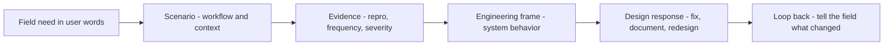

# Translating Ecosystem Needs for Engineers

> **Core skill:** Converting developer complaints and ecosystem observations into the vocabulary engineering actually acts on — scenarios, reproduction paths, impact models, and design constraints.

## Why This Matters

Engineering teams do not lack empathy; they lack bandwidth for unfiltered field noise. A developer complaint arriving as "your API is terrible" triggers defensiveness; the same problem arriving as "when an access token expires mid-batch, integrators get a 401 with no retry hint, and six of the nine teams we watched resolved it by disabling retries entirely" triggers engineering instinct. The difference is translation, and translation is the advocate's most valuable internal service.

The translation problem is real because the two sides operate on different organizing principles. The field thinks in workflows and frustrations: things they were trying to accomplish when the product got in the way. Engineering thinks in systems and invariants: what input produces what output, under what conditions, with what guarantees. A message that stays in the field's frame gets sorted as "feedback" and shelved; a message in engineering's frame gets sorted as "bug" or "design gap" and scheduled.

Translation is not spin. The discipline is to be more precise, not more flattering: name the scenario exactly, strip the emotion from the evidence while preserving the severity, and hand over the materials an engineer needs to verify the claim themselves. Honest translation earns the right to say the hard things — including "this design choice is wrong for the ecosystem."

## Why Translation Fails

| Failure | What It Looks Like | The Fix |
|---------|--------------------|---------|
| Framing mismatch | Complaints organized by emotion, not system behavior | Restate as scenarios and reproductions |
| Missing reproduction | "It does not work" with no steps | Build the minimal failing case yourself |
| Unquantified severity | "This is really bad" | Define severity by workflow impact: blocked, degraded, friction |
| Audience mismatch | Same message to support, PM, and engineers | One message per audience, one dataset |
| Lost context | The workaround is missing from the report | Include what users did instead — the workaround is a design signal |
| Advocacy tone | The messenger feels like a plaintiff | Neutral, precise, sourced — let the facts carry severity |

## Translation Patterns

| Field Signal | Engineering Frame |
|--------------|-------------------|
| "Setup took me two days" | Onboarding path has a specific step where users stall; here is the trace |
| "The SDK fights me" | Error taxonomy inconsistency: same root cause surfaces as four different errors |
| "The docs are wrong" | Doc example diverges from current API behavior; here is the diff |
| "It breaks at scale" | A limit manifests differently at three payload sizes; here are the profiles |
| "Everyone uses the old version" | Migration path has a blocking incompatibility; here is where it blocks |
| "I just gave up" | Abandonment point identified; here is where and why they stopped |
| "Why is this so complicated" | Conceptual model mismatch between product design and user mental model |

The right column hands engineering a system to inspect; the left is a symptom report.

## The Evidence Package

| Component | Content | Purpose |
|-----------|---------|---------|
| Scenario | Who was doing what when it broke | Grounds the problem in a workflow |
| Reproduction | Minimal steps, versions, environment | Lets engineering verify independently |
| Frequency | Count and source of cases | Separates pattern from anecdote |
| Severity | Defined scale with workflow impact | Justifies scheduling priority |
| Adoption link | Effect on activation, retention, or expansion | Connects to business evidence |
| Workarounds observed | What users did instead | Reveals cost and design direction |
| Quotes | Two or three, trimmed to the load-bearing sentence | Carries the human reality without noise |

## Working With Engineers

| Practice | Rationale |
|----------|-----------|
| Bring reproductions, not feelings | Engineers act on verifiable claims |
| Respect the queue | Frame as an input to prioritization, not a bypass of it |
| Be present in review | Answer questions live; translation continues in dialogue |
| Push back on design, not people | Critique the system's behavior, never the engineer's competence |
| Close the loop back | Tell the engineer when the fix helped; attribution matters |
| Keep the raw file | Engineers who want to audit can see the unedited strings |

## The Translation Flow



## Practical Applications

### Translation Checklist

- [ ] Every report leads with a scenario an engineer can picture
- [ ] A minimal reproduction, or an honest note that none exists yet
- [ ] Frequency and severity use defined scales, not adjectives
- [ ] The workaround users chose is documented
- [ ] The ask is framed as an input to prioritization, never a demand
- [ ] The report names its sample and its limits
- [ ] Every closed issue gets looped back to the reporters

### Translation Template

```markdown
## Engineering Brief — [issue]
- Scenario: [who, doing what, when it broke]
- Expected vs observed: [behavior]
- Minimal reproduction: [steps, env, versions]
- Frequency: [n cases, period, sources]
- Severity: [blocked / degraded / friction — why]
- Workaround observed: [what users do instead]
- Adoption evidence: [drop-off, support load, churn signal]
- Suggestion: [possible direction, clearly marked as optional]
```

## Common Pitfalls

| Pitfall | Why It Is a Problem | Better Approach |
|---------|---------------------|-----------------|
| **Emotional forwarding** | Raw frustration triggers defense, not action | Restate neutrally; preserve severity, strip heat |
| **No reproduction** | Unverifiable claims sink to the bottom of the queue | Build the minimal failing case before filing |
| **Severity by adjective** | "Critical" for everything means nothing is | One defined scale, used consistently |
| **Channel bypass** | Going around the process burns the process's owners | Use the queue; escalate with evidence, openly |
| **Talking past the queue** | Repeated informal nudging erodes trust | Let the evidence package do the asking |
| **Translation spin** | Softening evidence to be liked destroys credibility | Precision first; kindness is in clarity |

## Success Indicators

- Engineers request field write-ups for their own decisions
- Reports get reclassified from feedback to bug quickly
- The reproduction steps in a report run on the first try
- Fixes get shipped and the field notices
- Advocates are invited into design reviews of related areas

## Related Topics

- [[01_From_Field_Signal_to_Product_Insight]]: translation begins after synthesis
- [[03_Influencing_the_Roadmap_From_the_Field]]: translated evidence is the lever
- [[04_Developer_Experience_Advocacy]]: DX friction is the most common translation subject
- [[career-path/03_Staff_Engineer/04_Influence_and_Alignment/00_overview|Influence and Alignment (Staff)]]: influence mechanics for engineers without authority
- [[career-path/12_Technical_Program_Manager/00_overview|Technical Program Manager]]: the partner role for cross-team execution of fixes

## Summary

Translating ecosystem needs for engineers means restating field reality in the frame engineering acts on: scenarios, minimal reproductions, defined severity, adoption evidence, and observed workarounds — delivered neutrally, sourced, and respectful of the process it enters. The advocate's leverage is not louder complaints but more precise ones; precision is what turns a developer's bad afternoon into a bug that gets fixed.
