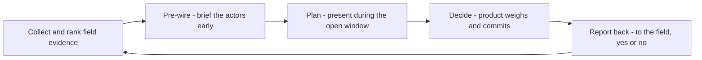

# Influencing the Roadmap From the Field

> **Core skill:** Converting field evidence into roadmap influence — building the case, pre-wiring the decision, and staying present through planning without becoming a lobbyist for one story.

## Why This Matters

Roadmaps are decided in rooms the advocate is not always in, by people weighing evidence the advocate may never see: strategy, capacity, competitive timing, revenue commitments. Influence from the field is therefore not about louder advocacy; it is about being the most reliable evidence source in the room — the person whose claims are always sourced, whose severity scales are respected, and who is known to say "the data does not support this one" about their own favorites.

The mechanics matter as much as the merit. A brilliant evidence package introduced after the roadmap is committed changes nothing; the same package introduced three weeks before planning, pre-wired with the engineers who will estimate it, changes everything. Influence is temporal: it happens in the season when decisions are still open, through people who carry your evidence when you are not present.

The failure mode to avoid is advocate-as-single-issue-lobbyist: the person who has one story, tells it in every meeting, and slowly loses the room. Sustainable roadmap influence comes from a portfolio of well-evidenced inputs, honest about being one input among many — and from gracefully accepting no, then reporting the no back to the field with the reasoning.

## Influence Mechanisms

| Mechanism | What It Is | Best Timing | Effort |
|-----------|------------|-------------|--------|
| Evidence briefs | Ranked, sourced insight documents | Ahead of planning; continuous for severe items | Medium, recurring |
| Pre-wiring | Informal conversations with engineers and PMs before the decision | Weeks before planning | Low per conversation, high discipline |
| Planning participation | A seat in or adjacent to planning rituals | During planning | Medium; earned by track record |
| Design review presence | Being in the room when solutions take shape | During discovery and design | Low once invited |
| Executive narratives | Field stories told upward, with numbers | Quarterly reviews; when severity is high | High; use sparingly |
| Public voice | Talks, posts, and community threads that raise an issue visibly | When the internal path stalls | Medium; last resort, handled carefully |

## The Evidence Case

| Element | Question It Answers | Common Weakness |
|---------|---------------------|-----------------|
| Problem statement | What breaks, for whom, in what workflow? | Too abstract to rank |
| Frequency | How many, how often, from where? | Missing counts |
| Severity | Blocked, degraded, or annoying — why? | Adjective inflation |
| Adoption impact | What does this cost activation, retention, expansion? | Guessed, not measured |
| Affected segments | Who cares most — beginners, experts, enterprise, ecosystem? | Unsegmented averages |
| Cost of inaction | What compounds if nothing changes? | Assumed, not argued |
| Options | What could product do, at what rough cost? | Solution presented as the only option |

## Roadmap Season Rhythm

| Cycle Stage | What The Advocate Does | What Not To Do |
|-------------|------------------------|----------------|
| Just after planning | Log and cluster; publish the field digest | Wait until planning to collect |
| Mid-cycle | Pre-wire severe items; brief champions | Escalate everything as urgent |
| Pre-planning | Deliver the ranked evidence pack; answer questions | Spring new evidence in the final meeting |
| Planning | Show up prepared; support estimators with reproductions | Argue for more than the evidence says |
| Post-decision | Communicate outcomes back to the field, wins and losses | Go silent on the nos |

## Working With Stakeholders

| Stakeholder | Cares About | Frame Your Evidence As |
|-------------|-------------|------------------------|
| Product manager | Segments, adoption, competitive parity | Ranked field inputs with impact estimates |
| Engineering | Verifiability, system behavior | Reproductions and failure modes |
| Support lead | Ticket volume, resolver time | Deflection potential and top failure themes |
| Sales or partner team | Deal blockers, ecosystem commitments | Named-segment blockers, sized honestly |
| Executive | Strategy and numbers | One or two narratives with outcome stakes |

## The Influence Loop



## Practical Applications

### Roadmap Influence Checklist

- [ ] I know the planning calendar and the decision points before they arrive
- [ ] The evidence pack is ranked and capped — five items, not fifty
- [ ] Each item carries frequency, severity, adoption impact, and a sample note
- [ ] Engineers who would build it have seen it before the decision meeting
- [ ] I include at least one item I expect to lose, honestly evidenced
- [ ] Decisions — including rejections — are communicated back to the field
- [ ] I am known for withdrawing claims the data does not support

### Roadmap Pitch Template

```markdown
## Roadmap Input — [cycle]
| # | Problem | Frequency | Severity | Adoption Impact | Segments | Est. Cost |
|---|---------|-----------|----------|-----------------|----------|-----------|
| 1 | [x] | [n cases] | [scale] | [metric] | [who] | [S/M/L] |

## The Case For #1
- Workflow: [who is blocked and when]
- Cost of inaction: [what compounds]
- Evidence links: [briefs, repros]
- Counterargument I considered: [and why the data still points here]

## Loop-Back Pledges
- Will report decision to: [sources]
- By when: [date]
```

## Common Pitfalls

| Pitfall | Why It Is a Problem | Better Approach |
|---------|---------------------|-----------------|
| **Late evidence** | Post-commitment input cannot change the plan | Deliver before the window opens |
| **Single-issue identity** | One story repeated endlessly loses the room | A portfolio of ranked, evidenced inputs |
| **Inflated severity** | Everything urgent means nothing is | One scale, honestly applied |
| **Bypassing owners** | Escalating over people wrecks the working relationship | Pre-wire with respect; escalate only openly |
| **Silence on no** | The field never learns why; trust erodes | Report rejections with the reasoning |
| **Advocacy as identity** | Being right matters more than the decision quality | Optimize for the best decision, not the win |

## Success Indicators

- Product planning cites field evidence by name and source
- Pre-wiring conversations happen before, not during, decisions
- Rejections are tolerated by the field because reasoning came back with them
- The advocate is consulted early on roadmap shape, not informed late
- Over quarters, the win rate improves because the claims are trustworthy

## Related Topics

- [[01_From_Field_Signal_to_Product_Insight]]: evidence quality sets influence ceilings
- [[02_Translating_Ecosystem_Needs_for_Engineers]]: translation makes evidence admissible
- [[06_Advocacy_Metrics_and_Reporting]]: track record is reported, not assumed
- [[career-path/14_Product_Manager/03_Prioritization/00_overview|Prioritization (PM)]]: the discipline whose weighing you are feeding
- [[career-path/12_Technical_Program_Manager/00_overview|Technical Program Manager]]: execution partner once decisions land

## Summary

Influencing the roadmap from the field is a seasonal, relational discipline: collect and rank evidence continuously, pre-wire the actors before decisions open, present inside the planning window with honest severity and adoption impact, and report every outcome — especially the nos — back to the field. The advocate's influence grows not by winning arguments but by being the source whose claims the room has learned to trust.
