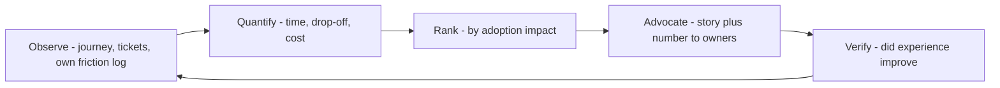

# Developer Experience Advocacy

> **Core skill:** Championing developer experience inside the organization — measuring friction, quantifying its cost, and turning the developer's daily reality into platform and tooling decisions.

## Why This Matters

Developer experience is the product's first impression and its daily tax. Every minute a developer spends fighting setup, deciphering errors, or working around an SDK quirk is a minute not spent building with the platform — and a small withdrawal from the account of goodwill that decides whether they return, recommend, and expand. DX problems rarely show up as loud complaints; they show up as quiet abandonment, slower integration timelines, and support load. Advocating for DX means making that invisible tax visible.

The advocacy is genuinely difficult because DX improvements compete against features in every planning conversation. A feature has a demo, a launch, and a champion; fixing error messages has none of those things. The advocate's counter is quantification: time-to-first-success measured against competitors, drop-off rates at specific onboarding steps, support tickets per integration, correlated with activation and retention. Numbers turn DX from a matter of taste into a business case.

DX advocacy is also where the advocate's own experience becomes evidence. Using the product daily, hitting the same sharp edges as the field, gives the advocate something no survey provides: an embodied, reproducible account of friction — precise, current, and verifiable. The discipline is to pair that lived experience with measurement, so the argument is both human and rigorous.

## What Developer Experience Covers

| Dimension | Question It Answers | Example Metric |
|-----------|---------------------|----------------|
| Onboarding | How fast can a new developer succeed? | Time to first successful call |
| Documentation | Can developers find and trust the answer? | Task success rate in docs testing |
| SDKs and libraries | Do the tools fit real workflows? | Completion rate of common tasks |
| Error design | Do failures teach recovery? | Percent of errors with actionable guidance |
| API and interface design | Are concepts predictable and consistent? | Time to integrate a standard use case |
| Support and escalation | When stuck, is rescue fast? | Time to first human response |
| Upgrade path | Do changes break trust? | Breaking changes per release; migration effort |

## The Friction Audit

A friction audit is structured empathy: walking the developer's journey with instruments running.

| Step | Method | Output |
|------|--------|--------|
| Map the journey | List every step from discovery to production | A shared journey diagram |
| Instrument the path | Time-to-first-success on clean machines; drop-off where measurable | Baseline numbers |
| Recruit real users | Watch five to ten developers onboard; no coaching | Observed stall points |
| Log your own friction | Use the product daily; keep a friction log with timestamps | A living evidence file |
| Mine the unconscious signal | Support tickets, forum questions, abandoned trials | Friction themes at volume |
| Benchmark externally | Compare with the two closest alternatives | A relative position, honestly stated |
| Rank by cost | Join friction to adoption impact | A ranked backlog of DX fixes |

## DX Metrics That Matter

| Metric | What It Reveals | Source |
|--------|-----------------|--------|
| Time to first successful call | Onboarding friction | Instrumented tutorial or sample |
| Time to first production use | Real-world integration complexity | Product telemetry cohorts |
| Onboarding drop-off by step | Where developers stall | Funnel analysis |
| Support tickets per integration | Residual friction and doc gaps | Support systems |
| Error recovery rate | Whether errors teach or trap | Error code telemetry |
| Upgrade migration effort | Trust tax of each release | Survey plus observed time |
| Docs task success | Whether answers are findable | Docs usability testing |

## Making the Case Internally

| Lever | Example Use |
|-------|-------------|
| Competitive comparison | "Our competitor gets a first call in four minutes; we take forty" |
| Monetary framing | Support cost per integration; engineer-hours lost to workarounds |
| Adoption linkage | Cohort analysis tying onboarding success to retention |
| Equity framing | Beginners suffer most; DX fixes widen the funnel |
| Risk framing | Every friction point is a churn candidate for a rival |
| Story plus number | One developer's session, quantified across the population |

Stories move rooms; numbers keep the decision moved. Use both, in that order.

## The DX Advocacy Loop



## Practical Applications

### DX Advocacy Checklist

- [ ] A developer journey map exists and is shared with platform teams
- [ ] Time to first success is measured on clean environments, not demo machines
- [ ] A friction log is kept, timestamped and citable
- [ ] DX items are framed with adoption or support cost, not taste
- [ ] At least one DX metric appears in the team's standing dashboard
- [ ] Improvements are re-measured after shipping — and celebrated
- [ ] External benchmarks exist and are refreshed honestly

### Friction Log Template

```markdown
## Friction Log — [quarter]
| Date | Journey Step | What Happened | Time Lost | Evidence | Severity | Status |
|------|--------------|---------------|-----------|----------|----------|--------|
| [d] | [onboarding / api / errors / upgrade] | [specific friction] | [minutes] | [trace, ticket, quote] | [blocked / degraded / friction] | [open / filed / fixed] |

## Themes This Quarter
- [theme] — cases: [n] — suspect fix: [x] — owner: [name]
```

## Common Pitfalls

| Pitfall | Why It Is a Problem | Better Approach |
|---------|---------------------|-----------------|
| **Taste-based advocacy** | "It feels bad" loses to every feature | Quantify time, drop-off, and support cost |
| **Expert blindness** | The advocate's power-user path hides beginner pain | Watch real beginners; test on clean machines |
| **One-off audits** | A quarterly snapshot misses daily reality | Keep a continuous friction log |
| **Feature envy** | Chasing competitor polish over local cost | Rank by adoption impact, not novelty |
| **Fix and forget** | Without re-measurement, teams assume improvement | Verify outcomes after shipping |
| **Developer-as-monolith** | Treating "developers" as one persona | Segment by skill, ecosystem, and use case |

## Success Indicators

- Time to first success improves release over release, visibly measured
- DX fixes appear in roadmaps with business cases attached
- Support load per integration declines
- Beginner-focused metrics improve without hurting experts
- Platform teams request friction audits before major changes

## Related Topics

- [[01_From_Field_Signal_to_Product_Insight]]: friction signals flow into the same insight pipeline
- [[02_Translating_Ecosystem_Needs_for_Engineers]]: DX evidence must be translated like any field signal
- [[05_Feedback_Loop_Design]]: a friction log is only useful if loops route it to owners
- [[career-path/07_SRE_and_Platform_Engineer/06_Developer_Platform/00_overview|Developer Platform (SRE)]]: internal platforms run the same DX logic for their users
- [[02_Documentation_and_Learning_Materials/00_overview|Documentation and Learning Materials]]: docs are the highest-leverage DX surface

## Summary

Developer experience advocacy turns daily friction into platform decisions: map the developer journey, instrument time to first success, keep a living friction log, and make every case with a story plus a number tied to adoption or support cost. The advocate is uniquely positioned to do this because the product is used daily, not observed from a dashboard — and the discipline is to pair that lived experience with measurement until friction is impossible for the organization to ignore.
