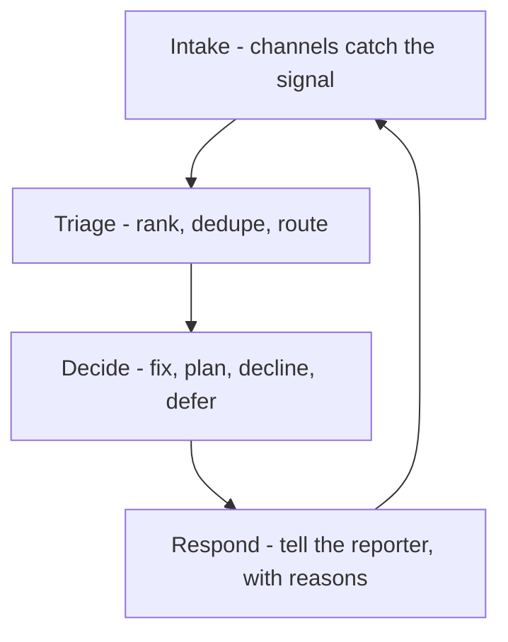

# Feedback Loop Design

> **Core skill:** Designing the channels and processes that make developer feedback flow in, get triaged honestly, and return to the people who raised it — so the loop is a system, not a lottery.

## Why This Matters

Developers keep giving feedback only as long as feedback keeps mattering. The first time a report disappears into silence, the reporter learns that the channel is decorative; after two or three such lessons, even enthusiastic developers stop typing. The feedback black hole is the default state of organizational life — reports arrive, urgency smears them across inboxes, and nothing returns. Closing the loop is the advocate's structural job, and it is one of the highest-leverage systems the role owns.

A designed loop has three movements: intake (channels where signal can enter from every direction), triage (a consistent path that turns raw reports into ranked, routed items), and response (the return message, whether fix, defer, decline, or duplicate — each with reasoning). Most organizations build intake enthusiastically, improvise triage, and skip response entirely. The advocate's contribution is building the missing movements and making all three visible.

The loop must also be honest to survive. Triage that hides hard decisions — silent declines, zombie tickets, feedback theater consultations — buys short-term comfort with long-term cynicism. The designed loop says no clearly, says why, and says how the decision could be revisited. A clear no keeps the channel credible; a fog of maybes destroys it.

## The Loop Anatomy

| Stage | Design Decision | Common Failure |
|-------|-----------------|----------------|
| Intake | Which channels, who watches them, what gets logged | Coverage gaps; signals lost between tools |
| Normalization | One vocabulary, one queue, dedupe rules | Five tools, five truth states |
| Triage | Cadence, criteria, owners, ranking rules | Ad hoc; loudness wins |
| Routing | Which team gets what, with what evidence | Reports vanish into the wrong backlog |
| Decision | Who decides, by what criteria, recorded where | Undocumented; re-litigated forever |
| Response | What the reporter hears, when, in what shape | Silence; generic status pages |
| Escalation | How severe items bypass the queue, transparently | Private routings that corrode trust |

## Channel Selection

| Channel | Strength | Blind Spot | Watch By |
|---------|----------|-----------|----------|
| In-product feedback | Low effort for users; context attached | Skews deep users | Product team |
| Public issue tracker | Transparency; community voting | Loud minorities; gaming | Advocate plus maintainers |
| Community forum | Rich discussion; context | Fragmented across platforms | Community team |
| Support tickets | Precise, abundant | Biased to blocked users | Support lead |
| Direct conversations | Depth; trust | Small n; memory loss | Advocate, logged same day |
| Surveys | Comparability over time | Asked rarely; self-report bias | Research team |

Design a portfolio that covers high-volume, high-context, and high-severity needs — then publish which channel is watched by whom, so users stop guessing.

## Triage Discipline

| Rule | Reason |
|------|--------|
| Triage on a fixed cadence | Items decay in queues; latency kills credibility |
| One shared queue of record | A single source of truth beats parallel opinions |
| Dedupe with clustering, keep the count | One loud thread and its silent siblings must be summed |
| Rank on frequency, severity, adoption impact | The same scale every time |
| Every item gets a state within a stated window | No zombies; open means something |
| Decisions recorded in the same place | The reasoning survives personnel changes |
| Escalation path is public and criteria-based | Bypasses become explainable, not political |

## Closing the Loop

| Outcome | What The Reporter Hears | When |
|---------|------------------------|------|
| Fixed | "You raised X; here is where it shipped" | At release, tagged to reporters |
| Planned | "X is scheduled for [horizon]; tracked as [id]" | At commitment |
| Investigating | "X needs more evidence; here is how to help" | On triage |
| Declined | "We are not doing X now because [reason]; it can be revisited if [condition]" | At decision |
| Duplicate | "X is tracked in [id]; your case was added to its count" | At triage |
| Not ours but noted | "X belongs to [project]; we passed it along and are tracking" | At routing |

The declined response is the load-bearing one. Organizations that cannot say no clearly end up saying yes to everything slowly — and nothing corrodes a feedback channel faster than a backlog of implied promises.

## Feedback Debt

Every unclosed item is a withdrawal from future participation. Track the size of the open backlog aged beyond its stated windows — that is feedback debt, and it should be reported like any other liability: trend, worst offenders, and a repay plan. The rule of thumb: if the queue's oldest open item predates two planning cycles, the channel has already been marked unreliable in the field's mental model.

## The Feedback Cycle



## Practical Applications

### Loop Design Checklist

- [ ] Every channel has a named watcher and a published purpose
- [ ] One queue of record holds all normalized, deduped items
- [ ] Triage runs on a fixed cadence with defined ranking criteria
- [ ] Every item has a state within a stated window — no zombies
- [ ] Decline messages include reasons and revisit conditions
- [ ] Reporters hear outcomes through the channel they used
- [ ] Feedback debt — aged open items — is measured and reported

### Loop Design Template

```markdown
## Feedback Loop — [product or area]
- Channels and watchers: [list]
- Queue of record: [tool] — normalization rules: [x]
- Triage: [cadence, participants, ranking criteria]
- Response SLAs: [acknowledge in x days; decide in y]
- Decision log: [where, who records]
- Escalation: [criteria, path, who may invoke]
- Feedback debt review: [cadence, threshold, owner]
```

## Common Pitfalls

| Pitfall | Why It Is a Problem | Better Approach |
|---------|---------------------|-----------------|
| **Black hole** | Silence teaches developers to stop reporting | Respond at every state change, especially declines |
| **Volume democracy** | The loudest thread tops the roadmap | Dedupe and sum silent duplicates; rank on impact |
| **Zombie items** | Aged tickets imply abandoned promises | States within windows; honest deferrals |
| **Fragmented queues** | Parallel truths; items fall between tools | One queue of record with normalization |
| **Theater consultations** | Asking without capacity to act destroys trust | Consult only where action is possible |
| **Decline avoidance** | Maybes accumulate; credibility drains | Clear nos with reasons and revisit conditions |

## Success Indicators

- Reporters can predict what will happen after they report
- Declines are accepted because the reasoning accompanies them
- Feedback debt trends down or is consciously capped
- Product decisions reference queue items by identifier
- New channels are added only with a named watcher and triage plan

## Related Topics

- [[01_From_Field_Signal_to_Product_Insight]]: the loop is the intake system for synthesis
- [[03_Influencing_the_Roadmap_From_the_Field]]: closed loops supply the evidence pipeline
- [[06_Advocacy_Metrics_and_Reporting]]: loop health is a reportable metric
- [[04_Developer_Experience_Advocacy]]: friction logs must enter a working loop to matter
- [[career-path/14_Product_Manager/00_overview|Product Manager]]: the decision partner at the loop's center

## Summary

Feedback loop design builds the three movements organizations usually leave unfinished: intake with named watchers, triage with one queue of record and honest ranking, and response that returns every outcome — fix, plan, defer, or no — to the person who wrote in. Track the loop's own debt, cap it, and repay it in the open. A loop that reliably closes is what turns a stream of developer reports into a durable, trusted institutional asset.
