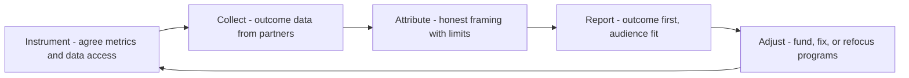

# Advocacy Metrics and Reporting

> **Core skill:** Measuring advocacy by the outcomes it moves — adoption, activation, retention, insight adopted — and reporting activity without mistaking it for impact.

## Why This Matters

Advocacy suffers from a measurement problem that is almost structural: its most visible outputs — talks given, posts published, events attended — are activities, while its most valuable results — a developer who succeeded, a signal adopted, a renewal influenced — are outcomes that happen elsewhere and later. Reporting activity is easy and tempting; it is also the reason advocacy budgets get cut. Nobody funds a calendar; organizations fund changed numbers.

The mature reporting posture separates the two honestly. Activity data is context — evidence of a functioning program — but the argument for the role rests on outcomes: measured improvements in activation, time-to-first-success, retention, support deflection, or product decisions that cite field evidence. Some of those outcomes require partnerships to measure — product analytics, CRM, support systems — and getting those partnerships is part of the reporting craft.

There is also a defensive dimension. Because advocacy outcomes are diffuse, a role without a credible narrative is vulnerable in exactly the quarters when it most needs protection. The advocate who can say, with numbers and named evidence, "here is what changed because this team exists" survives planning cycles that quietly delete roles whose reporting was a list of events attended.

## The Metric Hierarchy

| Level | Examples | Use It To | Never Use It To |
|-------|----------|-----------|-----------------|
| Activity | Talks, posts, events, office hours held | Show program operation; pacing | Justify the program alone |
| Engagement | Attendance, read-through, replies, participants | Judge channel and content fit | Claim adoption impact |
| Adoption outcome | Activation lift, time-to-first-success, retention cohorts | Make the core argument | Overstate attribution |
| Strategic outcome | Roadmap decisions citing field evidence, ecosystem partnerships, cost offsets | Frame the role in business terms | Flee from uncertainty when data is thin |

Report top-down: the outcome first, the activity as supporting evidence beneath it.

## Choosing Metrics Honestly

| Goal | Primary Metric | Supporting Evidence | Data Partner |
|------|----------------|---------------------|--------------|
| Improve onboarding | Time to first success | Tutoring sessions, drop-off points | Product analytics |
| Grow community participation | Weekly active contributors | Member-to-member answer rate | Community platform |
| Increase adoption | Activated accounts from community cohorts | Content-to-signup paths | Growth or CRM |
| Reduce support load | Tickets deflected on covered topics | Docs and forum resolution | Support systems |
| Improve product from field | Insights adopted with logged decisions | Evidence packs, decision records | Product management |
| Sustain ecosystem | Partner and contributor retention | Program renewals, contributions | Partner team |

Name the attribution limits next to the number: "registered through community content" is honest; "caused" usually is not.

## Reporting Formats

| Audience | Format | Focus | Cadence |
|----------|--------|-------|---------|
| Leadership | One-page summary, outcome-first | Numbers moved; strategic asks | Quarterly |
| Product and engineering | Insight digest with sources | Field evidence; decisions citing it | Monthly |
| Community | Public health summary | Participation, contribution, thanks | Monthly or quarterly |
| Finance and planning | Cost-per-outcome comparison | Efficiency; program comparisons | Annual plus quarterly check |
| The advocate's team | Full activity and learning log | What worked; what to change | Continuous, internal |

One dataset, many framings. If leadership sees numbers the community never sees, trust suffers; publish enough that every audience recognizes the same underlying truth.

## Attribution Discipline

| Claim | Honest Framing |
|-------|----------------|
| "The blog drove 300 signups" | "300 accounts registered through content links; 90 activated within a week" |
| "The talk generated pipeline" | "12 companies from the talk entered the trial; 3 progressed" |
| "The community reduced tickets" | "Ticket volume on covered topics fell 22 percent while overall volume was flat" |
| "The advocate influenced the roadmap" | "Six decisions this quarter cite field evidence; four from community signal" |
| "Adoption improved" | "Community cohort activation improved to x percent; other cohorts held flat" |

The pattern: state the observation, state the association, state the limits. Precision is the proof of honesty, and honesty is what makes the report survivable under scrutiny.

## The Reporting Cycle



## Practical Applications

### Metrics Checklist

- [ ] Every reported metric names its source and collection method
- [ ] The report leads with outcomes, not activity
- [ ] Attribution language distinguishes association from causation
- [ ] At least one product or support partnership supplies outcome data
- [ ] The community sees a version of the reporting that concerns it
- [ ] Metrics drive adjustments each cycle — programs funded, fixed, or refocused
- [ ] At least one counter-metric guards against gaming

### Quarterly Advocacy Report Template

```markdown
## Advocacy Impact — [quarter]
## Outcomes
- Activation from community cohorts: [n, trend] — source: [x]
- Time to first success: [metric, trend] — source: [x]
- Support deflection on covered topics: [n or percent] — source: [x]
- Insights adopted by product: [n, with decision links]

## Activity (Supporting)
- Talks and events: [n, highlights] — attendance: [n]
- Content published: [n] — read-through: [metric]
- Office hours and community sessions: [n]

## Attribution Notes
- [claims with limits stated]

## Adjustments
- Fund: [x] — because [evidence]
- Fix: [x] — because [evidence]
- Refocus: [x] — because [evidence]
```

## Common Pitfalls

| Pitfall | Why It Is a Problem | Better Approach |
|---------|---------------------|-----------------|
| **Activity as impact** | Calendars of events do not defend budgets | Outcome-first reporting with activity as context |
| **Attribution inflation** | "Caused" claims collapse under scrutiny | Observation, association, limits — every time |
| **Single-source vanity** | One flattering metric hides a flat reality | Multiple outcome metrics with counter-metrics |
| **Community-blind reporting** | Members discover they are measured but never shown | Publish the community-relevant version |
| **Report without action** | Numbers arrive; nothing changes | End each cycle with funded, fixed, or refocused programs |
| **Metrics frozen forever** | Goals shift; measurement calcifies | Revisit the metric set each planning season |

## Success Indicators

- Leadership renews and expands the role citing outcome data
- Product decisions cite the insight pipeline by name
- The community sees its health reflected accurately and publicly
- Attribution claims survive questioning from skeptical finance partners
- Each quarter's report visibly changes at least one program decision

## Related Topics

- [[01_From_Field_Signal_to_Product_Insight]]: the insight pipeline is half the outcome story
- [[03_Influencing_the_Roadmap_From_the_Field]]: report the influence track record, don't assume it
- [[05_Feedback_Loop_Design]]: loop health is a measurable program outcome
- [[07_Shaping_Ecosystem_Strategy]]: strategy work needs outcome evidence to be funded
- [[career-path/14_Product_Manager/00_overview|Product Manager]]: the partner for adoption and activation metric definitions

## Summary

Advocacy metrics and reporting turn a diffuse role into an accountable one: instrument outcomes with data partners, lead every report with what moved rather than what happened, attribute with stated limits, publish to the audience that needs it, and end each cycle with programs funded, fixed, or refocused. The advocate who reports this way does not merely survive budget seasons — they make the case that the field's voice, measured honestly, is one of the organization's compounding assets.
