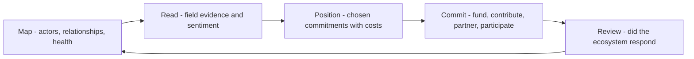

# Shaping Ecosystem Strategy

> **Core skill:** Contributing field-grounded strategy to how the organization participates in its ecosystem — open source, partnerships, platforms, and standards — from a seat earned by evidence, not title.

## Why This Matters

Every technology organization lives inside an ecosystem it does not control: open-source projects it depends on, platforms it builds on or against, partners whose integrations extend its reach, standards bodies that set the terms of interoperability. Strategy for that ecosystem is usually made at leadership level — and it is usually better when the field's daily reality reaches the room. The advocate, who watches developers navigate the ecosystem every day, holds exactly that reality.

The strategic questions are concrete: which projects should the company fund or maintain rather than merely consume? Which partnerships deepen developer value versus deepen lock-in? Where should the organization participate in standards, and where is participation theater? Should the platform invite complementors, and on what terms? Each of these decisions is better made with field evidence — what developers actually integrate, what they actually abandon, where trust actually sits — than with deal logic alone.

The advocate's contribution is bounded but real. This is not a claim to own strategy; it is a claim to supply its missing inputs: relationship maps, adoption evidence, friction reports, and honest readings of community sentiment. The advocate who does this reliably becomes a standing contributor to strategy discussions — and the one whose absence is noticed when decisions get made without the field in view.

## The Ecosystem Map

Start with an honest inventory of the actors and the state of each relationship.

| Actor Category | Examples | What The Organization Needs | Relationship Health Test |
|----------------|----------|-----------------------------|--------------------------|
| Upstream projects | Libraries, runtimes, standards | Reliability, influence, early knowledge | Do maintainers take our calls and patches? |
| Platforms | Cloud and app platforms hosting the product | Distribution, favorable terms, technical fit | Would we recommend this platform to our own developers? |
| Complements | Integrators, agencies, tooling vendors | Reach, workflow coverage | Do they grow without being paid to? |
| Standards bodies | Protocols, specifications, working groups | Interoperability; credible participation | Do our engineers show up and does it matter? |
| Communities | User groups, forums, conferences | Learning, feedback, trust | Do members recommend us unprompted? |
| Competitors | Direct and adjacent | Market honesty; cooperation where useful | Do we track their ecosystem moves with data? |

## Strategy Inputs the Field Supplies

| Input | Source | Strategic Question It Informs |
|-------|--------|-------------------------------|
| Integration patterns in the wild | Community, support, telemetry | Which complements matter; where friction blocks ecosystem growth |
| Abandonment and churn reasons | Interviews, tickets, exit paths | Whether platform or partner gaps are costing adoption |
| Maintainer sentiment | OSS relationships, contribution history | Whether dependencies are resilient or at risk |
| Developer trust signals | Community tone, event conversations | How much equity the brand holds with builders |
| Competitive ecosystem moves | Field observation, partner conversations | Where the map is shifting before it shows in analyst reports |
| Standards participation value | Engineers in working groups | Where to invest participation, where to withdraw |

## Strategic Positions

| Position | Choose It When | What It Commits The Organization To |
|----------|----------------|-------------------------------------|
| Open core with real contribution | Community growth is the adoption engine | Upstreaming, funding, maintainer respect — [[06_Community_and_Ecosystem/00_overview|Community and Ecosystem]] discipline |
| Consume-and-contribute | Projects are critical but not differentiated | Sustained fixes, sponsorship, no roadmap claims |
| Platform with complementors | Third parties build on the product | Fair terms, SDK investment, no competitive rug-pulls |
| Partnership-led expansion | Reach is the constraint, not product | Reciprocal value; integrations that serve developers first |
| Standards leadership | Interoperability is strategic | Engineering time, public commitments, patient participation |
| Ecosystem-neutral | No strategic dependency exists yet | Honest watching; avoid accidental lock-in anyway |

Positions are choices with costs; strategy documents that list principles without commitments are decoration. Each position the advocate supports should name what the organization will actually spend — time, code, or money.

## The Advocate's Seat

| Contribution | What It Looks Like | Why Leadership Listens |
|--------------|--------------------|------------------------|
| Field briefings | Quarterly ecosystem read with evidence | The stories come with numbers |
| Relationship stewardship | Named relationships with projects and partners | Trust lands in a person, not a department |
| Early warnings | Emerging friction or sentiment shifts before they compound | Time is the scarcest strategic resource |
| Integration reality checks | Telling strategy where the ecosystem actually is | Strategy documents meet field reality |
| Honest constraint naming | Saying what the organization cannot credibly claim | Credibility compounds across quarters |

Participation owes the same honesty as consulting: represent the ecosystem inward fully, including what is inconvenient, and never let the field's sentiment be sanitized into strategy slides.

## The Strategy Cycle



## Practical Applications

### Ecosystem Strategy Checklist

- [ ] The ecosystem map lists actors with named relationship owners
- [ ] Every critical dependency has a posture: contribute, fund, or consciously consume
- [ ] Field evidence — not deal convenience — informs partnership priorities
- [ ] The organization knows what it will not claim or promise in the ecosystem
- [ ] Strategic positions name concrete commitments: code, money, or staffed time
- [ ] Sentiment and trust signals are reported, including uncomfortable ones
- [ ] The map is refreshed each planning cycle, not written once

### Ecosystem Brief Template

```markdown
## Ecosystem Brief — [quarter]
## Map Updates
- New actors: [x] — move: [y]
- Relationship changes: [project or partner] — health now: [good / at risk / broken]

## Field Read
- Adoption patterns: [evidence]
- Friction and churn signals: [evidence]
- Trust and sentiment: [readings, sources]

## Positions And Commitments
| Area | Position | Commitment | Owner | Review |
|------|----------|------------|-------|--------|
| [upstream / platform / partners / standards] | [x] | [time, code, money] | [name] | [date] |

## Early Warnings
- [signal] — confidence: [x] — recommended watch item: [y]
```

## Common Pitfalls

| Pitfall | Why It Is a Problem | Better Approach |
|---------|---------------------|-----------------|
| **Deal-shaped strategy** | Partnerships optimized for revenue, not developer value | Field evidence first; deals second |
| **Consumption without posture** | Critical dependencies stranded; risk unowned | Every critical dependency gets a named posture |
| **Sanitized sentiment** | Bad news softens; strategy reacts late | Report trust signals honestly, including pain |
| **Participation theater** | Logo in a standards group; no engineers in the room | Staff real participation or withdraw openly |
| **Relationship hoarding** | Ecosystem trust lives in one person's inbox | Named owners; documented history |
| **Principles without commitments** | Strategy documents that spend nothing change nothing | Every position names code, money, or staffed time |

## Success Indicators

- Strategy documents cite field evidence for ecosystem positions
- Critical dependencies have owners, postures, and funding decisions on record
- Partners and maintainers describe the organization as reliable, not extractive
- Early warnings from the field precede analyst-visibility shifts
- The advocate is a scheduled contributor to strategy review, not an invited guest

## Related Topics

- [[03_Influencing_the_Roadmap_From_the_Field]]: the roadmap is where ecosystem strategy becomes product reality
- [[06_Advocacy_Metrics_and_Reporting]]: strategic commitments need outcome evidence to persist
- [[01_From_Field_Signal_to_Product_Insight]]: the evidence base beneath ecosystem reads
- [[06_Community_and_Ecosystem/00_overview|Community and Ecosystem]]: the community layer of every ecosystem position
- [[career-path/12_Technical_Program_Manager/00_overview|Technical Program Manager]]: the execution partner for multi-party strategic commitments

## Summary

Shaping ecosystem strategy means supplying the field-grounded inputs strategy usually lacks: an honest map of actors and relationship health, adoption and sentiment evidence from daily work, and positions that name real commitments — code, money, or staffed time — for open source, partners, platforms, and standards. The advocate's seat at that table is earned by reliability across quarters: being the source that tells the room the truth about the ecosystem, especially when the truth is inconvenient, and staying until the commitments are made.
