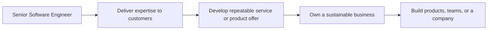

# Independent Consultant and Technical Founder

> **Positioning:** An independent path in which the engineer creates value through consulting, contracting, building products, founding a company, or combining technical work with business ownership.

## What This Path Is

An independent consultant sells expertise and outcomes to customers. A technical founder creates a product or company and takes responsibility for problem selection, product value, technology, customers, finances, and execution.

This path is not simply freedom from employment. It combines engineering with business development, sales, contracts, finance, legal concerns, customer discovery, delivery, and personal risk management.

## Primary Outcomes

- A clearly defined customer problem worth solving
- A viable service, product, or consulting offer
- Reliable delivery and customer trust
- Sustainable revenue or measurable organizational value
- Technical systems that can evolve with demand
- Responsible management of financial, legal, security, and operational risk

## Capability Areas

| Capability | Independent behavior | Existing vault anchor |
|---|---|---|
| Problem discovery | Finds a real customer need rather than starting with technology | [[body-of-knowledge/BABOK/04_Strategy_Analysis]] |
| Product and service design | Defines an offer, scope, value proposition, and delivery model | [[career-path/14_Product_Manager/00_overview|Product Manager]] |
| Business case | Evaluates cost, revenue, risk, and opportunity | [[software-engineering-note/15_Software_Engineering_Economics/Software Engineering Economics Overview]] |
| Delivery | Plans and executes work with explicit commitments | [[PMBOK v8 - Overview]] |
| Architecture | Builds a system appropriate for current and future constraints | [[software-engineering-note/02_Software_Architecture/Software Architecture Overview]] |
| Sales and communication | Explains value and builds trusted relationships | [[software-engineering-note/14_Software_Engineering_Professional_Practice/03_Communication_Skills]] |
| Governance and risk | Handles contracts, security, privacy, and continuity responsibly | [[CyBOK v1 - Overview]] |

## Typical Progression

## Signals for Moving Forward

- You want direct responsibility for customer value and commercial outcomes.
- You can tolerate uncertainty in income, scope, and organizational support.
- You are willing to learn sales, finance, contracts, and legal basics.
- You can separate a technically interesting idea from a validated customer problem.
- You can make decisions that balance survival, quality, speed, and long-term trust.

## Evidence to Build

- Customer discovery report
- Service or product one-page description
- Business model or business case
- Statement of work and contract outline
- Technical proposal
- Pricing or cost model
- Minimum viable product plan
- Delivery and support plan
- Risk, security, and continuity plan
- Customer outcome review

## Nearby Paths

- [[career-path/14_Product_Manager/00_overview|Product Manager]]: product value and customer direction
- [[career-path/13_Project_and_Program_Manager/00_overview|Project or Program Manager]]: structured delivery management
- [[career-path/15_Solutions_and_Enterprise_Architect/00_overview|Solutions or Enterprise Architect]]: customer solution design
- [[career-path/03_Staff_Engineer/00_overview|Staff Engineer]]: advanced technical influence

## Suggested Future Note Route

1. [[BABOK v3 - Overview]]
2. [[body-of-knowledge/BABOK/04_Strategy_Analysis]]
3. [[body-of-knowledge/BABOK/06_Solution_Evaluation]]
4. [[PMBOK v8 - Overview]]
5. [[body-of-knowledge/PMBOK/07_Finance_Performance_Domain]]
6. [[body-of-knowledge/PMBOK/08_Stakeholders_Performance_Domain]]
7. [[software-engineering-note/15_Software_Engineering_Economics/Software Engineering Economics Overview]]
8. [[CyBOK v1 - Overview]]
9. [[software-engineering-note/02_Software_Architecture/Software Architecture Overview]]

## Sources

- [[BABOK v3 - Overview]]
- [[PMBOK v8 - Overview]]
- [[SWEBOK v4 - Overview]]
- [[SEBoK v2 - Overview]]

## Related

- [[00_Career_Path_Overview]]
- [[career-path/02_Senior_Software_Engineer/00_overview|Senior Software Engineer]]
- [[career-path/14_Product_Manager/00_overview|Product Manager]]
- [[career-path/15_Solutions_and_Enterprise_Architect/00_overview|Solutions and Enterprise Architect]]
