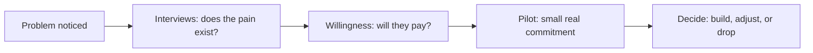

# Problem Discovery and Customer Validation

> **Core capability:** The independent finds a real customer problem worth solving — validating demand before building, and choosing a problem space that fits their skills, market, and appetite for risk.

## Why This Matters

The most expensive mistake in independent work is building something nobody will pay for. Employed engineers rarely face this risk; independents and founders face it with every project. The discipline that prevents it is customer discovery: talking to real people about real problems before writing code or quoting a project.

Validation extends beyond "people find this interesting" to "people will pay for this" — a much higher bar. The independent learns to run discovery interviews without pitching, test willingness to pay with pre-sales and pilots, and choose a problem space deliberately: one where their skills are rare, the pain is acute, and the market is reachable without a sales team.

## Topics in This Capability Area

| Topic | Core Skill | When It Matters |
|-------|------------|-----------------|
| [[01_Customer_Discovery_for_Independents]] | Finding and interviewing real prospects about real problems | Before any offer exists |
| [[02_Validating_Willingness_to_Pay]] | Testing payment intent, not just interest | Before building or quoting |
| [[03_Choosing_Your_Problem_Space]] | Selecting a niche where skills, pain, and market meet | Business inception |
| [[04_Niche_and_Positioning]] | Positioning as a specialist rather than a generalist | From the first engagement onward |
| [[05_Problem_Interviews_Without_Pitching]] | Interviewing without contaminating the signal | Every discovery conversation |
| [[06_Market_and_Competitor_Scanning]] | Reading the landscape quickly and cheaply | Problem selection; offer design |
| [[07_From_Insight_to_Offer_Hypothesis]] | Turning discovery into a testable offer | Between discovery and launch |

## The Validation Ladder

Each rung costs more than the last — climb in order.

## Practical Applications

### Discovery Checklist

- [ ] At least ten real prospects in the target space have been interviewed
- [ ] Interviews explore the problem, not pitch the solution
- [ ] Payment intent has been tested directly (pre-orders, deposits, pilots)
- [ ] The chosen niche fits your skills, experience, and reachable market
- [ ] Competing or substitute solutions are understood, including doing nothing

## Common Pitfalls

| Pitfall | Why It Is a Problem | Better Approach |
|---------|---------------------|-----------------|
| **Building first** | Code is the most expensive way to test an assumption | Interview and validate before building |
| **Friends as research** | Sympathy is not demand | Talk to strangers who match the target |
| **Pitching in interviews** | The pitch contaminates the data | Explore their problem; defer the offer |
| **Generalist by default** | Competing on price against everyone | Choose a niche; be the obvious choice there |

## Success Indicators

- Prospects describe the problem in their own words — repeatedly
- Someone has paid, pre-committed, or signed a pilot before the build
- The niche attracts inquiries without cold outreach
- Offers evolve fast because discovery continues after launch

## Related Capabilities

- [[02_Product_and_Service_Design/00_overview|Product and Service Design]]: discovery feeds what you offer
- [[06_Sales_and_Client_Communication/00_overview|Sales and Client Communication]]: positioning begins here
- [[career-path/14_Product_Manager/01_Problem_Discovery/00_overview|Problem Discovery (PM)]]: the product discovery discipline
- [[career-path/15_Solutions_and_Enterprise_Architect/01_Business_Analysis_and_Capability_Mapping/00_overview|Business Analysis and Capability Mapping (Solutions Architect)]]: enterprise-scale analysis

## Summary

Problem discovery and customer validation is the independent's survival skill: interviewing real prospects, testing payment intent before building, choosing a niche deliberately, and turning insight into offers that can be tested cheaply. The order matters — validation before build is the difference between a business and an expensive hobby.