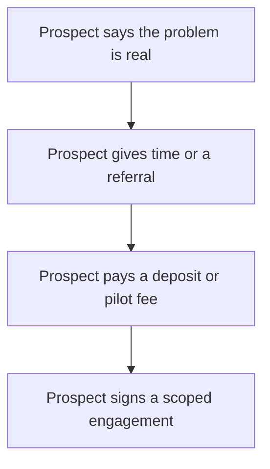

# Validating Willingness to Pay

> **Core skill:** Separating polite interest from payment intent — designing small, real tests where a prospect commits money, time, or reputation before you build or quote anything.

## Why This Matters

Interest is not demand. Nearly every pleasant conversation about a real problem ends with "that sounds useful", and that sentence has launched an uncountable number of dead products and unbillable consultancies. The gap between "sounds useful" and "I will pay" is where failed businesses live, and it is invisible unless you deliberately test it.

Willingness to pay is tested, not asked. Hypothetical questions — "would you pay for this?", "what would you pay?" — produce polite lies in almost every culture. The only reliable evidence is a commitment that costs the prospect something they can feel immediately: budget, cash, a calendared decision, or their internal reputation.

The test should happen early and escalate. Each rung on the commitment ladder costs the prospect more and delivers you better evidence than the rung below; each rung also costs you far less than building the full solution. The independent's discipline is to find the smallest rung that still produces a real signal, and to accept the answer whatever it is.

## The Evidence Ladder

| Evidence | What It Costs the Prospect | How Much to Trust It |
|----------|----------------------------|----------------------|
| "Keep me posted" | Nothing | Near zero |
| Completes a survey or poll | A few minutes | Low |
| Refers a colleague into the conversation | Their social capital | Low to medium |
| Books a follow-up with their boss present | Calendar time, internal exposure | Medium |
| Signs a paid pilot or pays a deposit | Budget and approval effort | High |
| Pre-orders or pays in full | Cash, now | Highest available |

The ladder is climbed one rung per conversation. Jumping from "keep me posted" to a full proposal is the most common way to hear "let us circle back next quarter" forever.

## Commitment Tests

| Test | What It Proves | Best Fit |
|------|----------------|----------|
| Paid assessment or discovery sprint | Budget access and the problem's priority | Enterprises with procurement friction |
| Deposit or pre-payment for a build | Priority above competing alternatives | Small teams and product ideas |
| Paid pilot with success criteria | Willingness to integrate and evaluate | Products and platforms |
| Letter of intent with named milestones | Sponsor commitment where payment takes months | Regulated and public-sector buyers |
| Charter customer agreement | Co-design appetite before the product exists | Early products needing design partners |

A commitment test is not a discount. The monetary amount can be small — its job is to force the prospect's internal decision, not to fund the business.

## Reading a Soft Answer

| Prospect Says | What It Usually Means | Next Move |
|---------------|----------------------|-----------|
| "No budget right now" | The problem is not a priority yet | Ask when budgets refresh; test a different segment |
| "Send me a proposal" | Often a polite exit | Ask what would make it a yes before writing anything |
| "We would use it, but adoption is hard" | Real objection, not a rejection | Scope a pilot that removes the adoption cost |
| "We are comparing three vendors" | Commodity framing; you are being shopped | Re-anchor on the outcome only you can deliver |
| "Let us revisit next quarter" | No internal champion | Find the person whose pain is loudest this month |

## The Commitment Ladder



The ladder only counts if each rung is climbed in order. Skipping a rung means the evidence is borrowed from below — and it collapses at the first invoice.

## Practical Applications

### Pre-Sale Test Design Checklist

- [ ] The test asks for something scarce: money, a decision, or calendar time with a buyer
- [ ] The commitment amount fits the prospect's approval authority or is clearly on their side of it
- [ ] Success criteria for the paid test are written before it starts
- [ ] A follow-up date exists in both calendars, not "sometime after the holidays"
- [ ] The offer stands up without discount pressure: the test is priced as a product
- [ ] A no is recorded as evidence, not treated as a relationship failure

### Paid Pilot One-Liner

```markdown
## Paid Pilot — one paragraph

For <prospect> we will run a <duration> pilot of <outcome> for <price>.
Success means <measurable criterion> measured by <method>.
Included: <deliverables>. Not included: <boundaries>.
Decision date: <date>. If it fails, <walk-away terms>.
```

## Common Pitfalls

| Pitfall | Why It Is a Problem | Better Approach |
|---------|---------------------|-----------------|
| **Asking hypotheticals** | "Would you pay" invites polite fiction | Ask for a commitment that costs something now |
| **Treating an LOI as money** | Intent letters approve nothing and fund nothing | Pair every LOI with a milestone and a date |
| **Discounting to force a signal** | A bought yes teaches nothing about real demand | Hold price; shrink scope to fit the budget |
| **Testing on non-buyers** | Users rarely control budget or signatures | Include the economic buyer in the test conversation |
| **Test too big** | Big asks stall and drain months of momentum | Start at the smallest rung the buyer can approve alone |
| **No follow-up date** | Enthusiasm cools in days, not quarters | Calendar the next step before the call ends |

## Success Indicators

- Money has moved, or a signature exists, before the build starts
- Prospects negotiate terms and dates rather than vague enthusiasm
- A predictable ratio emerges between discovery conversations and paid tests
- Price holds in the test without discounting or scope giveaways
- Soft answers are recognized early and converted into qualified nos

## Related Topics

- [[01_Customer_Discovery_for_Independents]]
- [[07_From_Insight_to_Offer_Hypothesis]]
- [[03_Business_Case_and_Economics/00_overview|Business Case and Economics]]
- [[career-path/14_Product_Manager/01_Problem_Discovery/00_overview|Problem Discovery (PM)]]

## Summary

Validating willingness to pay is the discipline that separates demand from sympathy: climb the evidence ladder from spare time to real money, design commitment tests that force the prospect's internal decision, and read soft answers for what they actually mean. The independent who does this hears fewer enthusiastic maybes and far more profitable, honest nos and yeses.
