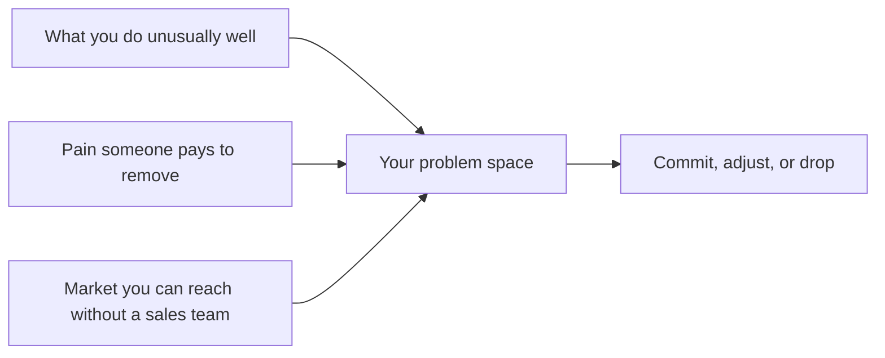

# Choosing Your Problem Space

> **Core skill:** Choosing where to work — the intersection of what you do unusually well, pain someone pays to remove, and a market you can actually reach without a sales team.

## Why This Matters

Problem selection is the highest-leverage decision an independent makes, and it happens before skill, effort, or execution matter. The same engineer can earn five times more in one problem space than another because demand density, willingness to pay, and reachability differ enormously between spaces. Employment hides this fact: a company decides the space and the engineer optimizes inside it. Independents own the choice, and therefore own the consequences.

The classic failure is choosing the space that is interesting to build rather than the space that is bought. Novel technology, elegant architecture, and fascinating data problems are not the same as a painful, funded business need. The independent's job is to stand at the overlap of four circles: capability, pain, reach, and appetite — where what you can do meets what someone urgently needs, in a market you can touch, at a risk level you can survive.

Choosing a space is a bet, not a vow. It should be committed to long enough to learn — quarters, not weeks — with kill criteria written in advance. The goal is not certainty but a defined downside: if this space fails, what did it cost, and what did it teach?

## Four Tests of a Problem Space

| Test | Question | Strong Signal | Red Flag |
|------|----------|---------------|----------|
| Capability fit | Can I be in the top tier here within a year? | Existing work, projects, or reputation in the domain | Counting on skills you have not used professionally |
| Pain quality | Is the pain funded, urgent, and recurring? | Budget lines, compliance deadlines, lost revenue | "Nice to have" improvements and cosmetic projects |
| Reachability | Can I find buyers without a sales team? | Communities, conferences, directories, referral chains | A market that requires enterprise sales machinery |
| Appetite | Do I tolerate this work, risk, and customer type? | Energy for the domain after a hard week | Choosing purely for money or prestige |

Score each test honestly and let the weakest one veto the space. A space fails commercially on its weakest circle, not its strongest.

## Space Archetypes

| Archetype | Typical Shape | Advantage | Risk |
|-----------|---------------|-----------|------|
| Deep-domain return | The industry you worked in as an employee | Instant credibility and network | Captive of one industry's cycles |
| Tooling gap | Developer tools, platforms, integration glue | Reachable buyers, fast feedback | Crowded; price-sensitive users |
| Regulated niche | Compliance-heavy sectors with high stakes | Urgency, budget, defensible expertise | Long sales cycles; certification burden |
| Cross-industry method | A repeatable technique sold broadly | Broad market; reusable assets | Harder to position; commoditizes |
| Modernization wave | Migrations off legacy stacks or vendors | Clear deadlines and budgets | Short window before the wave passes |
| Vertical product seed | A painful workflow inside one industry | Path from service to product | Requires domain depth and patience |

Most durable independent businesses combine two archetypes: a reachable niche plus a repeatable method.

## The Space Choice



The diagram is a filter, not a formula: every input can disqualify the space on its own, and the output is a decision with a review date attached.

## Practical Applications

### Space Selection Checklist

- [ ] The space is described in one sentence without listing technologies
- [ ] At least five conversations confirm the pain is funded and recurring
- [ ] Buyers are reachable through channels you can operate alone
- [ ] The capability claim is backed by real, recent work you can show
- [ ] The downside is defined: what a failed bet costs in time and money
- [ ] Kill criteria and a review date are written down before committing

### Problem Space One-Pager

```markdown
## Problem Space — <one-sentence name>

| Field | Entry |
|-------|-------|
| Space in one sentence | <who has which problem, in which context> |
| Who pays | <role, company type, trigger event> |
| Evidence so far | <interviews, spend, workarounds found> |
| Why me | <rare skill, proof, unfair advantage> |
| Reach plan | <communities, channels, referral paths> |
| First offer hypothesis | <outcome, format, rough price> |
| Kill criteria | <what would make me leave this space> |
| Review date | <date> |
```

## Common Pitfalls

| Pitfall | Why It Is a Problem | Better Approach |
|---------|---------------------|-----------------|
| **Technology-first choice** | "I want to do AI" is not a problem anyone buys | Start from the paid pain; let technology follow |
| **The friends' market** | A space full of peers rarely contains buyers | Verify a buyer role exists before committing |
| **Open to anything** | Generalism destroys pricing power and referrals | Pick a space; revisit quarterly, not weekly |
| **Ignoring reachability** | A perfect market you cannot contact is not a market | Test the outreach path before the offer |
| **Wishful capability claims** | Positioning on skills you lack collapses in delivery | Claim only what recent work backs |
| **No kill criteria** | Sunk cost turns a bet into a decade | Pre-commit to what a failure looks like |

## Success Indicators

- Saying no to out-of-space work becomes easy because the space is clear
- Prospects matching the space appear within days of light outreach
- Pricing sits above adjacent generalist rates without apology
- Every engagement compounds: assets, proof, and referrals stack in one direction
- The space still earns energy after a hard week, not just after a good one

## Related Topics

- [[02_Validating_Willingness_to_Pay]]
- [[04_Niche_and_Positioning]]
- [[06_Market_and_Competitor_Scanning]]
- [[03_Business_Case_and_Economics/00_overview|Business Case and Economics]]
- [[career-path/15_Solutions_and_Enterprise_Architect/01_Business_Analysis_and_Capability_Mapping/00_overview|Business Analysis and Capability Mapping (Solutions Architect)]]

## Summary

Choosing a problem space is the strategic bet that everything else compounds on: test capability, pain, reachability, and appetite, let the weakest veto, and commit with kill criteria and a review date. The independent who selects deliberately — rather than drifting into whatever arrives — gives every later discipline, from positioning to pricing, a foundation to stand on.
