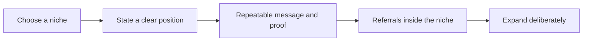

# Niche and Positioning

> **Core skill:** Choosing a niche and stating a position — what you do, for whom, and why you — so the market can remember you, refer you, and pay a premium without comparison shopping.

## Why This Matters

Generalists compete on price and availability; specialists get remembered and referred. The market cannot refer what it cannot recall, and recall is built from a position simple enough to repeat at lunch: one sentence that says what you do, for whom, and what changes as a result. Positioning is that sentence, made true by the work underneath it.

Positioning is not a tagline exercise — it is an operating decision. It changes who you market to, which work you accept, what proof you build, and even what you charge. A niche shrinks the visible market in exchange for a much higher hit rate inside it: fewer, better-fit leads, shorter discovery, less fee negotiation, and case studies that compound in one direction.

Most strong independents position at the junction of two axes — a problem and an industry, a method and a buyer role — and then widen only after the position is undeniable. Positioning is never final; it is provisional and reviewable, but it should be stable long enough for referrals to accumulate.

## The Axes of a Niche

| Axis | Example | When It Works Well |
|------|---------|--------------------|
| Problem category | Payment reconciliation, data platform migrations | The pain is named the same way by buyers |
| Industry | Mid-market insurers, clinical labs | Domain language creates defensibility |
| Technology or method | Legacy-to-cloud migration, observability | The method is scarce and provable |
| Buyer role | Engineering leaders, CTO office | You can be reached where the buyer gathers |
| Company size or stage | Seed-stage startups, 200-2000 employees | Budget sizes and needs are predictable |
| Engagement type | Fractional CTO, audit, build-and-hand-over | The format itself becomes recognizable |

Two axes usually suffice. Three sounds impressive and is usually unprovable in conversation.

## Generalist vs Specialist Trade-offs

| Dimension | Generalist | Specialist |
|-----------|------------|------------|
| Competition | Everyone, including offshore and agencies | A short list you can name |
| Pricing power | Competed down to market rates | Premium justified by scarcity |
| Marketing | Broad, noisy, forgettable | Narrow, memorable, referable |
| Referrals | "Knows someone who does websites" | "Is the person for this exact problem" |
| Pipeline stability | Feast and famine | Fewer but better-fit leads |
| Discovery speed | Long, educational calls | Buyers arrive pre-qualified |

The specialist's risk — too narrow, no demand — is fixed by testing the niche before branding it, not by staying vague forever.

## The Position Loop



The loop compounds: every engagement delivers both money and evidence. Expansion happens along an axis proved by client language, never by boredom.

## Practical Applications

### Positioning Checklist

- [ ] The niche is one junction of two axes a buyer would recognize
- [ ] The positioning sentence can be repeated by a client without notes
- [ ] Proof exists or is planned for every claim in the sentence
- [ ] The website, profile, and one-pager state the same position
- [ ] There is a written answer to "what if a great off-niche project appears?"
- [ ] The position has a review date tied to evidence, not mood

### Positioning Statement Template

```markdown
## Positioning Statement

I help <who exactly> achieve <outcome> through <method or approach>.

Unlike <alternative they use today>, I <specific difference>.

Evidence: <case study, result, credential, or referral that proves it>.

Currently accepting: <engagement type and fit criteria>.
```

## Common Pitfalls

| Pitfall | Why It Is a Problem | Better Approach |
|---------|---------------------|-----------------|
| **Niche cosplay** | Claiming a niche without proof reads as marketing noise | Earn the claim with one published result first |
| **Technology-only positioning** | "Rust consultant" attracts curiosity, not budget | Position on the outcome the technology unlocks |
| **Hiding the niche** | Fear of turning people off makes the message invisible | State the niche; off-fit referrals can still flow via you |
| **Monthly repositioning** | Referrals need time to compound under one label | Commit for two or three quarters; change on evidence |
| **Positioning without saying no** | Accepting everything quietly deletes the niche | Write fit criteria and decline politely, with referrals |
| **Serving two niches** | The market files you under neither | Pick a primary; let the second become a sub-specialty |

## Success Indicators

- Prospects describe you to others using your own positioning language
- Inbound inquiries self-select with high fit and less price haggling
- Case studies and testimonials cluster around one recognizable problem
- Rate increases land with minimal pushback because alternatives are few
- Off-niche requests arrive as referrals onward instead of distractions you accept

## Related Topics

- [[03_Choosing_Your_Problem_Space]]
- [[06_Market_and_Competitor_Scanning]]
- [[02_Product_and_Service_Design/00_overview|Product and Service Design]]
- [[06_Sales_and_Client_Communication/00_overview|Sales and Client Communication]]

## Summary

Niche and positioning turn capability into memory: pick a junction of two axes a market recognizes, state the position in one repeatable sentence, and back every claim with proof that compounds. The specialist who holds one position long enough to be referred, and only widens on evidence, converts a crowded market into a shortlist of one.
