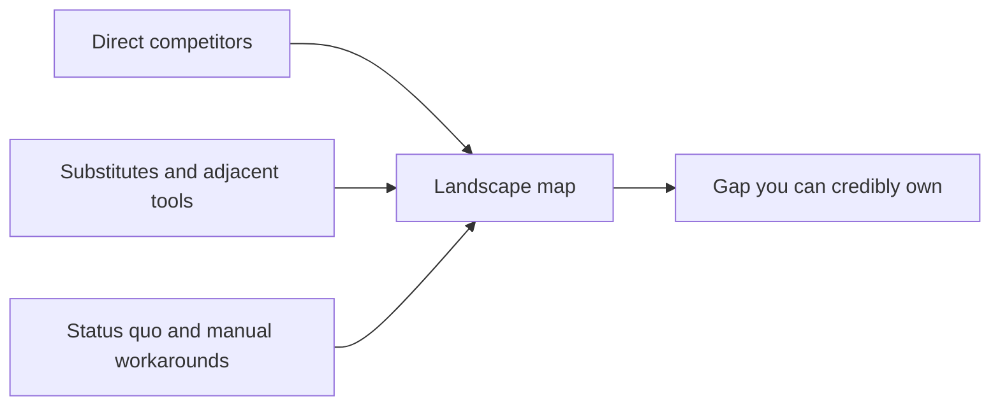

# Market and Competitor Scanning

> **Core skill:** Mapping the landscape around a problem space — competitors, substitutes, and the status quo — fast and cheaply enough to inform positioning without draining discovery time.

## Why This Matters

Independents skip scanning and then get surprised: undercut on price, dismissed with "we already use something", or defeated by a tool the customer built in-house. Scanning is not academic research — it is knowing the alternatives your buyer will compare you against, including the most common one, which is doing nothing.

The most important competitor is rarely a named company. It is the status quo: a manual process, a spreadsheet, an internal script, or the decision to tolerate the pain. Spend is the tell — what does the buyer already pay in tools, contractors, or lost hours? That figure anchors both the value story and the price.

Scanning must be time-boxed. Two weeks of cheap, buyer-facing research with an explicit stop date beats endless analysis, and it draws from the same sources buyers themselves see: pricing pages, review sites, community threads, job postings, and sales conversations. The output is a single landscape page that feeds positioning and offer design, refreshed quarterly rather than studied continuously.

## What to Scan

| Category | Where It Is Visible | What It Tells You |
|----------|---------------------|-------------------|
| Direct competitors | Websites, pricing pages, review sites | Price bands, promises, service levels |
| Adjacent tools | Product docs, marketplaces, integrations | Where buyers stitch solutions together |
| Agencies and outsourcing | Portfolios, retainers, job ads | Who competes for the same budget line |
| Internal workarounds | Prospect conversations, job descriptions | The real incumbent to displace |
| Status quo | Budget documents, tolerance for pain | Cost of doing nothing, your true benchmark |
| Open-source options | Repositories, forums, community channels | Free substitutes and their hidden costs |

## Scan Sources and Cost

| Source | Effort | Best Signal |
|--------|--------|-------------|
| Competitor pricing and marketing pages | An hour per competitor | Positioning claims and price anchors |
| Review sites and community threads | An afternoon | Complaints, switching triggers, unmet needs |
| Job postings in the space | An afternoon | Budgets, tooling, internal capability gaps |
| Tender and procurement portals | Ongoing, light | Contract sizes, requirements language |
| Sales conversations | Every deal | What buyers evaluate against you |
| News, funding, and launches | Monthly scan | Market direction and new entrants |

## The Landscape Map



The output is not a report — it is a shortlist of gaps, ranked by how credibly you can own each one given your skills, proof, and reach.

## Practical Applications

### Scanning Checklist

- [ ] Three to five alternatives the buyer considers are named with price bands
- [ ] The status quo cost is estimated in money and hours per month
- [ ] Complaints and switching triggers are collected from reviews and forums
- [ ] The scan has a written stop date and a fixed time budget
- [ ] Findings are condensed to one page, not a research archive
- [ ] A refresh date is set for the next pass, typically quarterly

### Landscape One-Pager

```markdown
## Landscape — <problem space>

| Alternative | Price Band | Promise | Weakness |
|-------------|------------|---------|----------|
| <competitor> | <range> | <claim> | <gap> |
| <adjacent tool> | <range> | <claim> | <gap> |
| <internal workaround> | <cost> | <claim> | <gap> |
| <do nothing> | <cost> | none | <tolerance limit> |

Gap I can credibly own: <one sentence>
Why not the status quo: <one sentence>
Next scan: <date>
```

## Common Pitfalls

| Pitfall | Why It Is a Problem | Better Approach |
|---------|---------------------|-----------------|
| **Analysis paralysis** | Scanning feels productive and delays selling indefinitely | Cap it: two weeks, one page, move on |
| **Copying competitor positioning** | Matching incumbents means competing where they are strongest | Scan to differentiate, not to imitate |
| **No competitors detected** | Usually means the problem is unvalidated, not untapped | Check for substitutes and status quo before celebrating |
| **Ignoring the status quo** | Spreadsheets and manual processes win most deals by default | Quantify the cost of doing nothing for each prospect |
| **Review-site tunnel vision** | Reviews skew toward the loudest, not the typical buyer | Pair reviews with primary conversations |
| **One-time scan** | Markets shift while you deliver | Refresh on a quarterly cadence |

## Success Indicators

- You can describe the buyer's top three alternatives and their prices from memory
- Offers attack a specific, named gap rather than a vague improvement
- The "why not do nothing" answer is ready before every sales conversation
- New entrants and price moves are noticed within a quarter
- Positioning language differs deliberately from every competitor's claims

## Related Topics

- [[03_Choosing_Your_Problem_Space]]
- [[04_Niche_and_Positioning]]
- [[03_Business_Case_and_Economics/00_overview|Business Case and Economics]]
- [[06_Sales_and_Client_Communication/00_overview|Sales and Client Communication]]

## Summary

Market and competitor scanning is a time-boxed instrument for seeing the buyer's real alternatives — competitors, substitutes, and the status quo — before they appear in a sales conversation. Condensed to one page and refreshed quarterly, it turns positioning, pricing, and offer design from guesswork into grounded judgment.
