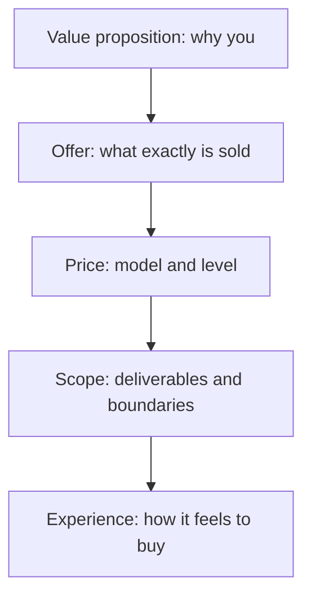

# Product and Service Design

> **Core capability:** The independent defines what they sell — a clear offer, scope, value proposition, pricing model, and delivery experience — designed so customers buy confidently and engagements succeed.

## Why This Matters

Independents sell two different things: services (time, expertise, outcomes) and products (software, content, platforms) — often a mix. Both require offer design: what exactly is being sold, to whom, at what price, with what scope, and what the customer experiences from first contact to final delivery.

A well-designed offer sells itself: the customer knows what they get, what it costs, and why it matters. A vague offer creates endless scoping conversations, price negotiations, and scope creep. The design work happens before the sale — and it is where the most profitable hours are spent.

## Topics in This Capability Area

| Topic | Core Skill | When It Matters |
|-------|------------|-----------------|
| [[01_Service_Offers_and_Packaging]] | Structuring consulting and service offers | Before selling anything |
| [[02_Value_Propositions_and_One_Pagers]] | Articulating value crisply for prospects | Marketing; proposals |
| [[03_Pricing_Models_and_Strategies]] | Choosing pricing: hourly, fixed, value-based, retainer | Every offer |
| [[04_Product_vs_Service_Decisions]] | Deciding what to sell and how the mix evolves | Business strategy |
| [[05_Scoping_and_Deliverable_Definition]] | Defining scope, deliverables, and acceptance | Every engagement |
| [[06_MVP_and_Offer_Iteration]] | Launching small, iterating on the offer itself | From first sales onward |
| [[07_Client_Experience_and_Reporting]] | Designing the experience customers pay for | Every engagement |

## The Offer Stack

Customers buy the whole stack — a great offer with a bad experience churns.

## Practical Applications

### Offer Design Checklist

- [ ] The offer names the customer, the problem, and the outcome in one paragraph
- [ ] Pricing model matches the value delivered and the risk taken
- [ ] Deliverables and acceptance criteria are explicit
- [ ] The offer has been sold (or realistically tested) at least once
- [ ] The client experience is designed: kickoff, cadence, closure

## Common Pitfalls

| Pitfall | Why It Is a Problem | Better Approach |
|---------|---------------------|-----------------|
| **Hourly-only pricing** | Punishes efficiency; caps income | Mix models; value-based where outcomes are clear |
| **Custom everything** | Every proposal bespoke; no repeatability | Productize the repeatable parts |
| **Vague scope** | Infinite revisions; unprofitable projects | Explicit deliverables and acceptance |
| **Selling the stack, not the outcome** | Customers buy outcomes, not technologies | Lead with the result; tech is the mechanism |

## Success Indicators

- Prospects understand the offer from one page
- Sales conversations start from the offer, not from scratch
- Projects land within scope and margin because the scope was designed
- Repeat sales and referrals cite the experience, not just the work

## Related Capabilities

- [[01_Problem_Discovery_and_Customer_Validation/00_overview|Problem Discovery and Customer Validation]]: offers are designed from validated problems
- [[03_Business_Case_and_Economics/00_overview|Business Case and Economics]]: offers must be economically viable
- [[career-path/14_Product_Manager/00_overview|Product Manager]]: product discipline the founder applies to their own product
- [[career-path/16_Developer_Advocate_and_Technical_Consultant/05_Solution_Guidance/00_overview|Solution Guidance (Dev Advocate)]]: consultative scoping in practice

## Summary

Product and service design turns validated problems into sellable offers: clear value, deliberate pricing, explicit scope, and a designed experience. The offer is the product of the business — design it as carefully as any system.