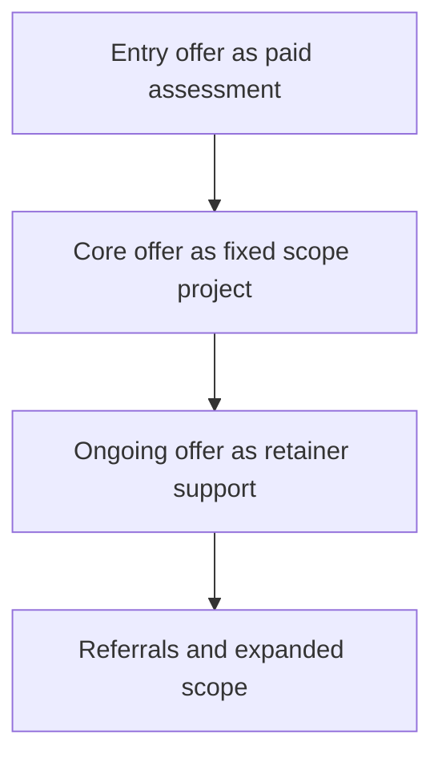

# Service Offers and Packaging

> **Core skill:** Structuring what you sell into defined, repeatable offers — assessments, projects, retainers — packaged so prospects can buy without a bespoke proposal every time.

## Why This Matters

Services feel bespoke by nature, and most independents let them be fully bespoke. The cost appears quietly: every sale starts from zero, every proposal is written from scratch, every scope conversation is new, and delivery quality varies with whatever was promised in the moment. Custom selling makes the cost of sales unbounded — the classic independent trap where revenue grows but hours and stress grow faster.

Packaging turns expertise into products that can be sold and delivered repeatedly. An offer is a promise with edges: a named outcome, a duration or effort limit, explicit inclusions and exclusions, a price, and a defined way to start. Edges are not bureaucracy — they are what allows a prospect to say yes without a series of meetings, and what allows the independent to deliver profitably without renegotiating scope mid-flight.

A healthy portfolio layers three kinds of offers. The entry offer — a paid assessment or diagnostic — lets a cautious buyer start small and lets you qualify the problem. The core offer delivers the main outcome. The ongoing offer — retainer or support — stabilizes revenue between projects and turns one-time engagements into relationships. Each layer answers a different question the buyer is asking.

## The Offer Layers

| Layer | Buyer's Question | Typical Shape | Portfolio Role |
|-------|------------------|---------------|----------------|
| Entry offer | "Can I start small and see how they work?" | Paid audit, discovery sprint, health check | Qualifies buyers; funds scoping |
| Core offer | "Who delivers the outcome I need?" | Fixed-scope project or build | Delivers the thesis; carries margin |
| Ongoing offer | "Who keeps this running and improving?" | Retainer, support, advisory cadence | Stabilizes revenue; deepens accounts |
| Pilot | "Can we test value before committing broadly?" | Bounded paid pilot with criteria | De-risks adoption for both sides |
| Enablement | "Can you make my team better at this?" | Workshops, training, playbooks | Reaches budget owners beyond delivery |
| Template product | "Do you have something I can use myself?" | Toolkit, template, documentation | Serves smaller buyers; seeds referrals |

## Packaging Dimensions

| Dimension | Choice Range | Why It Matters |
|-----------|--------------|----------------|
| Outcome promise | Activity, deliverable, or measurable result | Determines pricing power and acceptance criteria |
| Duration | Fixed days, fixed weeks, until milestone | Caps effort and anchors price |
| Price model | Fixed fee, day rate, retainer, milestone | Must match scope certainty and buyer culture |
| Boundaries | What is excluded, and what the client provides | Exclusions prevent scope creep better than goodwill |
| Limits | Revisions, environments, seats, sessions | Unbounded revisions destroy margin silently |
| Deliverables | Documents, systems, reports, handover | The buyer's receipt; the basis of acceptance |
| Start conditions | Deposit, access, kickoff prerequisites | Momentum begins when the clock can actually start |

## The Layered Offer



Buyers enter through the smallest gate they trust and move right as value is proven. Each layer is priced to stand alone; none depends on a promise of future work.

## Practical Applications

### Packaging Checklist

- [ ] Each offer has a one-line outcome promise a buyer can repeat
- [ ] Inclusions, exclusions, and client responsibilities are written down
- [ ] At least one entry offer exists below the main project's commitment level
- [ ] An ongoing offer exists for clients who want continuity
- [ ] The offer can be quoted from a template in under an hour
- [ ] Every offer has been sold or realistically tested at least once

### Offer Card Template

```markdown
## Offer Card — <offer name>

Promise: <outcome in one sentence>.
For: <buyer and trigger>.
Format: <duration, cadence, engagement shape>.
Price: <model and range>.
Included: <deliverables 1-4>.
Not included: <exclusions and prerequisites>.
Client provides: <access, data, people, decisions>.
Starts when: <deposit, kickoff conditions>.
```

## Common Pitfalls

| Pitfall | Why It Is a Problem | Better Approach |
|---------|---------------------|-----------------|
| **Bespoke everything** | Sales cost balloons and nothing compounds | Package the repeatable eighty percent |
| **Hourly-only offers** | Buyers cannot see outcomes; efficiency is punished | Price outcomes for defined scopes; reserve hourly for unknown work |
| **No entry offer** | First ask is the biggest ask a buyer can face | Add a small paid assessment to qualify |
| **Unbounded revisions** | "Reasonable revisions" means unlimited revisions | Cap rounds explicitly in the offer card |
| **Scope defined by effort** | "Ten days" says nothing about what changes for the client | Define deliverables and acceptance, not just duration |
| **Discounting through scope** | Cutting deliverables to discount teaches buyers to haggle | Hold scope and price; remove a phase instead |

## Success Indicators

- Prospects choose from a small menu of offers instead of requesting custom quotes
- Proposals are light edits of an offer card, not fresh documents
- Delivery runs repeatably across clients because boundaries are explicit
- Entry offers convert into core projects at a healthy rate
- Recurring retainers smooth the revenue curve between projects

## Related Topics

- [[02_Value_Propositions_and_One_Pagers]]
- [[03_Pricing_Models_and_Strategies]]
- [[05_Scoping_and_Deliverable_Definition]]
- [[01_Problem_Discovery_and_Customer_Validation/00_overview|Problem Discovery and Customer Validation]]
- [[career-path/16_Developer_Advocate_and_Technical_Consultant/05_Solution_Guidance/00_overview|Solution Guidance (Dev Advocate)]]

## Summary

Service offers and packaging convert expertise into buyable products: layered offers — entry, core, ongoing — with explicit promises, boundaries, prices, and start conditions. The independent who packages what they sell spends less time re-selling themselves, delivers with fewer surprises, and builds a portfolio where each client relationship has a natural next step.
