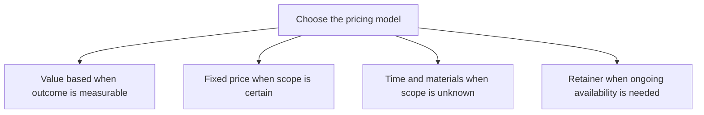

# Pricing Models and Strategies

> **Core skill:** Choosing a pricing model — hourly, fixed, value-based, retainer — that matches the outcome, the risk, and the customer's buying culture, and setting a level that funds the business.

## Why This Matters

Pricing is where the independent's value and risk meet, and most independents default to hourly because it feels safe and defensible. Hourly pricing has three structural costs: it caps income at available hours, it punishes the efficiency that expertise should buy, and it anchors every conversation to your cost rather than the customer's outcome. Choosing a model deliberately — and revisiting it as the offer changes — is one of the highest-leverage skills in independent work.

Each model suits a situation. Fixed price fits certain scope and confident delivery. Time and materials with a cap fits exploration under uncertainty. Value-based pricing fits outcomes that are measurable and attributable, where the buyer can see the return. Retainers fit value that is really availability and continuity — the call that gets answered within the hour. The model and the offer must agree; a mismatched deal fights itself from signature to delivery.

The price level is a business decision with three reference points: the floor (cost plus a margin that lets the business survive), the band (what the market pays for comparable outcomes), and the premium (what scarcity and proof justify). Undercharging is not modesty — it is a subsidy that exhausts the operator, signals low stakes to the buyer, and attracts clients who treat the work as cheap. Rates should rise on a cadence, not on a rescue.

## Pricing Models Compared

| Model | How It Works | Best When | Main Risk |
|-------|--------------|-----------|-----------|
| Hourly or day rate | Time is the billed unit | Scope genuinely unknowable; staff aug | Caps income; rewards slowness |
| Fixed price | One fee for a defined deliverable | Scope is certain; buyer needs certainty | Mispriced discovery eats the margin |
| Time and materials with cap | Rate plus a ceiling | Exploration with a bounded budget | Cap becomes a de facto fixed price |
| Value-based | Price against the outcome's worth | Outcome is measurable and attributable | Attribution arguments; buyer sophistication |
| Retainer | Recurring fee for access or capacity | Ongoing availability and continuity | Retainer without boundaries becomes a job |
| Milestone or phase pricing | Payments tied to delivered stages | Large projects needing cash discipline | Milestone disputes stall everything |

## Setting the Level

| Input | Question | Consequence If Ignored |
|-------|----------|------------------------|
| Cost floor | What does a month of my business cost? | Any fee below it is slow bankruptcy |
| Market band | What do comparable outcomes sell for? | Wild pricing destroys trust or leaves money |
| Buyer value | What is the outcome worth to this buyer? | Value pricing becomes guesswork |
| Risk allocation | Who absorbs overruns in this deal? | Your margin pays for other people's chaos |
| Urgency | How fast must it happen? | Rush value is donated for free |
| Alternatives | What is their next-best option? | Negotiation happens with no anchor |

## The Model Decision



Pick the model whose assumption you can defend. When two fit, prefer the one closer to the buyer's outcome — it prices the result, not your calendar.

## Practical Applications

### Pricing Checklist

- [ ] The model matches scope certainty, not habit
- [ ] A cost floor exists and no quote goes below it silently
- [ ] The quote names what happens when scope changes
- [ ] Payment is milestone or deposit weighted, not all at the end
- [ ] Rates are reviewed annually against market and value
- [ ] The three-option structure is used where choices help the buyer

### Quote Structure Template

```markdown
## Quote — <engagement>

Price: <fee or rate>.
Covers: <deliverables and scope summary>.
Assumes: <client dependencies and conditions>.
Payment: <deposit, milestones, schedule>.
Changes: <how scope changes are priced and approved>.
Valid until: <date>.
```

## Common Pitfalls

| Pitfall | Why It Is a Problem | Better Approach |
|---------|---------------------|-----------------|
| **Hourly by default** | Couples income to hours and invites cost audits | Match the model to the outcome; use hourly only for unknown scope |
| **Fixed price on unknown scope** | Discovery becomes unpaid risk absorbed by you | De-risk with a paid assessment first |
| **Discounting without scope change** | Teaches buyers that your first number is fiction | Cut scope or phases instead of price |
| **Never raising rates** | Below-market fees accumulate silently for years | Schedule annual reviews; raise on new clients first |
| **Ignoring payment terms** | Net-90 from a slow payer is an interest-free loan | Negotiate deposits and milestones up front |
| **Unbounded retainers** | Access without limits becomes an underpaid job | Cap hours, response scope, and review cadence |

## Success Indicators

- Project margins hold across delivery, not just in proposals
- Rate increases lose few good clients and improve the client mix
- Buyers discuss outcomes and value rather than hours and timesheets
- Revenue includes recurring retainers or subscriptions alongside projects
- Payment arrives on schedule because terms were priced into the deal

## Related Topics

- [[01_Service_Offers_and_Packaging]]
- [[05_Scoping_and_Deliverable_Definition]]
- [[04_Product_vs_Service_Decisions]]
- [[03_Business_Case_and_Economics/00_overview|Business Case and Economics]]

## Summary

Pricing models and strategies connect the offer to the business that must survive it: choose the model that matches scope certainty and outcome measurability, set the level from cost floor, market band, and buyer value, and structure payments so cash arrives as work progresses. The independent who prices deliberately earns more from the same expertise — and attracts the clients who value it.
