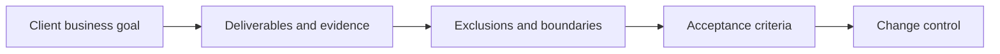

# Scoping and Deliverable Definition

> **Core skill:** Defining exactly what is delivered, what is excluded, and how acceptance is decided — before work starts, so the engagement can succeed on paper first.

## Why This Matters

Most independent project pain originates in scope, not in code. Vague promises, undefined acceptance, and unbounded revisions turn profitable engagements into unpaid apprenticeship. Scoping is not paperwork that follows the sale — it is the design of the commitment itself, and it happens while both sides are still optimistic. If the commitment cannot be written down precisely, it cannot be delivered profitably.

A solid scope statement contains seven parts: the client's business goal, the deliverables that mark progress, the exclusions that bound the work, the assumptions the plan rests on, the client-side dependencies with dates, the acceptance criteria that define done, and the change control that handles everything reality throws at the plan. The exclusions list is the most valuable and most neglected part — it is where scope creep dies, politely, before it exists.

Exclusions are not hostility; they are honesty. Good clients respect boundaries that make outcomes testable, and difficult clients reveal themselves at the exclusions conversation — which makes the scope document a discovery instrument as much as a contract. Change control protects the relationship: the working answer to new requests is never "no", it is "yes — here is the change order, priced and scheduled".

## Scope Statement Anatomy

| Element | Question It Answers | Failure Mode If Missing |
|---------|--------------------|-------------------------|
| Business goal | Why is the client buying this? | Work proceeds with no success definition |
| Deliverables | What tangible items are produced? | Progress is invisible; arguments at the end |
| Exclusions | What is explicitly not included? | Everything becomes negotiable |
| Assumptions | What must remain true for the plan to hold? | Every surprise becomes your problem |
| Dependencies | What must the client provide, and when? | Delays blamed on you regardless |
| Acceptance | Who confirms done, how, and by when? | "We will know it when we see it" |
| Change control | How are new requests priced and approved? | Scope creep absorbed silently |

## Deliverable Definition Fields

| Field | Example | Why It Matters |
|-------|---------|----------------|
| Name | "Migration runbook" | One deliverable, one name, no ambiguity |
| Format | Document, repository, recording, system | Sets production effort and review mode |
| Evidence | Reviewed by client lead in a walkthrough | Defines how delivery is demonstrated |
| Acceptance criterion | "Chapters approved by named reviewers" | Done becomes objective |
| Owner | Who on your side produces it | Accountability without meetings |
| Due point | Kickoff plus two weeks | Sequences payment and dependencies |

## The Scope Chain



Each link converts the one before it into something testable. A chain with a missing link fails at the weak point, and the failure surfaces late — at delivery, when goodwill is exhausted.

## Practical Applications

### Scoping Checklist

- [ ] The business goal is one paragraph the client would sign their name to
- [ ] Every deliverable has a format and an acceptance criterion
- [ ] Exclusions are explicit and were discussed out loud, not just listed
- [ ] Client dependencies have owners and dates
- [ ] Acceptance is time-boxed: silence after review counts as approval
- [ ] Change handling is written: small fixes vs new scope vs new phases

### Scope Section Template

```markdown
## Scope — <engagement>

Goal: <business outcome the client buys>.
Deliverables: <numbered list, each with format and acceptance criterion>.
Excluded: <explicit out-of-scope list>.
Assumptions: <conditions the plan rests on>.
Client provides: <access, data, reviewers — with dates>.
Acceptance: <reviewer, method, and response window>.
Changes: <anything new is quoted separately; nothing is absorbed silently>.
```

## Common Pitfalls

| Pitfall | Why It Is a Problem | Better Approach |
|---------|---------------------|-----------------|
| **"Reasonable revisions"** | Every party defines reasonable differently, always in the client's favor | Cap revision rounds numerically |
| **Undefined acceptance** | "When they are happy" is not a criterion anyone can hit | Name the reviewer, method, and window |
| **Scope by effort** | "Ten days" describes input, not value | Sell deliverables; use time only internally |
| **Ignored dependencies** | Slow access or feedback becomes your delivery delay | Put client duties in the document with dates |
| **No change control** | New requests arrive as favors, not priced work | Every change gets a written response and a number |
| **Absorbing creep to be nice** | Hospitality without boundaries kills margin and resentment grows | Offer the change order kindly and immediately |

## Success Indicators

- Deliverables are accepted on the first formal review, without debate about done
- Change requests arrive as questions about cost, not as expectations
- Project margin holds at close because scope was designed, not discovered
- Clients say the scope document made them more confident, not more suspicious
- "Quick question" requests arrive in batches for the weekly cadence slot

## Related Topics

- [[01_Service_Offers_and_Packaging]]
- [[03_Pricing_Models_and_Strategies]]
- [[07_Client_Experience_and_Reporting]]
- [[04_Delivery_and_Client_Management/00_overview|Delivery and Client Management]]
- [[07_Governance_Risk_and_Continuity/00_overview|Governance, Risk and Continuity]]

## Summary

Scoping and deliverable definition convert a hopeful sale into a deliverable commitment: a business goal, named deliverables with acceptance criteria, explicit exclusions, client dependencies with dates, and a written path for change. Designed before the work starts, the scope document protects the margin, the schedule, and — counterintuitively — the relationship, because both sides agreed on the shape of done while they still liked each other.
