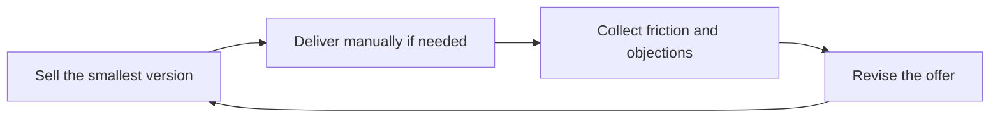

# MVP and Offer Iteration

> **Core skill:** Launching the smallest sellable version of an offer and iterating on the offer itself — informed by delivery friction, objections, and margins — rather than only polishing the product inside it.

## Why This Matters

MVP is usually discussed for products, but the independent's first version of any offer is also an MVP: a concierge delivery, a single-client pilot, a one-outcome sprint. What it tests is the offer itself — who buys, what they pay, and what delivery actually costs — and it tests those questions for the price of a few weeks rather than a few quarters of building. A product launch can hide a broken offer behind a beta; a pilot cannot.

The operative principle is the smallest thing someone will actually pay for. Manual delivery is allowed, and early on it is often best: the client buys an outcome, and the independent delivers it however is honest and reliable. Transparent concierge delivery is a service; pretending manual work is a finished product is not a strategy, it is a liability. The line between them is disclosure and pricing, not elegance of implementation.

Iteration applies to the offer, not only inside it. Price, scope, promise, cadence, and positioning all update from evidence: sales objections, delivery hours, scope variance, churn reasons, and margin. Version the offer explicitly — v1, v2, with a changelog — so changes trace to signals instead of to boredom. Market-facing iteration, with clients in the loop, is what keeps the offer alive; internal polishing without market contact is what keeps it expensive.

## MVP Forms for Offers

| Form | What It Tests | Typical Cost |
|------|---------------|--------------|
| Concierge or manual delivery | Whether the outcome matters enough to pay for | Days to weeks of hands-on work |
| Single-outcome sprint | Whether one result sells as a standalone unit | One to two weeks |
| Limited-seat workshop or cohort | Demand strength and price tolerance | Setup plus facilitation |
| Paid pilot with criteria | Fit for ongoing engagement | Weeks, partially funded |
| Template or toolkit sale | Whether knowledge sells without your hours | Content production only |
| Pre-sale before build | Willingness to fund the unbuilt | A landing page and conversations |

## Iteration Inputs

| Source | What to Watch | Offer Change It Drives |
|--------|---------------|------------------------|
| Sales conversations | Repeated objections and confusions | Message, price signal, fit criteria |
| Delivery hours | Where effort exceeds estimates | Scope limits and pricing |
| Scope variance | Which requests appear every time | New inclusions or a new offer tier |
| Client requests | Adjacent outcomes clients ask for | Upsell offers or next product seed |
| Churn and declines | Why buyers walk away | Promise realism and qualification |
| Margin at close | Which offers actually pay | Model, level, and mix |

## Signals to Version Up

| Signal | What It Means | Version Change |
|--------|---------------|----------------|
| Objection repeats three times | Message or price mismatch | Adjust promise or add a tier |
| Delivery time falls repeatably | Process matured | Raise price or add a seat |
| Clients ask for the same extra | Hidden demand | Productize the extra into scope |
| Pilot converts every time | Offer is too cheap or too wide | Increase price and qualification |
| Decline reasons cluster | Wrong buyers arriving | Tighten fit criteria |

## The Offer Loop



The loop runs on customer contact. Each cycle should change one meaningful thing — price, scope, or promise — and produce fewer support hours or cleaner sales than the last.

## Practical Applications

### Iteration Checklist

- [ ] The current offer version is written down with a version label
- [ ] At least one pilot or pre-sale has tested it with real money
- [ ] Delivery friction and objection notes are collected in one place
- [ ] Each revision cites the signal that caused it
- [ ] Manual delivery is disclosed honestly and priced fairly
- [ ] A kill date exists for any version that stops improving

### Offer Iteration Log

```markdown
## Offer Iteration Log — <offer name>

| Version | Date | Change | Signal That Caused It |
|---------|------|--------|-----------------------|
| v1 | <date> | Initial offer | <pilot or pre-sale evidence> |
| v2 | <date> | <price, scope, or promise change> | <objection, margin, or churn data> |

Current known frictions: <list>.
Next review: <date>.
```

## Common Pitfalls

| Pitfall | Why It Is a Problem | Better Approach |
|---------|---------------------|-----------------|
| **MVP as an excuse** | Sloppy delivery burns the clients who took the risk | Deliver small but deliver excellently |
| **Iterating internally** | Building without market contact perfects the wrong thing | Keep clients in every revision cycle |
| **Hiding manual delivery** | Pretending a concierge process is a product is a trust cliff | Disclose the mechanism; sell the outcome |
| **Gold-plating v1** | Months of polish delay the first real lesson | Ship the smallest sellable version |
| **No version discipline** | Offers drift silently and nobody can explain changes | Log versions with their evidence |
| **Confusing product MVP with offer MVP** | Teams build software to test a business | Test the offer first; build only what paid |

## Success Indicators

- Every offer change can be traced to a named objection, number, or client request
- Delivery hours per engagement trend down at a stable price
- The objection list shrinks with each version instead of recycling
- Price rises as the promise sharpens, without losing fit clients
- Pilots convert into ongoing work because the offer was iterated, not guessed

## Related Topics

- [[01_Service_Offers_and_Packaging]]
- [[04_Product_vs_Service_Decisions]]
- [[05_Scoping_and_Deliverable_Definition]]
- [[01_Problem_Discovery_and_Customer_Validation/00_overview|Problem Discovery and Customer Validation]]

## Summary

MVP and offer iteration apply the startup's cheapest-experiment logic to an independent's business: sell the smallest version someone will pay for, deliver it honestly, collect friction and objections as data, and revise the offer — price, scope, promise — on a versioned cadence. The offer improves the way products improve: through contact with paying reality, one measured change at a time.
