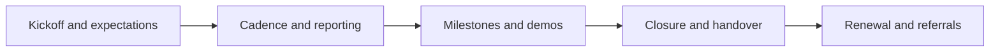

# Client Experience and Reporting

> **Core skill:** Designing the experience around the work — kickoff, cadence, reporting, closure — because renewals and referrals come from how the engagement feels, not only from what it produced.

## Why This Matters

Clients judge an engagement through its rituals: how the start felt, how often they heard from you, whether bad news arrived early, and whether the ending was a handover or a disappearance. Independents neglect experience design because delivery consumes the calendar — and that is precisely when silence starts, surprises accumulate, and a technically excellent project earns a lukewarm reference.

Experience is systematic, not accidental. A good engagement has a designed kickoff that sets expectations, roles, success criteria, and communication rhythm; a cadence of updates and demos that matches the client's risk tolerance; immediate early warning when something slips; and a structured closure with handover, documentation, and an outcomes review. After closure, the relationship becomes an asset: alumni contact, renewal timing, and referral asks placed at the moment of demonstrated success.

Reporting quality compounds across engagements. Report outcomes and decisions, not activity logs; keep updates short, regular, and skimmable; a weekly three-paragraph note prevents most status anxiety, and a demo beats a document every time. Bad news travels fastest of all — a client who hears about a slip from you on the day you learn it stays a client; one who discovers it at the review becomes a former client.

## Client Journey Stages

| Stage | Client's Question | What Good Looks Like |
|-------|-------------------|----------------------|
| First contact | "Do they understand my problem?" | Fast reply, sharp questions, no pitch dump |
| Proposal | "What exactly am I buying?" | Offer card, scope, price, start conditions |
| Kickoff | "How will this actually run?" | Roles, cadence, success criteria on one page |
| Delivery cadence | "Is it on track?" | Predictable updates; risks surfaced early |
| Milestones | "Is it working?" | Working demos against agreed criteria |
| Closure | "Can we run it without them?" | Handover, documentation, outcomes review |
| After | "Would I use them again?" | Check-in, renewal conversation, referral ask |

## Reporting Cadence

| Ritual | Frequency | Content | Purpose |
|--------|-----------|---------|---------|
| Written update | Weekly | Done, next, risks, asks | Kill status anxiety cheaply |
| Milestone demo | Per milestone | Working result against criteria | Convert progress into confidence |
| Risk flag | Immediately when known | Issue, impact, options | No surprises rule |
| Monthly summary | Monthly | Outcome metrics, decisions, spend vs plan | Sponsor-level visibility |
| Closure report | Once | Outcomes vs goals, handover, next steps | A receipt worth forwarding |

## The Experience Arc



Each stage feeds the next: the kickoff sets the cadence, the cadence builds trust for the demo, the demo earns the closure, and the closure makes renewal a conversation about the next outcome rather than a pitch.

## Practical Applications

### Experience Design Checklist

- [ ] Kickoff covers roles, cadence, success criteria, and escalation in one session
- [ ] The update rhythm is agreed and never lapses for two consecutive periods
- [ ] Demos show working results against acceptance criteria, not slides
- [ ] Bad news has a template: issue, impact, options, recommendation
- [ ] Closure always delivers handover documentation and an outcomes review
- [ ] A follow-up is scheduled for thirty to sixty days after closure

### Weekly Client Update Template

```markdown
## Weekly Update — <engagement, week of <date>>

**Done.** <Two or three concrete completions.>
**Next.** <What happens this coming week.>
**Risks.** <Issue, impact, options — or "none this week".>
**Asks.** <Decisions or access needed, with dates.>
```

## Common Pitfalls

| Pitfall | Why It Is a Problem | Better Approach |
|---------|---------------------|-----------------|
| **Going dark** | Silence reads as drift, even when work is on track | Fixed update ritual, however short |
| **Activity reporting** | Logs of busyness do not tell the client whether they are winning | Lead with outcome metrics and decisions |
| **Surprise at review** | Late-broken bad news destroys trust retroactively | Flag risks the day you know them |
| **Skipping closure** | Projects that fade out never convert to renewals | End every engagement with a structured close |
| **Theater meetings** | Long recurring calls drain both sides without decisions | Agenda-less calls become written updates |
| **Post-project silence** | The asset decays; referrals never get asked for | Schedule the thirty-day check-in and renewal talk |

## Success Indicators

- "What is the status?" emails stop arriving because the rhythm answers first
- Risks surface from both sides early, without defensiveness
- Clients propose renewals or expansions themselves before closure
- Referrals reference the experience — clarity, cadence, closure — not only the output
- Handover documents are actually used by the client's team after you leave

## Related Topics

- [[05_Scoping_and_Deliverable_Definition]]
- [[01_Service_Offers_and_Packaging]]
- [[04_Delivery_and_Client_Management/00_overview|Delivery and Client Management]]
- [[06_Sales_and_Client_Communication/00_overview|Sales and Client Communication]]

## Summary

Client experience and reporting design the rituals that carry an engagement: a kickoff that sets expectations, a cadence that prevents anxiety, demos that prove progress, early honest risk flags, and a closure that hands over rather than abandons. Independents live on renewals and referrals, and both are bought by how the work felt — which is a design problem, solvable in advance.
