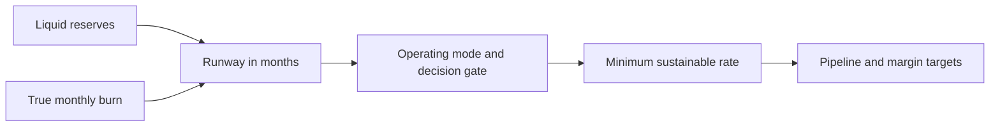

# Cost Structures and Runway

> **Core skill:** Knowing the true monthly cost of your life and business, and converting savings into a runway clock that governs every decision.

## Why This Matters

An employee's financial world is automatic: salary arrives, costs are personal, and the buffer is someone else's problem. An independent carries both sides of the ledger — revenue must be earned before anything is paid, and every slow month consumes reserves. The most common failure of independent technical work is not technical: it is arithmetic discovered too late. You cannot price, negotiate, or decide without first knowing your number — the true monthly cost of operating your life and your business.

Runway is the clock that converts that number into a decision. Liquid reserves divided by true monthly burn gives months of survival, and every significant choice — take this client, decline that one, build this product, wait for a better engagement — is a bet measured against that clock. Independents who track runway make calm decisions because the consequences are bounded; those who do not discover the clock only when it is nearly out.

Costs split into fixed and variable, and the split is a design choice, not an accident. Fixed costs determine how fragile slow months are; variable costs determine how much margin a busy month actually produces. Building the right cost structure — lean fixed, controlled variable, honest personal baseline — is the first act of business design.

## Fixed and Variable Costs of a One-Person Firm

| Category | Typical Examples | Nature | Control Lever |
|----------|------------------|--------|---------------|
| Personal baseline | Housing, food, family obligations, health cover | Fixed, personal | Lifestyle decisions revisited annually, not monthly |
| Workspace | Rent or coworking, utilities share, furniture | Fixed | Workspace tier; home office first |
| Software and tools | IDE, design tools, AI assistants, hosting, analytics | Fixed, creeps upward | Quarterly subscription audit |
| Hardware | Laptop, monitor, phone, test devices | Step-fixed, amortized | Replacement cycle discipline |
| Connectivity | Internet, mobile plans, backup link | Fixed | Right-size plans to actual use |
| Professional services | Accounting, legal, insurance broker | Fixed, lumpy | Scope the advice you actually need |
| Taxes and contributions | Income tax, social security, VAT administration | Proportional to revenue | Reserves and structure, not avoidance |
| Subcontractors | Designers, developers, specialists | Variable per engagement | Engagement design and margins |
| Cloud and infrastructure | Client systems, product hosting, CI | Variable, can surprise | Pass-through clauses; monitoring; budgets |
| Marketing and community | Website, events, sponsorships, content | Discretionary | Fund only what feeds pipeline |
| Payment and banking | Transfer fees, card fees, currency conversion | Variable | Invoicing and payment channels practice |

The discipline is classifying honestly: a cost that recurs every month is fixed whether or not you call it that, and fixed costs set the floor below which no month can go.

## The True Monthly Cost Baseline

Maintain three layers, not one number. The survival layer covers personal essentials plus the business costs that must be paid to stay legal and functional. The operating layer adds tools, services, accounting, and buffer maintenance. The growth layer adds marketing, learning, and experiments. Know which layer you are living in, and which layer your pricing must support.

Amortize annual costs into monthly figures so nothing arrives as a surprise, and treat the tax reserve as a policy rather than a cost you hope to afford later.

| Layer | What It Includes | Example Monthly Figure |
|-------|------------------|------------------------|
| Survival | Personal essentials plus must-pay business costs | 60,000 |
| Operating | Survival plus tools, services, accounting, buffer upkeep | 80,000 |
| Growth | Operating plus marketing, learning, experiments | 100,000 |

Figures are illustrative and currency-neutral; the layers matter more than the amounts.

## Runway Mathematics

Runway equals liquid reserves divided by true monthly burn. Count only money you can actually spend: savings and accessible business cash, with receivables counted conservatively if at all. Recompute on a fixed day every month, no exceptions — a stale runway is worse than none because it produces false confidence.

| Reserves | Monthly Burn | Runway | Operating Mode |
|----------|--------------|--------|----------------|
| 1,200,000 | 80,000 | 15 months | Aggressive: invest, build, take selective bets |
| 720,000 | 80,000 | 9 months | Confident: grow pipeline, control fixed costs |
| 400,000 | 80,000 | 5 months | Defensive: sell now, cut discretionary spend |
| 200,000 | 80,000 | 2.5 months | Emergency: survival focus, take work that funds |

Runway also feeds pricing. The minimum sustainable rate is the monthly cost baseline divided by realistically billable hours per month — and billable hours are roughly half of working hours once sales, admin, learning, and support are counted. Pricing below that floor means the business pays you to work.

| Component | Example | Note |
|-----------|---------|------|
| Monthly cost baseline | 80,000 | Operating layer |
| Realistic billable hours | 80 hours | Half of a 160-hour month |
| Floor rate | 1,000 per hour | Covers costs with zero profit |
| Target rate | 1,500 to 2,000 per hour | Funds buffer, slow months, investment |



## Practical Applications

Cost and runway review, run monthly:

```markdown
## Monthly Cost Baseline
- [ ] List every recurring cost, personal and business, in one sheet
- [ ] Amortize annual costs into a monthly figure
- [ ] Classify each cost as fixed, variable, or discretionary
- [ ] Cancel or downgrade anything unused in the last 30 days
- [ ] Compute the survival, operating, and growth layers

## Runway Check
- [ ] Total liquid reserves, excluding illiquid or optimistic assets
- [ ] True monthly burn including personal draw and tax reserve
- [ ] Runway in months, updated on the same day every month
- [ ] Operating mode chosen for the current runway band
- [ ] Minimum sustainable rate recomputed from current costs
```

## Common Pitfalls

| Pitfall | Why It Is a Problem | Better Approach |
|---------|---------------------|-----------------|
| **Personal costs excluded** | The business looks profitable while the owner is quietly underpaid and stressed | One baseline includes both; pay yourself an explicit monthly draw |
| **Subscription creep** | Ten small tools quietly add up to a second rent payment | Quarterly audit; cancel anything unused for a month |
| **Taxes treated as an annual surprise** | Money owed is spent months before it is due | Reserve a fixed share of every payment received |
| **Single monthly number** | No distinction between survive, operate, and grow modes | Maintain three layers and know which one is active |
| **Stale runway** | Slow months pass unnoticed until the clock is nearly out | Recompute on a fixed day monthly, no exceptions |
| **Optimistic asset counting** | Runway appears longer than the money can actually fund | Count only liquid reserves; treat receivables conservatively |

## Success Indicators

- You can state your monthly burn and runway in months without opening a spreadsheet
- Tool and subscription costs are reviewed on schedule and trending flat
- Fast months and slow months are both survivable from reserves
- Pricing decisions cite the minimum sustainable rate, not market guesses
- Runway entering the defensive band triggers action before crisis

## Related Topics

- [[02_Revenue_Models_and_Forecasting]]: costs set the floor that every revenue model must clear
- [[03_Financial_Planning_for_Solopreneurs]]: the monthly ritual that keeps the baseline current
- [[05_Bootstrapping_vs_Funding]]: runway length determines which growth path is available
- [[career-path/13_Project_and_Program_Manager/03_Schedule_and_Cost/03_Cost_Estimation_and_Budgeting|Cost Estimation and Budgeting (PjM)]]: project-level cost discipline adapted to a business of one
- [[07_Governance_Risk_and_Continuity/00_overview|Governance, Risk and Continuity]]: taxes and legal structure are part of the cost baseline

## Summary

Cost structure and runway are the first numbers of an independent business: classify fixed and variable costs honestly, keep three baseline layers, and convert reserves into a runway clock that gates every decision. Recompute monthly, price above the minimum sustainable rate, and let the runway band — not mood — set how aggressively to invest, sell, or cut.

