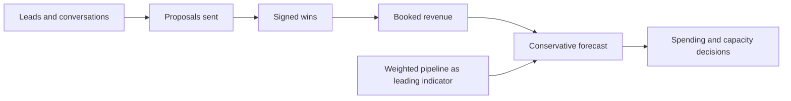

# Revenue Models and Forecasting

> **Core skill:** Modeling how money actually arrives — engagement shapes, pipeline math, and conservative forecasts that survive contact with reality.

## Why This Matters

A revenue model is not a label on an invoice; it is a shape of cash. Hourly work pays linearly and stops when you stop. Retainers pay in calm repeating pulses. Products pay late but can pay while you sleep. Fixed-price work pays a known amount against an uncertain cost. The mix you choose determines how predictable your income is, how much risk each month carries, and how much of your time is sellable at all.

Forecasting is where discipline shows. Most independent income collapses come from forecasts built on best cases: the big proposal counted as won, the client's verbal commitment treated as signed, the conversion rate taken from the single best month. A conservative forecast is not pessimism — it is the operating budget. Upside is a bonus; the conservative case must cover the cost baseline or the plan is fiction.

Pipeline math turns sales from a mystery into arithmetic. If twenty conversations yield six proposals, and six proposals yield two wins, then a monthly target of two wins implies a standing flow of twenty conversations. Once you know the ratios, you know exactly how much selling next quarter requires — and whether your current activity is enough.

## Revenue Models Compared

| Model | How It Earns | Margin Shape | Main Risk | Fits When |
|-------|--------------|--------------|-----------|-----------|
| Time and materials | Hours billed at a rate, invoiced monthly | Linear, capped by hours | Income stops when work stops | Scope is evolving and trust is high |
| Fixed price | One price for a defined outcome | Upside if efficient, downside if wrong | Estimation error eats the margin | Work is well-scoped and understood |
| Monthly retainer | Recurring fee for capacity or access | Predictable and compounding | Scope creep hides inside access | Trusted ongoing relationships exist |
| Value based | Price tied to a measurable client outcome | Highest margin, hardest to sell | Value attribution disputes | Outcomes are measurable and credible |
| Productized service | Fixed scope, fixed price, repeatable | Efficient at volume | Standardization and fit problems | The same problem recurs across clients |
| Product or subscription | Recurring software fee | Negative early, scales later | Churn and support burden | Repeat use is validated and retained |
| Training and workshops | Day rate for teaching | High per day, lumpy pipeline | Feast and famine | An audience and material exist |
| Fractional or advisory | Part-time executive capacity | High rate, long horizon | Commitment creep | Track record and relationship are strong |

Most independent businesses run two or three models deliberately: one for cash flow, one for margin, one for leverage. Running none of them deliberately is also a choice — the accidental one.

## Pipeline Math

Pipeline is a funnel with measurable ratios. Track the counts every month and the forecast stops being a feeling.

| Stage | Example Count | Conversion | Note |
|-------|---------------|------------|------|
| Conversations and leads | 20 | — | Inbound, referrals, outbound, community |
| Qualified opportunities | 10 | 50 percent | Problem fits the offer; budget plausible |
| Proposals sent | 6 | 60 percent | Priced and scoped |
| Wins | 2 | 33 percent | Signed contracts |
| Average engagement value | 150,000 | — | Blended across models |

Two rules keep the math honest. First, forecast only from signed contracts; weighted pipeline is tracked separately as a leading indicator, never as revenue. Second, keep pipeline coverage above three times the target: if the month needs two wins, there should be roughly six qualified live proposals in view, because roughly one in three closes.

## Forecasting Discipline

| Case | How It Is Built | Role in Planning |
|------|-----------------|------------------|
| Conservative | Signed work only, collected on actual payment terms | The operating budget; must cover the cost baseline |
| Base | Signed work plus high-probability renewals and repeat clients | The working plan; reviewed monthly |
| Best | Everything in the pipeline converts on schedule | Motivation, not planning; never budgeted against |

Seasonality, collection lag, and concentration belong in every forecast. Invoices are not cash: a net-30 client paying on day 45 means this month's revenue arrives next quarter's bank balance. And a single client above roughly a third of revenue is not a forecast line — it is a business risk.



## Practical Applications

Monthly forecast, filled from records rather than memory:

```markdown
## Monthly Revenue Forecast

### Signed and Committed
- Recurring revenue: <retainers, subscriptions, support plans>
- Signed project work in progress: <value and billing milestone this month>
- Expected collections this month: <after payment terms, not invoice dates>

### Weighted Pipeline
- Open proposals: <name, value, probability, decision date>
- Weighted subtotal: <value x probability summed>
- Next month's forecast on current pipeline: <conservative figure>

### Coverage and Actions
- Gap to cost baseline and to target: <amount>
- Pipeline coverage ratio: <weighted pipeline divided by target>
- Actions to close the gap: <proposals to send, renewals to open, raises due>
```

## Common Pitfalls

| Pitfall | Why It Is a Problem | Better Approach |
|---------|---------------------|-----------------|
| **Unsigned pipeline counted as revenue** | Plans are built on money that never arrives | Forecast signed work only; weight the rest separately |
| **Single-client concentration** | One lost contract becomes an income crisis | Cap any client near a third of revenue; keep the funnel active |
| **Optimistic conversion rates** | The best month becomes the assumed average | Use trailing three-month ratios, rounded down |
| **Collection lag ignored** | Profitable months with empty bank accounts | Forecast collections, not invoices; negotiate deposits |
| **Best case as budget** | Any miss becomes a crisis instead of a variance | Budget the conservative case; treat upside as bonus |
| **Revenue recognized before delivery** | Refund and dispute exposure, strained trust | Invoice against delivered milestones and payment terms |

## Success Indicators

- Forecast variance is small and explainable — surprises are rare and named
- No single client is near a third of revenue, or the exposure is deliberate and managed
- Two or more revenue models are active, each with a defined role
- Collections are predictable because payment terms and deposits are enforced
- Pipeline coverage ratio is tracked and selling starts before the gap appears

## Related Topics

- [[01_Cost_Structures_and_Runway]]: the cost baseline is the line every forecast must clear
- [[03_Financial_Planning_for_Solopreneurs]]: forecasts feed the money ritual and reserves
- [[06_Unit_Economics_of_Small_Products]]: product revenue is judged by different math than services
- [[06_Sales_and_Client_Communication/00_overview|Sales and Client Communication]]: pipeline math depends on the sales conversation quality
- [[career-path/13_Project_and_Program_Manager/01_Initiation_and_Charter/02_Business_Case_Development|Business Case Development (PjM)]]: structured business case thinking applied to a business of one

## Summary

Revenue models are shapes of cash and risk; choose two or three deliberately, one each for cash flow, margin, and leverage. Forecast from signed contracts on conservative ratios, track the pipeline as a leading indicator with coverage above three times target, and manage concentration and collection lag as first-class risks. The forecast is the budget, and the budget must survive the bad month, not just celebrate the good one.

