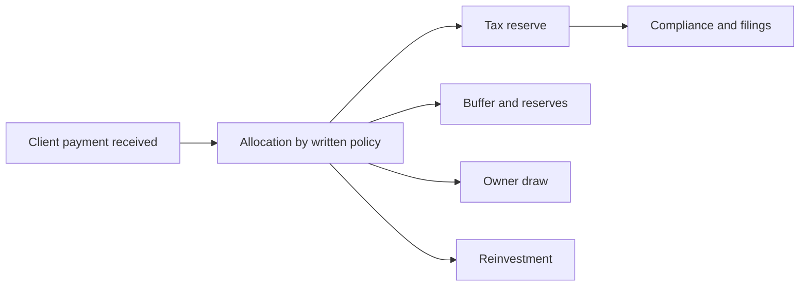

# Financial Planning for Solopreneurs

> **Core skill:** Running one-person finances like a business — separated accounts, tax reserves, budgets, and monthly hygiene that keep the firm solvent and calm.

## Why This Matters

A solo business has no finance department, no payroll office, and no one to catch mistakes. Every function a company splits across specialists — bookkeeping, tax reserves, budgeting, collections, compliance — lands on the same person who is also supposed to be delivering client work. The result is predictable: finances run reactively, taxes arrive as shocks, and business cash and personal cash blur into one anxious pool.

The fix is not sophistication; it is a small set of mechanical habits. Separated accounts remove ambiguity about what money belongs to whom. A tax reserve policy converts a yearly lump-sum dread into a monthly transfer. A budgeting cadence keeps the cost baseline current. None of this requires an accountant on staff — it requires a ritual that survives busy months precisely because it is short.

Financial hygiene also buys negotiation strength. An independent with reserves, current books, and a known runway can decline bad deals, ask for deposits, and walk away from clients who pay late. Financial chaos has the opposite effect: it forces you to accept whatever is offered, which is how margins and standards erode together.

## The Financial Stack

Separate accounts are the backbone. Each account has one job and one funding rule.

| Account | Purpose | Funding Rule |
|---------|---------|--------------|
| Operating | Day-to-day business flow | Receives all client payments; pays business costs |
| Tax reserve | Holds money owed to authorities | Fixed percentage of every payment, transferred on receipt |
| Buffer | Survival fund for slow months | Funded from profit share until 3 to 6 months of burn |
| Personal draw | Owner pay | Fixed transfer on a set day, like a salary |
| Reinvestment | Tools, learning, product bets | Remaining profit after reserves and draw |

## The Monthly Money Ritual

Small and boring beats thorough and infrequent. A compact monthly close plus a quarterly review keeps everything else honest.

| Cadence | Step | Output |
|---------|------|--------|
| On receipt | Transfer tax reserve share of every payment | Reserve account grows with obligations |
| Weekly | Check receivables against payment terms | Polite chase emails go out early |
| Monthly | Reconcile accounts, categorize spending, record invoices | Books current within one month |
| Monthly | Update runway and compare to cost baseline | Operating mode confirmed or changed |
| Quarterly | Tax filing check, subscription audit, rate review | Compliance current; costs trimmed; pricing revisited |
| Annually | Structure review with an accountant | Legal form and tax posture still fit the business |

## Taxes, Structure and Compliance

Tax specifics vary by jurisdiction and change often — verify current rules with a licensed professional rather than trusting any note, including this one. The principles are stable: reserves prevent shocks, documentation prevents disallowance, and structure affects both tax and liability.

| Question | Why It Matters | Who Answers |
|----------|----------------|-------------|
| Which legal structure fits | Affects tax rates, liability, and admin burden | Accountant or lawyer |
| When registration obligations begin | Thresholds for VAT and similar regimes trigger duties | Accountant |
| How withholding and documentation work | Cash arrives net of withholding; timing differs from billing | Accountant |
| What expenses are deductible | Home office, hardware, software, travel rules vary | Accountant |
| What social contributions apply | Contributions are part of the cost baseline | Accountant |

In markets such as Thailand, services are commonly subject to withholding tax and personal versus corporate structures carry materially different treatment — specifics worth one paid hour of professional advice, repeated whenever the business shape changes.

## Allocation Policy

Write the split once and apply it to every payment so decisions are automatic. A common policy: tax reserve first, buffer second, owner draw third, reinvestment last. Adjust the shares deliberately at quarterly reviews, never impulse by impulse.



## Practical Applications

```markdown
## Monthly Finance Ritual
- [ ] All client payments landed in the operating account, not personal
- [ ] Tax reserve share transferred on the day of receipt
- [ ] Receivables list checked; anything past terms has a chase email
- [ ] Expenses categorized; receipts filed where they can be found
- [ ] Runway recomputed and compared with the cost baseline
- [ ] Owner draw transferred on schedule, no more and no less

## Quarterly Review
- [ ] Tax filing status confirmed with the accountant
- [ ] Subscriptions audited; unused tools cancelled
- [ ] Rates and margins reviewed against the minimum sustainable rate
- [ ] Allocation percentages revisited for the next quarter
```

## Common Pitfalls

| Pitfall | Why It Is a Problem | Better Approach |
|---------|---------------------|-----------------|
| **One account for everything** | Business and personal money blur; taxes get spent | Separate accounts with one job each |
| **No tax reserve** | The annual bill becomes a debt or a panic | Fixed percentage of every payment, transferred on receipt |
| **DIY on complex structure** | Misclassification costs more than advice ever would | Pay a professional at every shape change |
| **Late invoicing** | Cash arrives a month later than it needed to | Invoice on delivery; batch invoices on a fixed day |
| **Missing documentation** | Deductions disallowed; audits become expensive | File receipts weekly in the same place |
| **Lifestyle inflation on revenue** | Costs rise with revenue, leaving nothing for slow months | Raise the draw last, after reserves and buffer |

## Success Indicators

- Taxes are paid from the reserve account, never from operating cash
- The monthly ritual survives busy months because it takes under an hour
- Books are reconcilable and current within one month, year-round
- The buffer holds three to six months of burn and is actively refilled
- Accountant conversations are about strategy, not cleanup

## Related Topics

- [[01_Cost_Structures_and_Runway]]: the baseline this ritual keeps current
- [[02_Revenue_Models_and_Forecasting]]: forecasts decide what the allocation policy receives
- [[07_Risk_Adjusted_Decision_Making]]: reserves are what make risk-taking survivable
- [[07_Governance_Risk_and_Continuity/00_overview|Governance, Risk and Continuity]]: legal structure and compliance sit alongside financial policy
- [[career-path/13_Project_and_Program_Manager/03_Schedule_and_Cost/03_Cost_Estimation_and_Budgeting|Cost Estimation and Budgeting (PjM)]]: budgeting craft that scales down to a firm of one

## Summary

Financial planning for a solopreneur is a short, mechanical ritual built on separated accounts, an allocation policy, and a tax reserve funded on receipt. Keep the runway current, invoice promptly, document everything, and pay a professional at every structural change. The point is not sophistication — it is never being surprised, and always having the option to say no.

