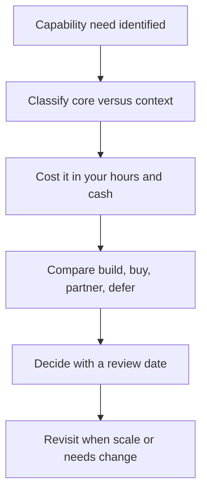

# Build vs Buy vs Partner

> **Core skill:** Deciding whether to build a capability, buy it, or partner for it — under one-person constraints where your own hours are the scarcest asset.

## Why This Matters

The classic build-versus-buy question changes shape for an independent. There is no team to build with, so "build" means your own hours — the most expensive resource in the business, measured at the rate those hours could otherwise earn. "Buy" means tools and services that convert cash into capability without consuming delivery time. "Partner" means subcontractors, agencies, or white-label providers who deliver under your name. And there is a fourth option teams rarely admit: "defer" — living without the capability until it actually pays for itself.

Every wrong choice here is expensive in a different way. Building something non-core burns billable weeks and produces maintenance you cannot afford. Buying an enterprise-priced tool too early converts precious runway into shelfware. Partnering without quality control mortgages your reputation to someone else's standards. The decision framework exists to make these costs visible before you commit, because a solo operator absorbs every mistake personally.

The sharpest tool in the framework is honesty about core versus context. A capability is core when it directly differentiates the offer and clients can feel it. Everything else is context — necessary but generic. Core capabilities deserve slow, deliberate building. Context capabilities should be bought, partnered, or deferred almost every time, even when building them would be fun.

## The Four Options

| Option | What It Means | True Cost | Best When | Main Risk |
|--------|---------------|-----------|-----------|-----------|
| Build | Your hours create the capability | Billable-rate hours plus maintenance forever | Core, frequent, and differentiating | Time sink; permanent upkeep burden |
| Buy | Tools, SaaS, or services provide it | Subscription or license cash, integration time | Context, standard, and available | Cost creep; lock-in; shallow differentiation |
| Partner | Subcontractor or agency delivers under your name | Their rate plus your management time | Core but infrequent, or capacity spikes | Quality and confidentiality leave your control |
| Defer | Live without it until justified | Opportunity cost only | Unproven need or premature stage | Delays that compound if the need was real |

## The Decision Dimensions

| Dimension | Question to Ask | Tilts Toward |
|-----------|-----------------|--------------|
| Strategic importance | Do clients feel this capability, or only its absence? | Core tilts to build; context tilts to buy |
| Frequency of use | Daily, per engagement, or once a quarter? | Frequent favors buy; rare favors partner |
| Time to competence | Weeks or months before the capability works? | Long ramps favor buying or partnering |
| Cash versus time | Which is scarcer this quarter? | Cash-heavy phases favor time-based builds |
| Reversibility | How hard is it to undo in six months? | Irreversible choices deserve slower decisions |
| Client constraints | Does the contract require consent for subcontracting? | Restricted engagements limit partnering |
| Confidentiality and IP | Who may see client data and code? | Sensitive work demands controlled parties |

Score the options against these dimensions on paper. The point is not precision — it is surfacing the dimension you were privately ignoring.

## A Worked Decision

A consultant needs a client portal for engagement updates. Three routes, honestly costed.

| Dimension | Build | Buy | Partner |
|-----------|-------|-----|---------|
| Upfront cash | Minimal | 200 to 500 monthly | 100,000 to 300,000 project |
| Your hours | 80 to 160 hours | 10 to 20 hours | 15 to 25 hours of management |
| Time to value | Three to six months | Days | Four to six weeks |
| Ongoing burden | Yours forever | Vendor's problem | Monthly retainer |
| Differentiation | Low, clients expect portals | None | None |
| Verdict | Wrong: context capability built out of pride | Right: standard problem, standard tool | Wrong: overkill for a solved need |

The pattern repeats: capabilities that feel like "real engineering" are often context, and the boring buy is the correct call.

## Working With Partners

When partnering is right, the management load is the hidden cost. Structure it explicitly.

| Area | What to Agree | Why It Matters |
|------|---------------|----------------|
| Rate and model | Fixed quote or day rate, payment milestones | Margin depends on a known cost |
| Client consent | Written approval where contracts require it | Protects the primary relationship |
| Quality bar | Acceptance criteria and review rights | Your name is on the deliverable |
| Confidentiality | NDA and data handling rules | Client data is not yours to leak |
| IP ownership | Work product assigned to you or the client | Prevents future disputes |
| Continuity | Backup option if the partner disappears mid-project | Solo firms have no bench by default |

Maintain a bench: two or three trusted partners you have tested on small work before a crisis needs them.



## Practical Applications

```markdown
## Capability Decision Checklist
- [ ] Name the capability and the client-visible outcome it produces
- [ ] Classify it as core or context, in writing
- [ ] Estimate the build in your billable hours, not enthusiasm
- [ ] Price the buy option including integration and switching cost
- [ ] Check client contracts for subcontracting and confidentiality clauses
- [ ] Compare all options on cash, hours, time to value, reversibility
- [ ] Choose, record why, and set a review date
```

```markdown
## Decision Record
- Capability:
- Options considered:
- Choice and rationale:
- True cost accepted:
- Reversibility and exit plan:
- Review date:
```

## Common Pitfalls

| Pitfall | Why It Is a Problem | Better Approach |
|---------|---------------------|-----------------|
| **Building because you can** | Engineering pride converts billable weeks into maintenance you never recover | Build only core, frequent, differentiating capabilities |
| **Enterprise tools too early** | Runway pays for capacity that sits unused | Start on the cheapest tier that genuinely works |
| **Subcontracting without consent** | Contract breach and a damaged primary relationship | Check the SOW; get written approval every time |
| **No quality control on partners** | Their defects land on your reputation | Acceptance criteria, review rights, and staged payments |
| **Underestimating integration** | The "cheap" buy becomes expensive glue work | Count integration hours at your own rate |
| **Irreversible multi-year lock-in** | Exit cost quietly exceeds the capability's value | Prefer reversible choices; demand exit terms |

## Success Indicators

- Capability decisions are recorded with rationale and a review date
- Nothing non-core has been built in the last year without a written reason
- A small bench of tested partners exists before it is urgently needed
- Tools and subscriptions map to capabilities actually in use
- Time spent on context work is visibly trending down while core work compounds

## Related Topics

- [[05_Bootstrapping_vs_Funding]]: growth engine choice determines how much you can afford to buy
- [[06_Unit_Economics_of_Small_Products]]: product margins expose whether build costs ever pay back
- [[01_Cost_Structures_and_Runway]]: every buy decision consumes the runway clock
- [[career-path/02_Senior_Software_Engineer/08_Engineering_Economics_and_Trade_Offs/02_Build_vs_Buy_Decisions|Build vs Buy Decisions (Senior)]]: the engineering economics foundation this adapts
- [[05_Architecture_for_Independents/00_overview|Architecture for Independents]]: architecture choices are leverage choices for a solo builder

## Summary

For a one-person firm, build means spending your scarcest resource to create permanent upkeep, so only core and frequent capabilities deserve it. Buy handles context problems cheaply and reversibly; partner covers core-but-infrequent needs and capacity spikes at the cost of control; defer is a legitimate answer to premature ambitions. Decide on paper, record the rationale, set a review date, and keep a small tested bench for the day you need leverage.

