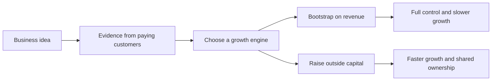

# Bootstrapping vs Funding

> **Core skill:** Choosing between growing on revenue and raising outside capital — matching the funding engine to the actual shape of the business.

## Why This Matters

There are two engines for growth and they trade different currencies. Bootstrapping trades speed for control: growth is limited to what revenue and margin can fund, and the founder keeps every decision and every share. Outside funding trades control for speed: growth accelerates beyond cash flow, at the cost of dilution, investor expectations, and a clock that now belongs to someone else. Neither engine is virtuous; each fits a particular business shape, and choosing wrong is expensive either way.

The most common mistake is borrowing the vocabulary of venture-backed startups for a business that is not one. A consulting practice or a services business rarely benefits from raising — it has no winner-take-most dynamics and no capital moat — while a capital-intensive product in a land-grab market may lose simply by being slow. The question is never "should I raise?" in the abstract, but "does this specific business, at this specific stage, get more from speed or from control?"

A useful default: grow on revenue until the evidence says otherwise. Bootstrapping forces the discipline — paying customers, positive margins, paying back what you spend — that also makes a later raise credible. The hybrid path is also real and common: a cash-flowing consulting practice funds a product bet under strict rules, with the consulting counted as a funding round from the best investor you will ever have — yourself.

## Two Growth Engines

| Dimension | Bootstrapping | Outside Funding |
|-----------|---------------|-----------------|
| Growth speed | Limited by revenue and margin | Beyond current cash flow |
| Control | Complete: pricing, priorities, exit | Shared: board, investors, expectations |
| Ownership | Undiluted | Diluted at each round |
| Failure tolerance | Failures threaten the founder directly | Failures spend investor money first |
| Natural discipline | Cash: you cannot spend what you lack | Milestones: you must hit plan or raise again |
| Typical fit | Services, profitable niches, slow-compounding products | Winner-take-most markets, capital-intensive plays |
| Founder energy | Sustained grind | Fundraising cycles interspersed |

## When Funding Is Rational

Raising deserves consideration only when a specific condition holds — and the condition should be written down before any investor conversation begins.

| Condition | Why Funding Fits | Evidence to Show |
|-----------|------------------|------------------|
| Winner-take-most market | Being second is nearly worthless; speed decides | Growth rate and retention curves |
| Capital intensity | Hardware, inventory, or regulated buildup precedes revenue | Cost model and unit plan |
| Timing race | A window exists that closes; slow entry forfeits it | Market signals and competitor motion |
| Network effects | Value compounds with scale in ways cash flow cannot fund fast enough | Early cohort behavior |
| Strong retention and payback | Spend converts to durable revenue reliably | Cohorts, churn, contribution margin |

Without at least one of these, raising usually transplants investor expectations into a business that cannot satisfy them — the classic way a healthy small firm dies of a condition it caught from its own funding.

## Funding Options Compared

| Source | Shape | Cost | Control Impact |
|--------|-------|------|----------------|
| Customer prepayment | Deposits, pre-orders, annual plans | Fulfilment obligation | None; the cleanest capital |
| Revenue-based financing | Repayment as a share of revenue | Fixed multiple on amount | Minimal; aligned with cash flow |
| Grants and programs | Non-dilutive, milestone-based | Application effort and reporting | Some reporting duties |
| Bank credit | Term loan or credit line | Interest and covenants | Low; personal guarantees common |
| Angel investors | Early equity or convertible | Equity and informal expectations | Moderate; one or few voices |
| Venture capital | Priced rounds toward scale | Significant dilution, board seats | High; growth clock is imposed |
| Strategic investors | Corporate partner capital | Equity plus commercial entanglement | High; exit paths narrow |

Order the list the way a bootstrapper should: exhaust the cheap, non-dilutive sources before considering the expensive ones.

## The Hybrid Path

Consulting cash funding a product is the most common independent route — and it works only with rules.

| Rule | Why | Failure It Prevents |
|------|-----|---------------------|
| Separate books for consulting and product | Margin truth for both activities | Product losses hidden inside service profits |
| Fixed weekly time budget for the product | Progress does not depend on consulting mood | The product always loses to billable urgency |
| Time-boxed phases with kill criteria | Small losses stay small | A decade of unfunded product drift |
| The product passes the same evidence gates | Funding decisions stay honest | Emotional continuation |
| Consulting rates cover both lives | The firm stays solvent | Subsidizing a product with personal reserves unknowingly |



## Practical Applications

```markdown
## Funding Decision Review
- [ ] Write the business shape: winner-take-most, capital-intensive, or neither
- [ ] Define the evidence gates that would justify spending more money
- [ ] List the non-dilutive options first: prepayment, revenue-based, grants, credit
- [ ] Model what the money buys: months of runway, hires, or channel, with numbers
- [ ] Write what control is being sold and at what price
- [ ] If hybrid: separate books, fixed weekly product budget, kill criteria
- [ ] Re-decide only when gates are met or missed, not when morale dips
```

## Common Pitfalls

| Pitfall | Why It Is a Problem | Better Approach |
|---------|---------------------|-----------------|
| **Raising for a services business** | Investor growth expectations cannot be met by billable hours | Bootstrap services; raise only for product shapes that fit |
| **Fundraising as validation** | A raise feels like success and masks absent customers | Validation is paying customers; raise is fuel, not proof |
| **Waiting for funding instead of selling** | Months pass with no revenue and no progress | Sell today; raise in parallel only if the shape fits |
| **Ignoring dilution math** | Control and exit economics erode round by round | Model ownership at each future round before signing |
| **Mixing consulting and product money** | Neither activity shows its true economics | Separate books and time budgets from day one |
| **Perpetual hybrid drift** | The product neither ships nor dies, funded by quiet subsidies | Time-boxed phases with stated kill criteria |

## Success Indicators

- The growth engine is a written decision with the reasoning attached
- Evidence gates for further investment are defined before money is spent
- Non-dilutive funding sources are exhausted before equity is discussed
- In hybrid mode, both activities show honest, separated economics
- Control trade-offs are understood — what was sold, to whom, and why

## Related Topics

- [[04_Build_vs_Buy_vs_Partner]]: funded or not, every capability is still a leverage decision
- [[06_Unit_Economics_of_Small_Products]]: product payback determines whether outside money is ever needed
- [[07_Risk_Adjusted_Decision_Making]]: funding decisions are bets judged by expected value and survival
- [[02_Product_and_Service_Design/00_overview|Product and Service Design]]: the offer shape drives which growth engine fits
- [[career-path/03_Staff_Engineer/03_Technical_Strategy/02_Technology_Betting|Technology Betting (Staff)]]: deliberate betting logic applied to business growth

## Summary

Two engines, two currencies: bootstrapping buys control with slowness, funding buys speed with ownership and expectations. Match the engine to the business shape — winner-take-most and capital-intensive plays justify raising; services and profitable niches almost never do. Default to growing on revenue, exhaust non-dilutive sources first, and when running the hybrid path, enforce separate books, fixed time budgets, and kill criteria so the consulting funds the product without quietly dying for it.

